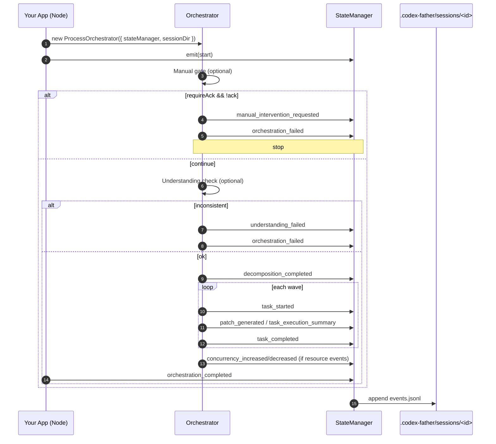

# Codex Father — MVP11 PRD（模式 1/2/3/4 全量整合）

## 0. 背景与目标
- 背景：Codex Father 面向“可编排、可审计、可集成”的工程自动化，强调非交互、流水线友好与标准事件。
- 目标：在不引入 UI/TUI 前提下，提供 4 种稳定使用模式，覆盖 CI/脚本、长时作业、MCP 工具集成与服务端内嵌；统一事件与安全契约，确保可观测与可回放。
- 成功标准：
  - 任一模式均不破坏 stdout 两行契约（适用 orchestrate CLI），详细过程落盘 JSONL 审计。
  - 会话目录结构、权限与脱敏策略一致；日志/状态可查询与回放。

## 1. 范围（In Scope）
- 模式一：Orchestrate CLI（两行摘要 + JSONL 审计）
- 模式二：job.sh 异步作业流（start/status/logs/stop/list/metrics/clean）
- 模式三：MCP 服务器（stdio，tools/list & tools/call）
- 模式四：Node 内嵌编排器（服务端/脚本中直接编排）
- 统一事件/目录/审批/脱敏契约

不在范围（Out of Scope）
- 交互式 TUI 前端
- 与第三方平台的 GUI 整合与发布

## 2. 统一契约与目录
- 事件模型：统一使用 JSONL 追加式写入，字段扩展进入 `data`，保留 `event`、`timestamp`、`seq` 等基础字段。
  - 写入实现：`core/orchestrator/state-manager.ts`
  - 事件 schema 参考：`docs/schemas/stream-json-event.schema.json`
- stdout 契约：
  - orchestrate CLI：标准输出仅两行 Stream‑JSON 事件：`start` 与 `orchestration_completed`（或 `orchestration_failed`）。详见：`core/cli/commands/orchestrate-command.ts`
  - auto 命令（来自 MVP12）：默认 `--output-format json`，在 `--output-format stream-json` 下同样仅输出两行事件；如需“同时保留两行事件又获得 JSON 摘要”，可使用 `--save-stream <file>`。
  - 其他事件全部写入会话 JSONL，不进入 stdout。
- 会话目录（默认 0700）：`.codex-father/sessions/<id>/`
  - `events.jsonl`（0600）
  - `patches/`（补丁产物）
  - `workspaces/agent_<n>/`（每 Agent 独立工作目录）
- 脱敏：默认开启通用敏感模式（OpenAI/Token/Key/Password 等）
  - 配置项：`security.redactSensitiveData`；写入管线参见 `core/orchestrator/state-manager.ts`

## 3. Gate 顺序与安全策略
- 人工干预（Manual Intervention，可配）：未确认时写入 `manual_intervention_requested` 并终止。
- 理解校验（Understanding Check，可配）：失败写入 `understanding_failed` 并终止。
- 任务分解（Task Decomposer）：拓扑校验失败写入 `decomposition_failed` 并终止。
- 资源并发：根据 `resourceMonitor.captureSnapshot()` 调整并发，发出 `concurrency_reduced`/`concurrency_increased`（参考 `core/orchestrator/process-orchestrator.ts`）。
- 审批与沙箱：遵循 `ApprovalPolicy` 与 `SandboxMode` 约定（参考 `core/orchestrator/types.ts`）。

## 4. 模式一：Orchestrate CLI（两行摘要 + JSONL 审计）
- 价值：CI/脚本化友好，仅两行 stdout；详细事件写 JSONL，利于审计与回放。
- 用户故事：
  - 作为 CI，我希望编排任务仅输出两行摘要，避免污染管道；详细事件落盘供追踪。
- 主要接口：
  - 启动：`node dist/core/cli/start.ts orchestrate "<需求>" --output-format stream-json`
  - 跟随事件：`node dist/core/cli/start.ts logs <orchestrationId> --follow --format text`
- 输入与输出：
  - 输入：需求文本、可选配置（并发、阈值、输出格式、配置文件等）。
  - stdout：严格两行（start 与 completed/failed）。
  - 产物：`.codex-father/sessions/<orc_id>/events.jsonl`
- 验收标准：
  - stdout 仅两行，`events.jsonl` 存在且持续追加事件。
  - `logs` 命令可按 `sessionId` 正常导出/跟随。
- 参考文件：
  - `core/cli/commands/orchestrate-command.ts`
  - `core/orchestrator/state-manager.ts`

## 5. 模式二：异步作业流（job.sh）
- 价值：长时、可恢复、可清理；start/status/logs/stop/list/metrics/clean 一套齐全。
- 用户故事：
  - 作为平台运维，我希望所有作业在后台执行并可查询状态与日志、按条件清理历史。
- 主要接口：
  - 启动：`./job.sh start --task "demo" --dry-run --json`
  - 状态：`./job.sh status <job-id> --json`
  - 日志：`./job.sh logs <job-id> --tail 200 --follow`
  - 停止：`./job.sh stop <job-id> --force --json`
  - 列表：`./job.sh list --json`
  - 指标：`./job.sh metrics --json`
  - 清理：`./job.sh clean --state finished --older-than-hours 24 --dry-run --json`
- 输入与输出：
- 输出落盘：`.codex-father/sessions/<job-id>/`（`job.log`、`state.json`、`aggregate.*`）。
- 验收标准：
  - `start` 返回 `jobId`；`status/logs/stop/list/metrics/clean` 正常工作；目录权限符合约定。
- 参考文件：
  - `job.sh`, `job.d/01_commands.sh`

## 6. 模式三：MCP 服务器（stdio）
- 价值：将能力以 MCP 工具形式输出，供 Claude Desktop、Codex rMCP 或自研客户端调用。
- 用户故事：
  - 作为 Agent 客户端，我希望通过 MCP 调用 codex-father 的工具完成作业管理与编排。
- 主要接口：
  - 构建：`npm run mcp:build`
  - 启动（经 CLI 层包裹）：`node dist/core/cli/start.ts mcp --codex-command codex --debug`
  - 或直接启动工作区 MCP Server：`node mcp/codex-mcp-server/dist/index.js --transport=ndjson`
  - 客户端配置（示例）见 `README.md`（Claude Desktop、Codex CLI rMCP）。
- 工具能力（当前实现概览）：`exec/start/status/logs/stop/list/help`（下划线别名可配）
  - 命名策略/别名与“responses”兼容建议见 `mcp/codex-mcp-server/README.md`。
- 验收标准：
  - 完成 MCP `initialize/tools.list/tools.call`；未知/错误参数返回合理错误码；可查询/跟随作业日志。
- 参考文件：
  - `core/cli/commands/mcp-command.ts`, `core/mcp/server.ts`
  - `mcp/codex-mcp-server/src/index.ts`

## 7. 模式四：Node 内嵌编排器（服务端/脚本）
- 价值：在你的 Node 进程中直接使用编排能力，统一事件写 JSONL，复用 Gate/并发/重试骨架。
- 用户故事：
  - 作为服务开发者，我希望把编排直接嵌入服务，并以统一事件与权限策略运行。
- 接入步骤（最小范式）：
  1) 构造事件写入器：`const stateManager = new StateManager({ sessionDir })`
  2) 构造编排器：`const orchestrator = new ProcessOrchestrator({ stateManager, sessionDir, maxConcurrency, manualIntervention, understanding, ... })`
  3) 准备任务：拓扑无环、ID 以 `t-`/`t_` 开头，含超时与角色。
  4) 执行：`await orchestrator.orchestrate(tasks)`；事件持续写入 `<sessionDir>/events.jsonl`。
  - 参考示例：`scripts/orchestrate-demo.ts`（运行：`npm run demo:orchestrate`）
  - 选项：--tasks/--pattern/--concurrency/--retry-*/--simulate-fail/--session-id/--understanding/--manual-*
  5) 取消/资源：`await orchestrator.requestCancel()`；或注入 `resourceMonitor` 自动并发调整。
- 注意：
  - 顶层两行 stdout 契约属于 CLI。若在库模式需要同样的摘要，请在外层调用前后使用 `stateManager.emitEvent({event:'start'})` 与 `...('orchestration_completed'|'orchestration_failed')` 自行补齐。
  - 现版 `executeTask()` 为最小实现（返回成功），真实执行需接入你的执行器或通过 MCP 工具实现，并在适时 `releaseAgent()`。
- 参考文件：
  - `core/orchestrator/process-orchestrator.ts`
  - `core/orchestrator/state-manager.ts`

## 8. 配置与环境（精选）
- 全局/CLI 相关：
  - `--output-format stream-json`（orchestrate 两行摘要模式）
  - `--max-concurrency / --task-timeout / --success-threshold`
- 目录/日志：
  - `CODEX_SESSION_DIR`, `CODEX_LOG_FILE`, `CODEX_LOG_AGGREGATE*`（见 `job.d/01_commands.sh`）
- 脱敏：
  - `security.redactSensitiveData`（在配置文件中）；默认启用通用 patterns（`state-manager.ts`）
- MCP：
  - `CODEX_MCP_PROJECT_ROOT`, `CODEX_SESSIONS_ROOT`, `CODEX_MCP_NAME_STYLE`, `CODEX_MCP_TOOL_PREFIX`, `CODEX_MCP_HIDE_ORIGINAL`

## 9. 非功能需求（NFR）
- 性能：
  - 并发上限不超过 10（池大小可动态缩放）。
  - 文件写入为追加式 JSONL，单行不超过 10KB。
- 可观测性：
  - 所有关键节点必须写事件；失败/终止包含 `reason`。
- 安全：
  - 目录 0700、事件文件 0600；默认开启脱敏。
- 兼容性：
  - Node 18+；不绑定特定前端；支持 CI/容器化环境。

## 10. 风险与缓解
- 风险：外部引擎/协议演进导致事件差异。
  - 缓解：维持适配层；如需接入官方 SDK，采用“可插拔后端”策略，仅替换 Codex 客户端，保持事件/目录/契约不变。
- 风险：长时作业过多导致磁盘占用。
  - 缓解：通过 `job.sh clean` 周期清理；提供 `metrics` 与汇总。

## 11. 里程碑与验收
- M1（本 PRD 完成）：四种模式文档化，示例可运行，事件/目录契约对齐。
- M2（可选）：新增“官方 SDK 适配器”开关，保持行为等价，便于灰度切换。
- M3（扩展）：补充端到端用例与更多 Gate/资源策略。

## 12. 附录：快速开始命令清单
- Orchestrate（两行摘要）
  - `npm run build`
  - `node dist/core/cli/start.ts orchestrate "实现用户管理模块" --output-format stream-json`
  - `node dist/core/cli/start.ts logs <orc_id> --follow --format text`
- 异步作业
  - `./job.sh start --task "demo" --dry-run --json`
  - `./job.sh status <job-id> --json`
  - `./job.sh logs <job-id> --tail 200 --follow`
  - `./job.sh stop <job-id> --force --json`
  - `./job.sh list --json`
  - `./job.sh metrics --json`
  - `./job.sh clean --state finished --older-than-hours 24 --dry-run --json`
- MCP 服务器
  - `npm run mcp:build`
  - `node dist/core/cli/start.ts mcp --codex-command codex --debug`
  - 或：`node mcp/codex-mcp-server/dist/index.js --transport=ndjson`
- 内嵌编排（库模式）
  - 运行冒烟：`npm run demo:orchestrate:smoke`
  - 构造 `StateManager({ sessionDir })` + `ProcessOrchestrator({ stateManager, ... })`
  - `await orchestrator.orchestrate(tasks)`；事件在 `<sessionDir>/events.jsonl`

## 13. 时序图（Gates 与事件流）

