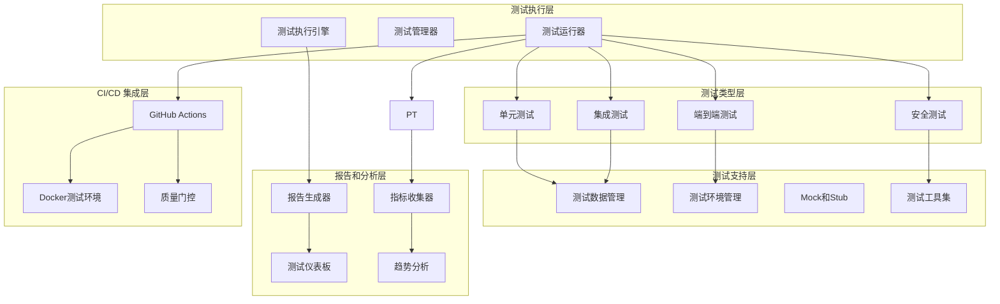
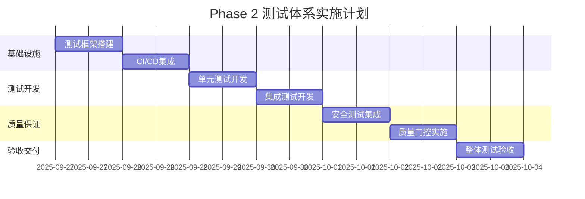

# Phase 2: 测试体系完善 - 设计文档

## 1. 设计概述

### 1.1 测试架构目标

构建全面、可扩展、高效的测试体系，确保 Codex
Father 项目在功能完整性、性能稳定性、安全可靠性等方面达到生产级别的质量标准。

### 1.2 设计原则

- **分层测试**: 单元测试、集成测试、端到端测试的清晰分层
- **自动化优先**: 最大化自动化测试覆盖，减少手工测试依赖
- **快速反馈**: 测试执行时间优化，支持快速开发迭代
- **环境一致性**: 确保测试环境与生产环境的一致性
- **可维护性**: 测试代码的可读性、可扩展性和可维护性

### 1.3 技术栈选型

- **Bash 测试**: BATS (Bash Automated Testing System)
- **TypeScript 测试**: Jest + 自定义 MCP 测试框架
- **安全扫描**: ShellCheck + ESLint Security + npm audit
- **CI/CD**: GitHub Actions + Docker 容器化测试
- **报告生成**: JSON + HTML + Markdown 多格式报告

## 2. 测试架构设计

### 2.1 整体测试架构



### 2.2 测试框架分层设计

#### 2.2.1 测试运行器架构 (tests/lib/test-runner.sh)

```bash
#!/bin/bash
# tests/lib/test-runner.sh - 统一测试运行器

# 测试运行器配置
readonly TEST_RUNNER_VERSION="1.0.0"
readonly TEST_CONFIG_DIR="tests/config"
readonly TEST_RESULTS_DIR="tests/results"
readonly TEST_ARTIFACTS_DIR="tests/artifacts"

# 测试套件定义
declare -A TEST_SUITES=(
    ["unit"]="tests/unit/**/*.bats"
    ["integration"]="tests/integration/**/*.bats"
    ["e2e"]="tests/e2e/**/*.bats"
    ["security"]="tests/security/**/*.sh"
)

# 主要测试运行函数
run_test_suite() {
    local suite_name="$1"
    local test_filter="$2"
    local environment="$3"
    local parallel="${4:-false}"

    validate_test_suite "$suite_name" || return 1
    setup_test_environment "$environment" || return 1

    local test_session_id
    test_session_id="test-$(date +%Y%m%d-%H%M%S)-$$"

    log_info "启动测试套件: $suite_name (Session: $test_session_id)"

    # 创建测试会话目录
    local session_dir="${TEST_RESULTS_DIR}/${test_session_id}"
    mkdir -p "$session_dir"

    # 初始化测试报告
    init_test_report "$session_dir" "$suite_name"

    # 执行测试
    case "$suite_name" in
        "unit"|"integration"|"e2e")
            run_bats_tests "$suite_name" "$test_filter" "$session_dir" "$parallel"
            ;;
        "security")
            run_security_tests "$test_filter" "$session_dir"
            ;;
        "all")
            run_all_test_suites "$test_filter" "$session_dir" "$parallel"
            ;;
    esac

    local test_result=$?

    # 生成测试报告
    generate_test_report "$session_dir" "$suite_name"

    # 清理测试环境
    cleanup_test_environment "$test_session_id"

    log_info "测试套件完成: $suite_name (Result: $test_result)"
    return $test_result
}

# BATS 测试执行器
run_bats_tests() {
    local suite_name="$1"
    local test_filter="$2"
    local session_dir="$3"
    local parallel="$4"

    local test_pattern="${TEST_SUITES[$suite_name]}"
    local test_files=()

    # 收集测试文件
    while IFS= read -r -d '' file; do
        if [[ -z "$test_filter" ]] || [[ "$file" =~ $test_filter ]]; then
            test_files+=("$file")
        fi
    done < <(find tests -name "*.bats" -path "$test_pattern" -print0)

    if [[ ${#test_files[@]} -eq 0 ]]; then
        log_warn "没有找到匹配的测试文件: $test_pattern"
        return 0
    fi

    log_info "发现 ${#test_files[@]} 个测试文件"

    # 配置 BATS 执行选项
    local bats_opts=(
        "--formatter" "json"
        "--output" "$session_dir"
        "--timing"
    )

    if [[ "$parallel" == "true" ]]; then
        bats_opts+=("--jobs" "$(nproc)")
    fi

    # 执行 BATS 测试
    bats "${bats_opts[@]}" "${test_files[@]}"
    local bats_result=$?

    # 处理测试结果
    process_bats_results "$session_dir" "$suite_name"

    return $bats_result
}
```

#### 2.2.2 测试环境管理 (tests/lib/test-env.sh)

```bash
#!/bin/bash
# tests/lib/test-env.sh - 测试环境管理

# 环境类型定义
readonly ENV_TYPE_LOCAL="local"
readonly ENV_TYPE_CI="ci"
readonly ENV_TYPE_CONTAINER="container"

# 测试环境配置
declare -A ENV_CONFIG=(
    ["local.isolation"]="process"
    ["local.cleanup"]="standard"
    ["local.temp_dir"]="/tmp/codex-father-test"
    ["ci.isolation"]="container"
    ["ci.cleanup"]="complete"
    ["ci.temp_dir"]="/tmp/cf-ci-test"
    ["container.isolation"]="namespace"
    ["container.cleanup"]="complete"
    ["container.temp_dir"]="/workspace/test-tmp"
)

# 环境初始化
setup_test_environment() {
    local env_type="$1"
    local test_session_id="$2"

    validate_environment_type "$env_type" || return 1

    log_info "初始化测试环境: $env_type"

    # 设置环境变量
    setup_environment_variables "$env_type" "$test_session_id"

    # 创建隔离的测试目录
    setup_test_workspace "$env_type" "$test_session_id"

    # 初始化测试仓库
    setup_test_repositories "$env_type"

    # 配置测试工具
    setup_test_tools "$env_type"

    # 验证环境就绪状态
    validate_test_environment "$env_type"
}

# 测试工作空间设置
setup_test_workspace() {
    local env_type="$1"
    local test_session_id="$2"

    local base_temp_dir="${ENV_CONFIG[${env_type}.temp_dir]}"
    export TEST_WORKSPACE="${base_temp_dir}/${test_session_id}"

    # 创建测试目录结构
    mkdir -p "$TEST_WORKSPACE"/{repos,configs,logs,artifacts}

    # 设置权限
    chmod 755 "$TEST_WORKSPACE"

    # 创建测试配置
    cat > "$TEST_WORKSPACE/configs/test.conf" <<EOF
# 测试环境配置
TEST_SESSION_ID="$test_session_id"
TEST_ENV_TYPE="$env_type"
TEST_ISOLATION_LEVEL="${ENV_CONFIG[${env_type}.isolation]}"
TEST_CLEANUP_LEVEL="${ENV_CONFIG[${env_type}.cleanup]}"

# Codex Father 配置
CODEX_SESSIONS_ROOT="$TEST_WORKSPACE/sessions"
CODEX_LOG_LEVEL="debug"
CODEX_DRY_RUN="true"
EOF

    export TEST_CONFIG_FILE="$TEST_WORKSPACE/configs/test.conf"
    log_info "测试工作空间创建: $TEST_WORKSPACE"
}

# 测试仓库设置
setup_test_repositories() {
    local env_type="$1"

    # 创建测试用的 Git 仓库
    local test_repo_dir="$TEST_WORKSPACE/repos/test-repo"
    mkdir -p "$test_repo_dir"

    (
        cd "$test_repo_dir"
        git init --initial-branch=main
        git config user.name "Codex Father Test"
        git config user.email "test@codex-father.local"

        # 创建初始提交
        echo "# Test Repository" > README.md
        echo "test-data" > test-file.txt
        git add .
        git commit -m "Initial commit"

        # 创建测试分支
        git checkout -b develop
        echo "develop branch content" > develop.txt
        git add .
        git commit -m "Add develop branch"
        git checkout main
    )

    # 创建 bare 仓库 (模拟远程)
    local bare_repo_dir="$TEST_WORKSPACE/repos/test-repo-bare"
    git clone --bare "$test_repo_dir" "$bare_repo_dir"

    # 配置远程仓库
    (
        cd "$test_repo_dir"
        git remote add origin "$bare_repo_dir"
    )

    export TEST_REPO_DIR="$test_repo_dir"
    export TEST_BARE_REPO_DIR="$bare_repo_dir"
    log_info "测试仓库设置完成: $test_repo_dir"
}
```

### 2.3 测试用例设计框架

#### 2.3.1 单元测试设计模式

```bash
#!/usr/bin/env bats
# tests/unit/git_workflow_test.bats

# 测试设置和清理
setup() {
    # 加载测试库
    load '../lib/test-helper'
    load '../lib/git-test-helper'
    load '../lib/mock-helper'

    # 设置测试环境
    setup_isolated_test_env
    setup_test_git_repo

    # 加载被测试模块
    source "$PROJECT_ROOT/lib/git_workflow.sh"
}

teardown() {
    cleanup_test_env
}

# 测试用例: 创建功能分支 - 正常情况
@test "git_workflow: create_feature_branch - 正常创建" {
    # 准备
    local task_id="test-12345"
    local description="测试功能分支"
    local base_branch="main"

    # 执行
    run create_feature_branch "$task_id" "$description" "$base_branch"

    # 验证
    assert_success
    assert_output --partial "成功创建功能分支"

    # 验证分支存在
    run git branch --list "feature/codex-task-$task_id"
    assert_success
    assert_output --partial "feature/codex-task-$task_id"

    # 验证分支状态文件
    local state_file=".codex-father/git-state/${task_id}.json"
    assert_file_exists "$state_file"
    assert_json_contains "$state_file" '.status' 'created'
    assert_json_contains "$state_file" '.branchName' "feature/codex-task-$task_id"
}

# 测试用例: 创建功能分支 - 分支已存在
@test "git_workflow: create_feature_branch - 分支已存在" {
    # 准备
    local task_id="test-12345"
    local description="测试功能分支"
    local branch_name="feature/codex-task-$task_id"

    # 预先创建分支
    git checkout -b "$branch_name"
    git checkout main

    # 执行
    run create_feature_branch "$task_id" "$description"

    # 验证
    assert_failure 2  # 分支已存在的错误码
    assert_output --partial "分支.*已存在"
}

# 测试用例: 代码提交 - 有变更
@test "git_workflow: commit_task_changes - 有代码变更" {
    # 准备
    local task_id="test-12345"
    create_feature_branch "$task_id" "测试分支"

    # 创建代码变更
    echo "新功能代码" > new-feature.js
    echo "修改内容" >> existing-file.txt

    # 执行
    run commit_task_changes "$task_id" "实现新功能"

    # 验证
    assert_success
    assert_output --partial "代码提交成功"

    # 验证提交存在
    run git log --oneline -1
    assert_success
    assert_output --partial "codex-task-$task_id"
    assert_output --partial "实现新功能"
}

# 测试用例: PR 创建 - 模拟 GitHub CLI
@test "git_workflow: push_and_create_pr - 成功创建PR" {
    # 准备
    local task_id="test-12345"
    create_feature_branch "$task_id" "测试分支"

    # 创建变更并提交
    echo "feature code" > feature.js
    commit_task_changes "$task_id" "添加功能"

    # 模拟 GitHub CLI
    mock_command "gh" "echo 'https://github.com/test/repo/pull/123'"

    # 执行
    run push_and_create_pr "$task_id" "功能PR" "添加新功能的PR"

    # 验证
    assert_success
    assert_output --partial "PR创建成功"
    assert_output --partial "https://github.com/test/repo/pull/123"

    # 验证状态更新
    local state_file=".codex-father/git-state/${task_id}.json"
    assert_json_contains "$state_file" '.status' 'pr_created'
    assert_json_contains "$state_file" '.prUrl' 'https://github.com/test/repo/pull/123'
}
```

#### 2.3.2 集成测试设计模式

```bash
#!/usr/bin/env bats
# tests/integration/mcp_git_integration_test.bats

setup() {
    load '../lib/test-helper'
    load '../lib/mcp-test-helper'
    load '../lib/integration-helper'

    # 启动 MCP 服务器
    start_test_mcp_server
    setup_test_git_environment
}

teardown() {
    stop_test_mcp_server
    cleanup_integration_test_env
}

# 集成测试: MCP Git 工具完整流程
@test "integration: MCP Git 工具完整工作流" {
    # Step 1: 通过 MCP 创建任务
    local task_response
    task_response=$(call_mcp_tool "codex.task.create" '{
        "description": "集成测试任务",
        "enableGitWorkflow": true,
        "baseBranch": "main",
        "autoCreatePR": true
    }')

    assert_json_success "$task_response"
    local task_id
    task_id=$(echo "$task_response" | jq -r '.result.taskId')

    # Step 2: 验证分支创建
    local branch_response
    branch_response=$(call_mcp_tool "codex.git.branch" '{
        "action": "status",
        "taskId": "'"$task_id"'"
    }')

    assert_json_success "$branch_response"
    assert_json_contains "$branch_response" '.result.status.status' 'created'

    # Step 3: 模拟代码变更和提交
    echo "integration test code" > "$TEST_REPO_DIR/integration-feature.js"
    cd "$TEST_REPO_DIR"

    local commit_response
    commit_response=$(call_mcp_tool "codex.git.commit" '{
        "taskId": "'"$task_id"'",
        "message": "添加集成测试功能"
    }')

    assert_json_success "$commit_response"

    # Step 4: 验证提交结果
    run git log --oneline -1
    assert_success
    assert_output --partial "codex-task-$task_id"

    # Step 5: 创建 PR (模拟)
    mock_command "gh" "echo 'https://github.com/test/repo/pull/456'"

    local pr_response
    pr_response=$(call_mcp_tool "codex.git.pr" '{
        "taskId": "'"$task_id"'",
        "title": "集成测试PR",
        "description": "这是一个集成测试创建的PR"
    }')

    assert_json_success "$pr_response"
    assert_json_contains "$pr_response" '.result.prUrl' 'https://github.com/test/repo/pull/456'

    # Step 6: 验证最终状态
    local final_status
    final_status=$(call_mcp_tool "codex.task.status" '{
        "taskId": "'"$task_id"'"
    }')

    assert_json_success "$final_status"
    assert_json_contains "$final_status" '.result.gitWorkflow.prUrl' 'https://github.com/test/repo/pull/456'
}
```

#### 2.3.3 端到端测试设计模式

```bash
#!/usr/bin/env bats
# tests/e2e/claude_code_integration_test.bats

setup() {
    load '../lib/test-helper'
    load '../lib/e2e-helper'
    load '../lib/claude-code-simulator'

    # 设置完整的 E2E 测试环境
    setup_e2e_test_environment
    start_full_test_stack
}

teardown() {
    stop_full_test_stack
    cleanup_e2e_test_environment
}

# E2E 测试: Claude Code 完整任务委托流程
@test "e2e: Claude Code 任务委托完整流程" {
    # 模拟 Claude Code 的任务委托请求
    local claude_request='{
        "request": "使用codex-father完成一个简单的JavaScript函数开发任务",
        "taskDescription": "创建一个计算两个数字和的函数",
        "requirements": ["创建sum.js文件", "包含add函数", "添加基本的错误处理"],
        "enableGitWorkflow": true,
        "deadline": "1小时"
    }'

    # Step 1: Claude Code 通过 MCP 创建任务
    log_info "Step 1: 创建开发任务"
    local task_creation_result
    task_creation_result=$(simulate_claude_code_request "$claude_request")

    assert_json_success "$task_creation_result"
    local task_id
    task_id=$(echo "$task_creation_result" | jq -r '.taskId')
    log_info "任务创建成功: $task_id"

    # Step 2: 验证任务队列状态
    log_info "Step 2: 检查任务队列状态"
    sleep 2  # 等待任务处理

    local queue_status
    queue_status=$(simulate_claude_code_monitor "$task_id")
    assert_json_contains "$queue_status" '.status' 'in_progress'

    # Step 3: 模拟 Codex 执行过程 (实际在后台运行)
    log_info "Step 3: 模拟任务执行过程"

    # 等待任务执行 (模拟)
    local max_wait=300  # 5分钟超时
    local wait_count=0
    while [[ $wait_count -lt $max_wait ]]; do
        local current_status
        current_status=$(simulate_claude_code_status_check "$task_id")
        local status
        status=$(echo "$current_status" | jq -r '.status')

        if [[ "$status" == "completed" || "$status" == "failed" ]]; then
            break
        fi

        sleep 5
        ((wait_count += 5))
    done

    # Step 4: 验证任务完成状态
    log_info "Step 4: 验证任务完成状态"
    local final_status
    final_status=$(simulate_claude_code_status_check "$task_id")

    assert_json_contains "$final_status" '.status' 'completed'
    assert_json_contains "$final_status" '.gitWorkflow.enabled' 'true'

    # Step 5: 验证 Git 工作流结果
    log_info "Step 5: 验证Git工作流"
    local git_status
    git_status=$(echo "$final_status" | jq -r '.gitWorkflow')

    # 验证分支创建
    assert_json_contains "$git_status" '.branchName' "feature/codex-task-$task_id"

    # 验证 PR 创建
    local pr_url
    pr_url=$(echo "$git_status" | jq -r '.prUrl')
    assert_not_null "$pr_url"
    assert_contains "$pr_url" "github.com"

    # Step 6: 验证代码交付物
    log_info "Step 6: 验证代码交付物"
    local session_dir=".codex-father/sessions/$task_id"

    # 检查会话日志
    assert_file_exists "$session_dir/job.log"
    assert_file_contains "$session_dir/job.log" "CONTROL: DONE"

    # 检查代码文件 (如果在工作目录中)
    if [[ -f "sum.js" ]]; then
        assert_file_contains "sum.js" "function add"
        assert_file_contains "sum.js" "error"
    fi

    # Step 7: Claude Code 获取最终结果
    log_info "Step 7: 获取任务结果"
    local task_result
    task_result=$(simulate_claude_code_get_result "$task_id")

    assert_json_contains "$task_result" '.success' 'true'
    assert_json_contains "$task_result" '.deliverables.prUrl' "$pr_url"

    log_info "E2E 测试完成: 任务 $task_id 成功完成"
}
```

### 2.4 安全测试设计

#### 2.4.1 安全扫描框架 (tests/security/security-scanner.sh)

```bash
#!/bin/bash
# tests/security/security-scanner.sh

# 安全扫描配置
readonly SECURITY_RESULTS_DIR="tests/results/security"
readonly SECURITY_CONFIG_DIR="tests/config/security"

# 安全扫描工具配置
declare -A SECURITY_TOOLS=(
    ["shellcheck"]="bash script security analysis"
    ["eslint-security"]="typescript security linting"
    ["npm-audit"]="dependency vulnerability scan"
    ["git-secrets"]="sensitive data detection"
    ["custom-security"]="custom security rules"
)

# 主要安全扫描函数
run_security_scan() {
    local scan_type="$1"
    local target_path="$2"

    log_info "开始安全扫描: $scan_type"

    case "$scan_type" in
        "shellcheck")
            run_shellcheck_scan "$target_path"
            ;;
        "eslint-security")
            run_eslint_security_scan "$target_path"
            ;;
        "npm-audit")
            run_npm_audit_scan "$target_path"
            ;;
        "git-secrets")
            run_git_secrets_scan "$target_path"
            ;;
        "custom-security")
            run_custom_security_scan "$target_path"
            ;;
        "all")
            run_all_security_scans "$target_path"
            ;;
        *)
            log_error "未知的安全扫描类型: $scan_type"
            return 1
            ;;
    esac
}

# ShellCheck 安全扫描
run_shellcheck_scan() {
    local target_path="$1"
    local report_file="${SECURITY_RESULTS_DIR}/shellcheck-report.json"

    log_info "运行 ShellCheck 安全扫描"

    # 收集所有 bash 脚本
    local script_files=()
    while IFS= read -r -d '' file; do
        script_files+=("$file")
    done < <(find "$target_path" -name "*.sh" -type f -print0)

    if [[ ${#script_files[@]} -eq 0 ]]; then
        log_warn "没有找到 bash 脚本文件"
        return 0
    fi

    log_info "扫描 ${#script_files[@]} 个 bash 脚本"

    # 运行 ShellCheck
    local shellcheck_results=()
    local total_issues=0
    local critical_issues=0

    for script in "${script_files[@]}"; do
        local script_result
        script_result=$(shellcheck -f json "$script" 2>/dev/null || true)

        if [[ -n "$script_result" ]]; then
            shellcheck_results+=("$script_result")

            # 统计问题数量
            local issues
            issues=$(echo "$script_result" | jq length)
            total_issues=$((total_issues + issues))

            # 统计严重问题
            local critical
            critical=$(echo "$script_result" | jq '[.[] | select(.level == "error")] | length')
            critical_issues=$((critical_issues + critical))
        fi
    done

    # 生成安全报告
    generate_shellcheck_report "$report_file" shellcheck_results "$total_issues" "$critical_issues"

    # 检查安全标准
    if [[ $critical_issues -gt 0 ]]; then
        log_error "ShellCheck 发现 $critical_issues 个严重安全问题"
        return 1
    else
        log_info "ShellCheck 安全扫描通过 (总问题: $total_issues)"
        return 0
    fi
}

# ESLint 安全扫描
run_eslint_security_scan() {
    local target_path="$1"
    local report_file="${SECURITY_RESULTS_DIR}/eslint-security-report.json"

    log_info "运行 ESLint 安全扫描"

    # 检查是否有 TypeScript/JavaScript 文件
    local ts_files
    ts_files=$(find "$target_path" -name "*.ts" -o -name "*.js" | wc -l)

    if [[ $ts_files -eq 0 ]]; then
        log_info "没有 TypeScript/JavaScript 文件需要扫描"
        return 0
    fi

    # 配置 ESLint 安全规则
    local eslint_config="${SECURITY_CONFIG_DIR}/eslint-security.json"
    create_eslint_security_config "$eslint_config"

    # 运行 ESLint
    local eslint_result
    if eslint_result=$(npx eslint --config "$eslint_config" --format json "$target_path" 2>/dev/null); then
        echo "$eslint_result" > "$report_file"

        # 分析结果
        local error_count
        error_count=$(echo "$eslint_result" | jq '[.[].messages[] | select(.severity == 2)] | length')

        if [[ $error_count -gt 0 ]]; then
            log_error "ESLint 发现 $error_count 个安全错误"
            return 1
        else
            log_info "ESLint 安全扫描通过"
            return 0
        fi
    else
        log_error "ESLint 安全扫描失败"
        return 1
    fi
}

# 敏感信息检测
run_git_secrets_scan() {
    local target_path="$1"
    local report_file="${SECURITY_RESULTS_DIR}/git-secrets-report.txt"

    log_info "运行敏感信息检测"

    # 敏感信息模式
    local sensitive_patterns=(
        "ghp_[a-zA-Z0-9]{36}"                    # GitHub Personal Access Token
        "ghs_[a-zA-Z0-9]{36}"                    # GitHub App Token
        "github_pat_[a-zA-Z0-9_]{82}"            # GitHub Fine-grained Token
        "sk-[a-zA-Z0-9]{48}"                     # OpenAI API Key
        "xoxb-[0-9]{12}-[0-9]{12}-[a-zA-Z0-9]{24}" # Slack Bot Token
        "AKIA[0-9A-Z]{16}"                       # AWS Access Key
        "-----BEGIN [A-Z ]+-----"                # Private Keys
    )

    local findings=()
    local total_findings=0

    # 扫描所有文本文件
    while IFS= read -r -d '' file; do
        # 跳过二进制文件和特定目录
        if file --mime "$file" | grep -q "charset=binary" || \
           [[ "$file" =~ \.(git|node_modules|\.codex-father)/ ]]; then
            continue
        fi

        # 检查每个敏感模式
        for pattern in "${sensitive_patterns[@]}"; do
            if grep -n -E "$pattern" "$file" >/dev/null 2>&1; then
                local matches
                matches=$(grep -n -E "$pattern" "$file")
                findings+=("文件: $file")
                findings+=("模式: $pattern")
                findings+=("匹配: $matches")
                findings+=("---")
                ((total_findings++))
            fi
        done
    done < <(find "$target_path" -type f -print0)

    # 生成报告
    if [[ ${#findings[@]} -gt 0 ]]; then
        printf '%s\n' "${findings[@]}" > "$report_file"
        log_error "发现 $total_findings 个敏感信息泄露"
        return 1
    else
        echo "未发现敏感信息泄露" > "$report_file"
        log_info "敏感信息检测通过"
        return 0
    fi
}

# 自定义安全规则检查
run_custom_security_scan() {
    local target_path="$1"
    local report_file="${SECURITY_RESULTS_DIR}/custom-security-report.json"

    log_info "运行自定义安全规则检查"

    local security_issues=()

    # 检查1: 未转义的用户输入
    log_info "检查未转义的用户输入"
    while IFS= read -r -d '' file; do
        if [[ "$file" =~ \.sh$ ]]; then
            # 检查直接使用 $1, $2 等的情况
            if grep -n 'echo.*\$[0-9]' "$file" >/dev/null; then
                security_issues+=({
                    "file": "$file",
                    "rule": "unescaped_user_input",
                    "severity": "medium",
                    "description": "直接输出用户输入可能导致注入攻击"
                })
            fi
        fi
    done < <(find "$target_path" -name "*.sh" -print0)

    # 检查2: 不安全的临时文件
    log_info "检查不安全的临时文件使用"
    while IFS= read -r -d '' file; do
        if grep -n '/tmp/[^/]*\$' "$file" >/dev/null; then
            security_issues+=({
                "file": "$file",
                "rule": "insecure_temp_file",
                "severity": "high",
                "description": "使用可预测的临时文件名可能导致竞争条件攻击"
            })
        fi
    done < <(find "$target_path" -name "*.sh" -print0)

    # 检查3: 硬编码的敏感配置
    log_info "检查硬编码的配置"
    local config_patterns=(
        "password.*="
        "secret.*="
        "token.*="
        "api_key.*="
    )

    for pattern in "${config_patterns[@]}"; do
        while IFS= read -r -d '' file; do
            if grep -i -n "$pattern" "$file" >/dev/null; then
                security_issues+=({
                    "file": "$file",
                    "rule": "hardcoded_secrets",
                    "severity": "high",
                    "description": "硬编码的敏感信息"
                })
            fi
        done < <(find "$target_path" -type f -print0)
    done

    # 生成报告
    local issues_count=${#security_issues[@]}
    local high_severity_count=0

    for issue in "${security_issues[@]}"; do
        if echo "$issue" | jq -r '.severity' | grep -q "high"; then
            ((high_severity_count++))
        fi
    done

    # 创建 JSON 报告
    {
        echo "{"
        echo "  \"timestamp\": \"$(date -Iseconds)\","
        echo "  \"totalIssues\": $issues_count,"
        echo "  \"highSeverityIssues\": $high_severity_count,"
        echo "  \"issues\": ["

        local first=true
        for issue in "${security_issues[@]}"; do
            if [[ "$first" == "true" ]]; then
                first=false
            else
                echo ","
            fi
            echo "    $issue"
        done

        echo "  ]"
        echo "}"
    } > "$report_file"

    if [[ $high_severity_count -gt 0 ]]; then
        log_error "发现 $high_severity_count 个高危安全问题"
        return 1
    else
        log_info "自定义安全检查通过 (总问题: $issues_count)"
        return 0
    fi
}
```

### 2.6 CI/CD 集成设计

#### 2.6.1 GitHub Actions 工作流设计

```yaml
# .github/workflows/phase2-tests.yml
name: Phase 2 Tests

on:
  push:
    branches: [main, develop, feature/*]
  pull_request:
    branches: [main, develop]
  schedule:
    # 每日性能基准测试
    - cron: '0 2 * * *'

env:
  NODE_VERSION: '18'
  BATS_VERSION: '1.8.2'

jobs:
  # 快速检查 (单元测试 + 基本安全扫描)
  quick-check:
    runs-on: ubuntu-latest
    timeout-minutes: 10
    steps:
      - name: Checkout
        uses: actions/checkout@v4

      - name: Setup Node.js
        uses: actions/setup-node@v4
        with:
          node-version: ${{ env.NODE_VERSION }}
          cache: 'npm'
          cache-dependency-path: 'mcp/codex-mcp-server/package-lock.json'

      - name: Install BATS
        run: |
          wget -O bats.tar.gz https://github.com/bats-core/bats-core/archive/v${BATS_VERSION}.tar.gz
          tar -xzf bats.tar.gz
          sudo ./bats-core-${BATS_VERSION}/install.sh /usr/local

      - name: Install dependencies
        run: |
          cd mcp/codex-mcp-server
          npm ci

      - name: Run unit tests
        run: |
          ./tests/run-tests.sh unit
        env:
          TEST_ENV: ci
          BATS_LIB_PATH: /usr/local/lib

      - name: Run security scan (quick)
        run: |
          ./tests/run-tests.sh security --quick
        env:
          TEST_ENV: ci

      - name: Upload test results
        if: always()
        uses: actions/upload-artifact@v4
        with:
          name: quick-check-results
          path: tests/results/
          retention-days: 7

  # 完整集成测试
  integration-tests:
    runs-on: ubuntu-latest
    needs: quick-check
    timeout-minutes: 30
    strategy:
      matrix:
        test-suite: [integration, e2e]
        node-version: [18, 20]

    steps:
      - name: Checkout
        uses: actions/checkout@v4

      - name: Setup Node.js ${{ matrix.node-version }}
        uses: actions/setup-node@v4
        with:
          node-version: ${{ matrix.node-version }}
          cache: 'npm'
          cache-dependency-path: 'mcp/codex-mcp-server/package-lock.json'

      - name: Install system dependencies
        run: |
          sudo apt-get update
          sudo apt-get install -y jq bc git

      - name: Install BATS
        run: |
          wget -O bats.tar.gz https://github.com/bats-core/bats-core/archive/v${BATS_VERSION}.tar.gz
          tar -xzf bats.tar.gz
          sudo ./bats-core-${BATS_VERSION}/install.sh /usr/local

      - name: Install GitHub CLI
        run: |
          curl -fsSL https://cli.github.com/packages/githubcli-archive-keyring.gpg | sudo gpg --dearmor -o /usr/share/keyrings/githubcli-archive-keyring.gpg
          echo "deb [arch=$(dpkg --print-architecture) signed-by=/usr/share/keyrings/githubcli-archive-keyring.gpg] https://cli.github.com/packages stable main" | sudo tee /etc/apt/sources.list.d/github-cli.list > /dev/null
          sudo apt update
          sudo apt install gh

      - name: Setup Git
        run: |
          git config --global user.name "GitHub Actions"
          git config --global user.email "actions@github.com"

      - name: Install project dependencies
        run: |
          cd mcp/codex-mcp-server
          npm ci
          npm run build

      - name: Run ${{ matrix.test-suite }} tests
        run: |
          ./tests/run-tests.sh ${{ matrix.test-suite }}
        env:
          TEST_ENV: ci
          NODE_VERSION: ${{ matrix.node-version }}
          GITHUB_TOKEN: ${{ secrets.GITHUB_TOKEN }}

      - name: Upload test results
        if: always()
        uses: actions/upload-artifact@v4
        with:
          name: ${{ matrix.test-suite }}-results-node${{ matrix.node-version }}
          path: tests/results/
          retention-days: 7

  # 全面安全扫描
  security-scan:
    runs-on: ubuntu-latest
    needs: quick-check
    timeout-minutes: 15

    steps:
      - name: Checkout
        uses: actions/checkout@v4

      - name: Setup Node.js
        uses: actions/setup-node@v4
        with:
          node-version: ${{ env.NODE_VERSION }}
          cache: 'npm'
          cache-dependency-path: 'mcp/codex-mcp-server/package-lock.json'

      - name: Install security tools
        run: |
          # ShellCheck
          sudo apt-get update
          sudo apt-get install -y shellcheck

          # ESLint security plugin
          cd mcp/codex-mcp-server
          npm ci
          npm install --save-dev eslint-plugin-security

      - name: Run comprehensive security scan
        run: |
          ./tests/run-tests.sh security --comprehensive
        env:
          TEST_ENV: ci

      - name: Upload security results
        if: always()
        uses: actions/upload-artifact@v4
        with:
          name: security-scan-results
          path: tests/results/security/
          retention-days: 30

      - name: Security Gate Check
        run: |
          if [[ -f tests/results/security/high-severity-issues ]]; then
            echo "::error::High severity security issues found!"
            cat tests/results/security/high-severity-issues
            exit 1
          fi

  # 多环境兼容性测试
  compatibility-tests:
    runs-on: ${{ matrix.os }}
    needs: quick-check
    strategy:
      matrix:
        os: [ubuntu-20.04, ubuntu-22.04, macos-12, macos-13]
        git-version: ['2.30', '2.35', 'latest']
        exclude:
          # macOS 不测试旧版本 Git
          - os: macos-12
            git-version: '2.30'
          - os: macos-13
            git-version: '2.30'

    steps:
      - name: Checkout
        uses: actions/checkout@v4

      - name: Setup specific Git version
        if: matrix.git-version != 'latest'
        run: |
          # 安装特定版本的 Git (简化实现)
          echo "Installing Git ${{ matrix.git-version }}"
          # 实际实现会根据操作系统下载编译特定版本

      - name: Run compatibility tests
        run: |
          ./tests/run-tests.sh compatibility
        env:
          TEST_ENV: ci
          TEST_OS: ${{ matrix.os }}
          TEST_GIT_VERSION: ${{ matrix.git-version }}

      - name: Upload compatibility results
        if: always()
        uses: actions/upload-artifact@v4
        with:
          name: compat-${{ matrix.os }}-git${{ matrix.git-version }}
          path: tests/results/compatibility/
          retention-days: 7

  # 测试报告汇总
  test-summary:
    runs-on: ubuntu-latest
    needs: [quick-check, integration-tests, security-scan, compatibility-tests]
    if: always()

    steps:
      - name: Checkout
        uses: actions/checkout@v4

      - name: Download all test results
        uses: actions/download-artifact@v4
        with:
          path: test-artifacts/

      - name: Generate test summary
        run: |
          ./tests/scripts/generate-test-summary.sh test-artifacts/
        env:
          GITHUB_TOKEN: ${{ secrets.GITHUB_TOKEN }}

      - name: Upload test summary
        uses: actions/upload-artifact@v4
        with:
          name: test-summary
          path: test-summary.html
          retention-days: 30

      - name: Comment PR with results
        if: github.event_name == 'pull_request'
        uses: actions/github-script@v7
        with:
          script: |
            const fs = require('fs');
            const summary = fs.readFileSync('test-summary.md', 'utf8');
            github.rest.issues.createComment({
              issue_number: context.issue.number,
              owner: context.repo.owner,
              repo: context.repo.repo,
              body: summary
            });
```

### 2.7 测试报告和监控设计

#### 2.7.1 测试报告生成器

```bash
#!/bin/bash
# tests/lib/report-generator.sh

# 报告生成配置
readonly REPORT_TEMPLATE_DIR="tests/templates"
readonly REPORT_OUTPUT_DIR="tests/reports"

# 生成综合测试报告
generate_comprehensive_report() {
    local test_session_id="$1"
    local output_format="$2"  # html|json|markdown

    log_info "生成综合测试报告: $test_session_id"

    local session_dir="${TEST_RESULTS_DIR}/${test_session_id}"
    local report_data_file="${session_dir}/report-data.json"

    # 收集所有测试数据
    collect_test_data "$session_dir" "$report_data_file"

    # 根据格式生成报告
    case "$output_format" in
        "html")
            generate_html_report "$report_data_file" "${REPORT_OUTPUT_DIR}/${test_session_id}.html"
            ;;
        "json")
            cp "$report_data_file" "${REPORT_OUTPUT_DIR}/${test_session_id}.json"
            ;;
        "markdown")
            generate_markdown_report "$report_data_file" "${REPORT_OUTPUT_DIR}/${test_session_id}.md"
            ;;
        *)
            log_error "不支持的报告格式: $output_format"
            return 1
            ;;
    esac
}

# 收集测试数据
collect_test_data() {
    local session_dir="$1"
    local output_file="$2"

    local test_summary="{}"

    # 收集基本信息
    test_summary=$(echo "$test_summary" | jq --arg id "$(basename "$session_dir")" \
                                           --arg timestamp "$(date -Iseconds)" \
                                           '. + {
                                               "sessionId": $id,
                                               "timestamp": $timestamp,
                                               "environment": env.TEST_ENV // "unknown"
                                           }')

    # 收集单元测试结果
    if [[ -f "$session_dir/unit-tests.json" ]]; then
        local unit_results
        unit_results=$(cat "$session_dir/unit-tests.json")
        test_summary=$(echo "$test_summary" | jq --argjson unit "$unit_results" \
                                                '. + {"unitTests": $unit}')
    fi

    # 收集集成测试结果
    if [[ -f "$session_dir/integration-tests.json" ]]; then
        local integration_results
        integration_results=$(cat "$session_dir/integration-tests.json")
        test_summary=$(echo "$test_summary" | jq --argjson integration "$integration_results" \
                                                '. + {"integrationTests": $integration}')
    fi

    # 收集安全扫描结果
    if [[ -d "$session_dir/security" ]]; then
        local security_results="{}"
        for security_file in "$session_dir/security"/*.json; do
            if [[ -f "$security_file" ]]; then
                local scan_type
                scan_type=$(basename "$security_file" .json)
                local security_data
                security_data=$(cat "$security_file")
                security_results=$(echo "$security_results" | jq --arg type "$scan_type" \
                                                                 --argjson data "$security_data" \
                                                                 '.[$type] = $data')
            fi
        done
        test_summary=$(echo "$test_summary" | jq --argjson security "$security_results" \
                                                '. + {"securityScans": $security}')
    fi

    # 计算总体统计
    test_summary=$(echo "$test_summary" | jq '. + {
        "summary": {
            "totalTests": ((.unitTests.summary.total // 0) + (.integrationTests.summary.total // 0)),
            "passedTests": ((.unitTests.summary.passed // 0) + (.integrationTests.summary.passed // 0)),
            "failedTests": ((.unitTests.summary.failed // 0) + (.integrationTests.summary.failed // 0)),
            "coverage": (.unitTests.coverage.overall // 0),
            "securityIssues": (.securityScans | [.[].totalIssues // 0] | add),
        }
    }')

    echo "$test_summary" > "$output_file"
}

# 生成 HTML 报告
generate_html_report() {
    local data_file="$1"
    local output_file="$2"

    local template_file="${REPORT_TEMPLATE_DIR}/test-report.html.template"

    if [[ ! -f "$template_file" ]]; then
        create_html_template "$template_file"
    fi

    # 使用模板生成 HTML 报告
    local report_data
    report_data=$(cat "$data_file")

    # 替换模板变量
    sed -e "s|{{REPORT_DATA}}|$(echo "$report_data" | jq -c .)|g" \
        -e "s|{{GENERATION_TIME}}|$(date)|g" \
        "$template_file" > "$output_file"

    log_info "HTML 报告生成: $output_file"
}

# 生成 Markdown 报告
generate_markdown_report() {
    local data_file="$1"
    local output_file="$2"

    local report_data
    report_data=$(cat "$data_file")

    # 解析数据
    local session_id
    session_id=$(echo "$report_data" | jq -r '.sessionId')
    local timestamp
    timestamp=$(echo "$report_data" | jq -r '.timestamp')
    local total_tests
    total_tests=$(echo "$report_data" | jq -r '.summary.totalTests')
    local passed_tests
    passed_tests=$(echo "$report_data" | jq -r '.summary.passedTests')
    local failed_tests
    failed_tests=$(echo "$report_data" | jq -r '.summary.failedTests')
    local coverage
    coverage=$(echo "$report_data" | jq -r '.summary.coverage')

    # 生成 Markdown 报告
    cat > "$output_file" <<EOF
# 测试报告 - $session_id

**生成时间**: $timestamp

## 📊 测试概览

| 指标 | 数值 |
|------|------|
| 总测试数 | $total_tests |
| 通过测试 | $passed_tests |
| 失败测试 | $failed_tests |
| 成功率 | $(echo "scale=2; $passed_tests * 100 / $total_tests" | bc)% |
| 代码覆盖率 | ${coverage}% |

## ✅ 单元测试结果

EOF

    # 添加单元测试详情
    if echo "$report_data" | jq -e '.unitTests' >/dev/null; then
        echo "$report_data" | jq -r '.unitTests.tests[]? | "- \(.name): \(.status)"' >> "$output_file"
    fi

    cat >> "$output_file" <<EOF

## 🔗 集成测试结果

EOF

    # 添加集成测试详情
    if echo "$report_data" | jq -e '.integrationTests' >/dev/null; then
        echo "$report_data" | jq -r '.integrationTests.tests[]? | "- \(.name): \(.status)"' >> "$output_file"
    fi

    cat >> "$output_file" <<EOF

## ⚡ 性能测试结果

EOF

    # 添加性能测试详情
    if echo "$report_data" | jq -e '.performanceTests' >/dev/null; then
        echo "$report_data" | jq -r '.performanceTests | to_entries[] | "- \(.key): \(.value.performance.time.average)s (期望: \(.value.performance.time.expected)s)"' >> "$output_file"
    fi

    cat >> "$output_file" <<EOF

## 🛡️ 安全扫描结果

EOF

    # 添加安全扫描详情
    if echo "$report_data" | jq -e '.securityScans' >/dev/null; then
        echo "$report_data" | jq -r '.securityScans | to_entries[] | "- \(.key): \(.value.totalIssues // 0) 个问题"' >> "$output_file"
    fi

    cat >> "$output_file" <<EOF

---
*报告由 Codex Father 测试框架自动生成*
EOF

    log_info "Markdown 报告生成: $output_file"
}
```

### 2.8 持续监控和质量门控

#### 2.8.1 质量门控实现

```bash
#!/bin/bash
# tests/lib/quality-gates.sh

# 质量门控配置
readonly QG_CONFIG_FILE="tests/config/quality-gates.json"
readonly QG_RESULTS_DIR="tests/results/quality-gates"

# 默认质量标准
declare -A QUALITY_STANDARDS=(
    ["test_pass_rate"]="95"
    ["code_coverage"]="80"
    ["performance_regression"]="20"
    ["security_high_issues"]="0"
    ["security_medium_issues"]="5"
)

# 质量门控检查
run_quality_gates() {
    local test_session_id="$1"

    log_info "运行质量门控检查: $test_session_id"

    local session_dir="${TEST_RESULTS_DIR}/${test_session_id}"
    local gate_results_file="${QG_RESULTS_DIR}/${test_session_id}-gates.json"

    mkdir -p "$QG_RESULTS_DIR"

    # 初始化门控结果
    local gate_results='{"timestamp": "'$(date -Iseconds)'", "gates": {}}'

    # 检查测试通过率
    local test_pass_gate
    test_pass_gate=$(check_test_pass_rate "$session_dir")
    gate_results=$(echo "$gate_results" | jq --argjson gate "$test_pass_gate" \
                                           '.gates.testPassRate = $gate')

    # 检查代码覆盖率
    local coverage_gate
    coverage_gate=$(check_code_coverage "$session_dir")
    gate_results=$(echo "$gate_results" | jq --argjson gate "$coverage_gate" \
                                           '.gates.codeCoverage = $gate')

    # 检查性能回归
    local performance_gate
    performance_gate=$(check_performance_regression "$session_dir")
    gate_results=$(echo "$gate_results" | jq --argjson gate "$performance_gate" \
                                           '.gates.performanceRegression = $gate')

    # 检查安全问题
    local security_gate
    security_gate=$(check_security_issues "$session_dir")
    gate_results=$(echo "$gate_results" | jq --argjson gate "$security_gate" \
                                           '.gates.securityIssues = $gate')

    # 计算总体通过状态
    local overall_passed
    overall_passed=$(echo "$gate_results" | jq '[.gates[].passed] | all')
    gate_results=$(echo "$gate_results" | jq --argjson passed "$overall_passed" \
                                           '. + {"overallPassed": $passed}')

    # 保存结果
    echo "$gate_results" > "$gate_results_file"

    # 输出结果
    log_info "质量门控检查完成"
    echo "$gate_results" | jq -r '.gates | to_entries[] | "\(.key): \(if .value.passed then "✅ PASSED" else "❌ FAILED" end) (\(.value.actual) / \(.value.threshold))"'

    if [[ "$overall_passed" == "true" ]]; then
        log_info "✅ 所有质量门控检查通过"
        return 0
    else
        log_error "❌ 质量门控检查失败"
        return 1
    fi
}

# 检查测试通过率
check_test_pass_rate() {
    local session_dir="$1"
    local threshold="${QUALITY_STANDARDS[test_pass_rate]}"

    local total_tests=0
    local passed_tests=0

    # 统计单元测试
    if [[ -f "$session_dir/unit-tests.json" ]]; then
        local unit_total unit_passed
        unit_total=$(jq -r '.summary.total // 0' "$session_dir/unit-tests.json")
        unit_passed=$(jq -r '.summary.passed // 0' "$session_dir/unit-tests.json")
        total_tests=$((total_tests + unit_total))
        passed_tests=$((passed_tests + unit_passed))
    fi

    # 统计集成测试
    if [[ -f "$session_dir/integration-tests.json" ]]; then
        local integration_total integration_passed
        integration_total=$(jq -r '.summary.total // 0' "$session_dir/integration-tests.json")
        integration_passed=$(jq -r '.summary.passed // 0' "$session_dir/integration-tests.json")
        total_tests=$((total_tests + integration_total))
        passed_tests=$((passed_tests + integration_passed))
    fi

    local pass_rate=0
    if [[ $total_tests -gt 0 ]]; then
        pass_rate=$(echo "scale=2; $passed_tests * 100 / $total_tests" | bc)
    fi

    local passed
    passed=$(echo "$pass_rate >= $threshold" | bc)

    cat <<EOF
{
    "name": "testPassRate",
    "description": "测试通过率检查",
    "threshold": $threshold,
    "actual": $pass_rate,
    "passed": $(if [[ $passed -eq 1 ]]; then echo "true"; else echo "false"; fi),
    "details": {
        "totalTests": $total_tests,
        "passedTests": $passed_tests,
        "failedTests": $((total_tests - passed_tests))
    }
}
EOF
}

# 检查代码覆盖率
check_code_coverage() {
    local session_dir="$1"
    local threshold="${QUALITY_STANDARDS[code_coverage]}"

    local coverage=0

    # 获取覆盖率数据
    if [[ -f "$session_dir/coverage.json" ]]; then
        coverage=$(jq -r '.overall // 0' "$session_dir/coverage.json")
    elif [[ -f "$session_dir/unit-tests.json" ]]; then
        coverage=$(jq -r '.coverage.overall // 0' "$session_dir/unit-tests.json")
    fi

    local passed
    passed=$(echo "$coverage >= $threshold" | bc)

    cat <<EOF
{
    "name": "codeCoverage",
    "description": "代码覆盖率检查",
    "threshold": $threshold,
    "actual": $coverage,
    "passed": $(if [[ $passed -eq 1 ]]; then echo "true"; else echo "false"; fi),
    "details": {
        "coveragePercentage": $coverage
    }
}
EOF
}

# 检查性能回归
        "maxRegressionPercentage": $max_regression,
        "hasRegression": $has_regression
    }
}
EOF
}

# 检查安全问题
check_security_issues() {
    local session_dir="$1"
    local high_threshold="${QUALITY_STANDARDS[security_high_issues]}"
    local medium_threshold="${QUALITY_STANDARDS[security_medium_issues]}"

    local high_issues=0
    local medium_issues=0
    local total_issues=0

    # 统计安全问题
    if [[ -d "$session_dir/security" ]]; then
        for security_file in "$session_dir/security"/*.json; do
            if [[ -f "$security_file" ]]; then
                local file_high file_medium
                file_high=$(jq -r '.highSeverityIssues // 0' "$security_file")
                file_medium=$(jq -r '.mediumSeverityIssues // 0' "$security_file")
                high_issues=$((high_issues + file_high))
                medium_issues=$((medium_issues + file_medium))
                total_issues=$((total_issues + $(jq -r '.totalIssues // 0' "$security_file")))
            fi
        done
    fi

    local passed=true
    if [[ $high_issues -gt $high_threshold ]] || [[ $medium_issues -gt $medium_threshold ]]; then
        passed=false
    fi

    cat <<EOF
{
    "name": "securityIssues",
    "description": "安全问题检查",
    "threshold": {
        "high": $high_threshold,
        "medium": $medium_threshold
    },
    "actual": {
        "high": $high_issues,
        "medium": $medium_issues,
        "total": $total_issues
    },
    "passed": $passed,
    "details": {
        "highSeverityIssues": $high_issues,
        "mediumSeverityIssues": $medium_issues,
        "totalIssues": $total_issues
    }
}
EOF
}
```

## 3. 部署和实施计划

### 3.1 实施时间线



### 3.2 交付清单

**核心交付物**:

- [ ] 完整的测试框架 (BATS + Jest + 自定义)
- [ ] 全面的测试用例集 (单元、集成、E2E、性能、安全)
- [ ] CI/CD 集成配置 (GitHub Actions)
- [ ] 测试报告和监控系统
- [ ] 质量门控机制
- [ ] 测试文档和使用指南

**支持工具**:

- [ ] 测试环境自动化脚本
- [ ] 安全扫描工具集成
- [ ] 测试数据管理工具

---

**文档版本**: v1.0 **创建日期**: 2025-09-26 **负责人**: Claude Code 集成项目组
**审批状态**: 待审批
