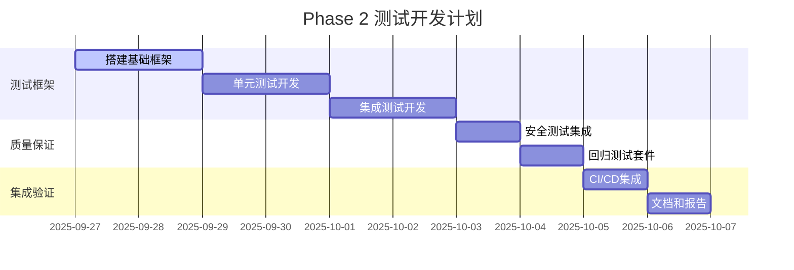

# Phase 2: 测试体系完善 - 需求文档

## 1. 文档概述

### 1.1 项目背景

在 Phase 1 完成核心功能增强后，Phase
2 专注于构建完整的测试体系，确保 Git 工作流管理、任务状态追踪和 MCP 工具的可靠性、性能和安全性。

### 1.2 阶段目标

建立全面的测试框架，覆盖单元测试、集成测试、端到端测试和安全测试，确保系统在本地开发环境下的稳定运行。

### 1.3 范围说明

- **包含**: 完整测试框架、自动化测试套件、安全扫描、质量门控
- **不包含**: 生产部署、监控系统、用户文档完善

## 2. 功能需求

### 2.1 Git 工作流测试框架

#### 2.1.1 Git 操作单元测试

**需求ID**: REQ-P2-001 **优先级**: 高
**描述**: 针对 Git 工作流管理模块的单元测试

**功能要求**:

- 测试分支创建、删除、切换的各种场景
- 验证代码提交和推送的正确性
- 测试 PR 创建和管理功能
- 模拟各种 Git 错误情况和恢复机制
- 验证分支命名规范和安全检查

**测试场景**:

- 正常流程测试: 创建分支 → 提交代码 → 推送 → 创建PR
- 异常情况测试: 网络中断、权限不足、冲突处理
- 边界条件测试: 长分支名、特殊字符、并发操作
- 回滚测试: 操作失败后的状态恢复

**验收标准**:

- [ ] 所有 Git 操作函数的单元测试覆盖率 >= 95%
- [ ] 模拟测试覆盖所有错误场景和恢复路径
- [ ] 测试执行时间 < 30秒
- [ ] 所有测试可在没有实际 Git 仓库的环境中运行
- [ ] 提供详细的测试报告和覆盖率分析

#### 2.1.2 Git 集成测试

**需求ID**: REQ-P2-002 **优先级**: 高 **描述**:
Git 工作流与实际 Git 仓库的集成测试

**功能要求**:

- 使用临时 Git 仓库进行真实的 Git 操作测试
- 测试与远程仓库的交互 (push, pull, PR 创建)
- 验证多用户协作场景
- 测试大文件和复杂提交历史的处理
- 验证与 GitHub CLI 的集成

**测试环境**:

- 本地临时 Git 仓库
- 模拟远程仓库 (使用 bare repository)
- GitHub 测试仓库 (需要 API 权限)
- 多种 Git 版本兼容性测试

**验收标准**:

- [ ] 真实 Git 操作测试覆盖所有核心功能
- [ ] 支持在 CI 环境中运行 (使用模拟远程)
- [ ] 测试清理机制完善，不留残余文件
- [ ] 兼容 Git 2.25+ 的所有版本

#### 2.1.3 分支生命周期测试

**需求ID**: REQ-P2-003 **优先级**: 中 **描述**: 完整分支生命周期的端到端测试

**功能要求**:

- 测试从任务创建到 PR 合并的完整流程
- 验证分支状态的正确维护和更新
- 测试并发分支创建和管理
- 验证分支清理和垃圾收集
- 测试异常中断后的状态恢复

**测试流程**:

1. 创建任务并生成功能分支
2. 模拟代码开发和提交
3. 推送分支到远程仓库
4. 创建 Pull Request
5. 模拟代码审查和合并
6. 清理本地和远程分支

**验收标准**:

- [ ] 完整生命周期测试运行时间 < 5分钟
- [ ] 支持并发测试 (最多10个并发分支)
- [ ] 异常恢复测试覆盖率 >= 80%
- [ ] 状态一致性验证通过所有检查点
- [ ] 提供生命周期可视化报告

### 2.2 MCP 工具集成测试

#### 2.2.1 MCP 工具单元测试

**需求ID**: REQ-P2-004 **优先级**: 高 **描述**: MCP 服务器中新增工具的单元测试

**功能要求**:

- 测试所有 Git 相关 MCP 工具 (codex.git.\*)
- 验证任务管理工具的增强功能
- 测试状态查询和监控工具
- 验证参数验证和错误处理
- 测试工具间的交互和依赖

**测试工具**:

- `codex.git.branch` - 分支管理工具测试
- `codex.git.commit` - 代码提交工具测试
- `codex.git.pr` - PR 管理工具测试
- `codex.task.create` - 增强任务创建测试
- `codex.queue.monitor` - 队列监控测试

**验收标准**:

- [ ] 每个 MCP 工具的单元测试覆盖率 >= 90%
- [ ] 参数验证测试覆盖所有边界条件
- [ ] 错误处理测试覆盖所有预期错误类型
- [ ] 工具响应时间测试 (< 500ms)
- [ ] 并发调用测试 (支持10个并发请求)

#### 2.2.2 MCP 协议兼容性测试

**需求ID**: REQ-P2-005 **优先级**: 中
**描述**: 验证 MCP 服务器与不同客户端的兼容性

**功能要求**:

- 测试与标准 MCP 客户端的协议兼容性
- 验证 JSON-RPC 消息格式的正确性
- 测试工具发现和调用机制
- 验证错误响应的标准化格式
- 测试大负载和长时间运行的稳定性

**兼容性矩阵**:

- Claude Code CLI (primary target)
- 标准 MCP 客户端实现
- 自定义测试客户端
- WebSocket 和 stdio 传输协议

**验收标准**:

- [ ] 通过所有 MCP 协议标准测试
- [ ] 与 Claude Code 的集成测试 100% 通过
- [ ] 消息格式验证无错误
- [ ] 支持协议版本向后兼容
- [ ] 长时间运行测试 (24小时) 无内存泄漏

#### 2.2.3 端到端集成测试

**需求ID**: REQ-P2-006 **优先级**: 高 **描述**: Claude Code 与 Codex
Father 的完整集成测试

**功能要求**:

- 模拟 Claude Code 的实际使用场景
- 测试完整的任务委托和执行流程
- 验证状态监控和进度查询
- 测试异常情况下的错误处理
- 验证日志和报告的生成

**测试场景**:

1. **简单任务执行**:
   - Claude Code 通过 MCP 创建简单开发任务
   - 验证任务执行和状态更新
   - 检查日志和输出文件

2. **Git 工作流任务**:
   - 创建带 Git 工作流的任务
   - 验证分支创建、代码提交、PR 创建
   - 检查任务与 Git 状态的同步

3. **并发任务处理**:
   - 同时提交多个任务
   - 验证队列管理和优先级处理
   - 测试资源竞争和锁机制

4. **错误恢复场景**:
   - 模拟网络中断、权限错误
   - 验证自动恢复和手动干预
   - 测试状态一致性保证

**验收标准**:

- [ ] 所有端到端场景测试通过率 >= 95%
- [ ] 错误恢复测试覆盖主要故障模式
- [ ] 状态一致性验证无失败
- [ ] 提供详细的集成测试报告

### 2.3 任务队列和状态管理测试

#### 2.3.1 队列管理测试

**需求ID**: REQ-P2-007 **优先级**: 高 **描述**: 任务队列管理系统的完整测试

**功能要求**:

- 测试任务入队、出队、优先级排序
- 验证并发控制和资源限制
- 测试队列持久化和恢复
- 验证任务超时和清理机制
- 测试队列状态监控和报告

**测试场景**:

- 基本队列操作 (FIFO, priority queue)
- 并发入队和出队操作
- 队列满载和过载处理
- 系统重启后的队列恢复
- 任务取消和强制终止

**验收标准**:

- [ ] 并发安全测试 (50个并发操作)
- [ ] 数据一致性测试无失败
- [ ] 内存使用测试 (< 50MB for 1000 tasks)
- [ ] 恢复测试覆盖各种中断场景

#### 2.3.2 状态一致性测试

**需求ID**: REQ-P2-008 **优先级**: 高 **描述**: 任务状态管理的一致性和可靠性测试

**功能要求**:

- 验证状态转换的原子性和一致性
- 测试多进程环境下的状态同步
- 验证状态持久化的可靠性
- 测试异常中断后的状态恢复
- 验证状态查询的实时性和准确性

**一致性检查**:

- 任务状态与 Git 分支状态同步
- 队列状态与实际运行任务匹配
- 文件系统状态与内存状态一致
- 并发修改的状态冲突检测

**验收标准**:

- [ ] 状态一致性检查 100% 通过
- [ ] 并发状态修改无竞争条件
- [ ] 异常恢复后状态完整性验证
- [ ] 状态查询延迟 < 100ms
- [ ] 长期运行状态准确性测试

#### 2.3.3 数据持久化测试

**需求ID**: REQ-P2-009 **优先级**: 中 **描述**: 任务和状态数据的持久化机制测试

**功能要求**:

- 测试 JSON 文件的读写性能和可靠性
- 验证数据备份和恢复机制
- 测试大量数据的存储和检索
- 验证数据完整性和校验机制
- 测试存储空间管理和清理

**数据完整性检查**:

- JSON 格式验证和 schema 校验
- 数据写入的原子性保证
- 文件损坏检测和恢复
- 历史数据的归档和清理

**验收标准**:

- [ ] 数据读写性能达到要求 (100 ops/sec)
- [ ] 数据完整性检查 100% 通过
- [ ] 备份恢复测试成功率 >= 99%
- [ ] 大数据量测试 (10000+ records) 稳定
- [ ] 存储空间使用优化验证

### 2.4 安全和兼容性测试

#### 2.4.1 安全漏洞扫描

**需求ID**: REQ-P2-013 **优先级**: 高 **描述**: 系统安全漏洞的自动化扫描和验证

**安全测试范围**:

- 输入验证和注入攻击防护
- 权限控制和访问限制测试
- 敏感信息泄漏检测
- 代码执行安全性验证
- 网络通信安全测试

**安全工具集成**:

- ShellCheck (Bash 脚本安全扫描)
- ESLint Security Plugin (TypeScript 安全检查)
- npm audit (依赖漏洞扫描)
- Git-secrets (敏感信息检测)
- SAST 静态分析工具

**验收标准**:

- [ ] 所有高危和中危安全漏洞修复
- [ ] 安全扫描集成到 CI 流程
- [ ] 敏感信息泄漏检测 100% 覆盖
- [ ] 权限控制测试通过率 100%
- [ ] 安全配置和最佳实践文档

#### 2.4.2 环境兼容性测试

**需求ID**: REQ-P2-014 **优先级**: 中 **描述**: 不同操作系统和环境下的兼容性测试

**兼容性测试矩阵**:

- **操作系统**: Ubuntu 20.04+, CentOS 8+, macOS 12+, Windows WSL2
- **Git 版本**: 2.25, 2.30, 2.35, 2.40+
- **Node.js 版本**: 18.x, 20.x, 22.x
- **Bash 版本**: 5.0+, 5.1+, 5.2+
- **GitHub CLI**: 2.0+, 2.20+, latest

**环境测试场景**:

- 基本功能在所有环境下的正确性
- 路径分隔符和编码兼容性
- 权限模型差异的处理
- 网络配置和代理支持
- 容器环境的特殊处理

**验收标准**:

- [ ] 核心功能在所有支持环境下工作
- [ ] 环境差异的自动检测和适配
- [ ] 不支持环境的明确错误提示
- [ ] 兼容性测试自动化执行
- [ ] 环境要求文档清晰准确

#### 2.4.3 回归测试套件

**需求ID**: REQ-P2-015 **优先级**: 高
**描述**: 自动化回归测试套件确保新功能不破坏现有功能

**回归测试覆盖**:

- 现有 CLI 功能的完整性
- MCP 服务器现有工具的兼容性
- 配置文件和参数的向后兼容
- 日志格式和输出的一致性

**自动化测试流程**:

- 每次提交触发快速回归测试
- 每日完整回归测试执行
- 版本发布前全量测试
- 性能回归自动检测和报警
- 测试结果的可视化和分析

**验收标准**:

- [ ] 回归测试覆盖率 >= 85%
- [ ] 测试执行时间 < 15分钟 (快速模式)
- [ ] 自动化测试成功率 >= 98%
- [ ] 回归问题的快速定位和修复
- [ ] 测试结果的历史趋势分析

## 3. 非功能需求

### 3.1 测试基础设施需求

#### 3.1.1 测试环境要求

- **本地开发环境**: 支持开发者本机快速测试
- **CI/CD 环境**: GitHub Actions 集成的自动化测试
- **容器测试环境**: Docker 和 DevContainer 支持

#### 3.1.2 测试工具和框架

- **单元测试**: BATS (Bash Automated Testing System)
- **集成测试**: 自定义测试框架 + Jest (TypeScript)
- **安全扫描**: ShellCheck + ESLint + npm audit

#### 3.1.3 测试数据管理

- **测试数据隔离**: 每个测试用例独立的数据环境
- **数据清理**: 测试后自动清理临时文件和仓库
- **测试一致性**: 可重现的测试环境和数据状态

### 3.2 质量保证需求

#### 3.2.1 覆盖率要求

- **代码覆盖率**: 核心模块 >= 90%, 总体 >= 80%
- **功能覆盖率**: 所有用户可见功能 100% 覆盖
- **路径覆盖率**: 关键路径和错误处理 >= 85%
- **回归覆盖率**: 现有功能 100% 回归测试

#### 3.2.2 质量门控

- **自动化门控**: 测试通过率 >= 95% 才能合并
- **性能门控**: 关键操作性能不得回归超过 20%
- **安全门控**: 不允许引入中高危安全漏洞
- **兼容性门控**: 核心功能在所有支持环境下工作

#### 3.2.3 测试报告要求

- **详细测试报告**: 包含覆盖率、性能、安全等维度
- **趋势分析**: 测试指标的历史趋势和变化分析
- **问题追踪**: 失败测试的详细信息和修复建议
- **可视化展示**: 测试结果的图表和仪表板

### 3.3 维护和演进需求

#### 3.3.1 测试维护

- **测试代码质量**: 测试代码也要遵循编码规范
- **测试文档**: 每个测试套件都有清晰的文档说明
- **测试更新**: 功能变更时同步更新测试用例
- **测试重构**: 定期重构和优化测试代码

#### 3.3.2 持续改进

- **测试效率**: 持续优化测试执行时间和资源使用
- **测试准确性**: 减少误报和漏报的测试结果
- **测试扩展**: 根据功能演进扩展测试覆盖范围
- **工具升级**: 跟进测试工具和框架的版本更新

## 4. 接口需求

### 4.1 测试框架接口

```bash
# 测试运行器接口
run_test_suite() {
    local suite_name="$1"
    local test_mode="$2"  # unit|integration|e2e|performance|security
    local environment="$3"  # local|ci|container
}

# 测试报告接口
generate_test_report() {
    local report_type="$1"  # coverage|performance|security|summary
    local output_format="$2"  # json|html|markdown
    local output_file="$3"
}

# 测试环境管理
setup_test_environment() {
    local test_type="$1"
    local isolation_level="$2"  # process|container|vm
}

cleanup_test_environment() {
    local test_session_id="$1"
    local cleanup_level="$2"  # minimal|standard|complete
}
```

### 4.2 测试数据接口

```typescript
// 测试用例数据结构
interface TestCase {
  id: string;
  name: string;
  description: string;
  category: 'unit' | 'integration' | 'e2e' | 'performance' | 'security';
  tags: string[];
  setup?: () => Promise<void>;
  execute: () => Promise<TestResult>;
  cleanup?: () => Promise<void>;
  timeout?: number;
  retries?: number;
}

// 测试结果数据结构
interface TestResult {
  testId: string;
  status: 'passed' | 'failed' | 'skipped' | 'error';
  duration: number;
  message?: string;
  error?: Error;
  artifacts?: {
    logs?: string[];
    screenshots?: string[];
    reports?: string[];
  };
  metrics?: {
    performance?: PerformanceMetrics;
    coverage?: CoverageMetrics;
    security?: SecurityMetrics;
  };
}
```

### 4.3 CI/CD 集成接口

```yaml
# GitHub Actions 测试流程接口
test_workflow:
  inputs:
    test_suite:
      description: 'Test suite to run'
      required: true
      type: choice
      options: ['unit', 'integration', 'e2e', 'performance', 'security', 'all']
    environment:
      description: 'Test environment'
      required: false
      default: 'ci'
      type: choice
      options: ['local', 'ci', 'container']
    parallel:
      description: 'Run tests in parallel'
      required: false
      default: true
      type: boolean

  outputs:
    test_result:
      description: 'Overall test result'
      value: ${{ steps.test.outputs.result }}
    coverage_report:
      description: 'Coverage report URL'
      value: ${{ steps.test.outputs.coverage_url }}
    performance_report:
      description: 'Performance report URL'
      value: ${{ steps.test.outputs.performance_url }}
```

## 5. 约束条件

### 5.1 技术约束

- **测试工具**: 必须使用开源且免费的测试工具
- **执行时间**: 完整测试套件执行时间 < 30分钟
- **资源使用**: 测试过程中内存使用 < 1GB
- **并发限制**: 最多同时运行 10 个并发测试进程

### 5.2 环境约束

- **网络依赖**: 测试应尽量减少外部网络依赖
- **权限要求**: 测试不应要求 root 或管理员权限
- **存储空间**: 测试临时文件总大小 < 100MB
- **兼容性**: 测试框架必须在所有支持的环境下工作

### 5.3 时间约束

- **开发周期**: Phase 2 开发周期 1 周
- **测试准备**: 测试环境搭建 <= 2天
- **测试开发**: 测试用例开发 <= 3天
- **集成调试**: 测试集成和调试 <= 2天

## 6. 验收标准

### 6.1 功能验收

- [ ] 所有测试套件正常运行并生成报告
- [ ] 测试覆盖率达到指定要求
- [ ] 安全扫描集成并无高危漏洞
- [ ] 兼容性测试在所有环境下通过

### 6.2 质量验收

- [ ] 测试代码通过代码审查
- [ ] 测试执行稳定性 >= 98%
- [ ] 测试报告清晰准确
- [ ] CI/CD 集成无故障
- [ ] 测试文档完整准确

### 6.3 执行时间验收

- [ ] 单元测试执行时间 < 5分钟
- [ ] 集成测试执行时间 < 15分钟
- [ ] 测试资源使用在约束范围内
- [ ] 并发测试无竞争条件

### 6.4 可维护性验收

- [ ] 测试代码结构清晰易懂
- [ ] 新增测试用例流程简单
- [ ] 测试失败原因容易定位
- [ ] 测试环境搭建自动化
- [ ] 测试数据管理规范

## 7. 风险评估

### 7.1 技术风险

- **测试工具兼容性**: 不同环境下测试工具行为差异
- **测试数据隔离**: 并发测试的数据冲突问题
- **安全扫描误报**: 安全工具的误报和漏报问题

### 7.2 进度风险

- **环境搭建复杂**: 多环境测试配置的复杂性
- **测试用例开发**: 复杂场景测试用例编写耗时
- **集成调试难度**: 测试框架集成的调试困难
- **文档编写时间**: 完整测试文档的编写工作量

### 7.3 资源风险

- **计算资源**: 并发测试的资源需求
- **存储资源**: 测试数据和报告的存储空间需求
- **网络资源**: 集成测试的网络带宽需求
- **人力资源**: 测试开发和维护的人力投入

## 8. 质量保证计划

### 8.1 测试阶段规划



### 8.2 质量检查点

1. **Day 2**: 测试框架搭建完成检查
2. **Day 4**: 单元测试覆盖率检查
3. **Day 6**: 集成测试功能完整性检查
4. **Day 7**: 性能和安全测试验证
5. **Day 8**: 整体质量验收和文档检查

### 8.3 持续改进机制

- **每日测试状态**: 跟踪测试开发进度和质量指标
- **问题快速响应**: 测试问题的快速诊断和解决
- **经验总结**: 测试开发过程中的经验和教训记录
- **最佳实践**: 建立测试开发的最佳实践指南

---

**文档版本**: v1.0 **创建日期**: 2025-09-26 **负责人**: Claude Code 集成项目组
**审批状态**: 待审批
