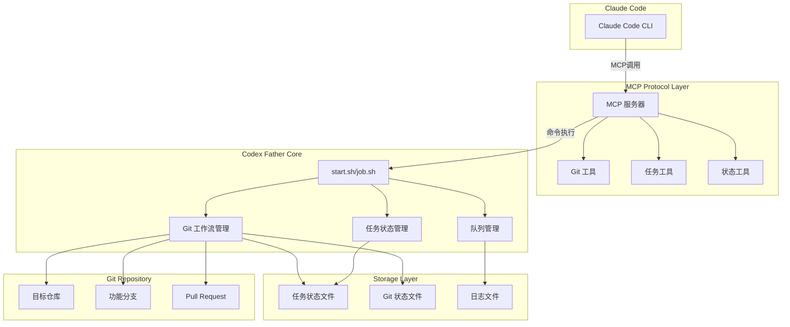
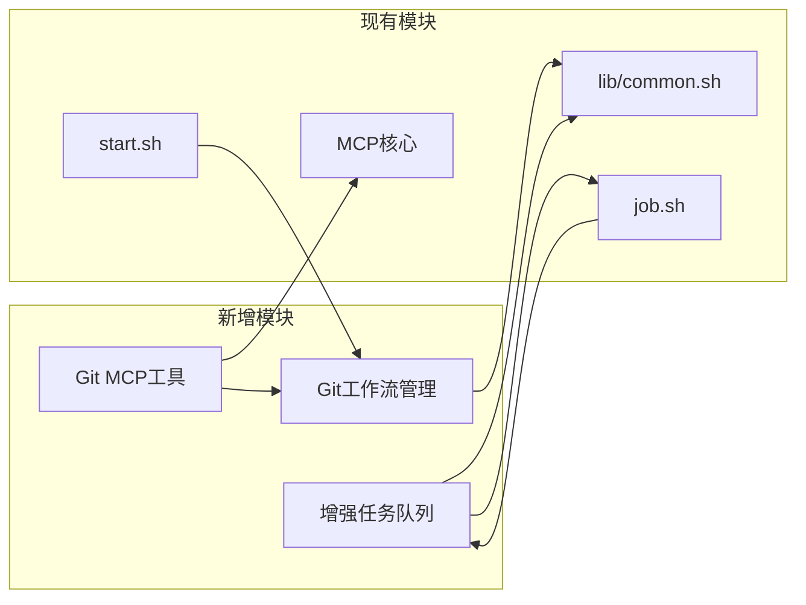
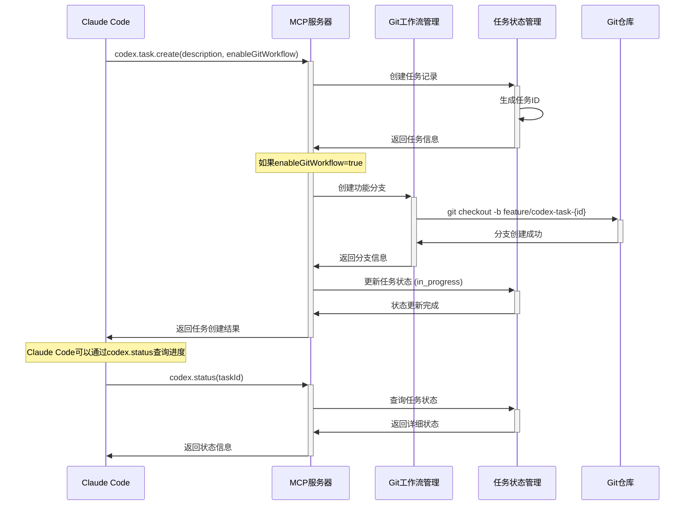

# Phase 1: 核心功能增强 - 设计文档

## 1. 设计概述

### 1.1 系统架构目标
本阶段设计的核心目标是在现有 Codex Father 架构基础上，新增 Git 工作流管理能力和增强的任务状态追踪系统，同时扩展 MCP 服务器功能以支持与 Claude Code 的深度集成。

### 1.2 设计原则
- **向后兼容**: 保持现有 CLI 和 MCP 接口的完全兼容性
- **模块化设计**: 新增功能以独立模块形式实现，便于测试和维护
- **错误恢复**: 所有 Git 操作支持失败回滚和状态一致性
- **安全优先**: 严格限制 Git 操作范围，防止意外修改

### 1.3 技术栈
- **核心**: Bash 5+ (现有脚本扩展)
- **MCP 服务器**: TypeScript + Node.js 18+
- **Git 集成**: 原生 Git 命令 + GitHub CLI
- **数据存储**: JSON 文件 (与现有格式兼容)
- **进程管理**: 现有 job.sh 机制扩展

## 2. 系统架构设计

### 2.1 整体架构图



### 2.2 模块依赖关系



### 2.3 数据流设计



## 3. 组件详细设计

### 3.1 Git 工作流管理模块 (lib/git_workflow.sh)

#### 3.1.1 核心函数设计

```bash
#!/bin/bash
# lib/git_workflow.sh - Git工作流管理模块

# 全局配置
readonly GWM_BRANCH_PREFIX="feature/codex-task"
readonly GWM_DEFAULT_BASE="main"
readonly GWM_STATE_DIR=".codex-father/git-state"

# 创建功能分支
# 参数: task_id, description, [base_branch]
# 返回: 0=成功, 1=失败, 2=分支已存在
create_feature_branch() {
    local task_id="$1"
    local description="$2"
    local base_branch="${3:-$GWM_DEFAULT_BASE}"
    local branch_name="${GWM_BRANCH_PREFIX}-${task_id}"

    # 验证仓库状态
    if ! git rev-parse --git-dir >/dev/null 2>&1; then
        log_error "当前目录不是Git仓库"
        return 1
    fi

    # 检查分支是否已存在
    if git rev-parse --verify "$branch_name" >/dev/null 2>&1; then
        log_warn "分支 $branch_name 已存在"
        return 2
    fi

    # 确保基础分支存在且是最新的
    if ! ensure_base_branch_updated "$base_branch"; then
        return 1
    fi

    # 创建并切换到功能分支
    if git checkout -b "$branch_name" "$base_branch"; then
        # 保存分支状态
        save_branch_state "$task_id" "$branch_name" "$base_branch" "$description"
        log_info "成功创建功能分支: $branch_name"
        return 0
    else
        log_error "创建分支失败: $branch_name"
        return 1
    fi
}

# 智能提交代码
# 参数: task_id, commit_message
commit_task_changes() {
    local task_id="$1"
    local commit_message="$2"
    local branch_name="${GWM_BRANCH_PREFIX}-${task_id}"

    # 验证当前分支
    local current_branch
    current_branch=$(git branch --show-current)
    if [[ "$current_branch" != "$branch_name" ]]; then
        log_error "当前分支 $current_branch 与任务分支 $branch_name 不匹配"
        return 1
    fi

    # 检查是否有变更
    if git diff --quiet && git diff --cached --quiet; then
        log_warn "没有检测到代码变更"
        return 2
    fi

    # 添加所有变更 (排除敏感文件)
    git add . || return 1

    # 生成标准化提交信息
    local formatted_message
    formatted_message=$(format_commit_message "$task_id" "$commit_message")

    # 提交变更
    if git commit -m "$formatted_message"; then
        update_branch_state "$task_id" "committed"
        log_info "代码提交成功: $formatted_message"
        return 0
    else
        log_error "代码提交失败"
        return 1
    fi
}

# 推送分支并创建PR
# 参数: task_id, pr_title, pr_description
push_and_create_pr() {
    local task_id="$1"
    local pr_title="$2"
    local pr_description="$3"
    local branch_name="${GWM_BRANCH_PREFIX}-${task_id}"

    # 推送分支到远程
    if ! git push origin "$branch_name"; then
        log_error "推送分支失败: $branch_name"
        return 1
    fi

    # 检查GitHub CLI可用性
    if ! command -v gh >/dev/null 2>&1; then
        log_error "GitHub CLI (gh) 未安装或不可用"
        return 1
    fi

    # 创建PR
    local pr_url
    if pr_url=$(gh pr create \
        --title "$pr_title" \
        --body "$pr_description" \
        --head "$branch_name" \
        --base "$(get_base_branch "$task_id")" \
        --draft); then

        # 保存PR信息
        update_branch_state "$task_id" "pr_created" "$pr_url"
        log_info "PR创建成功: $pr_url"
        echo "$pr_url"
        return 0
    else
        log_error "PR创建失败"
        return 1
    fi
}

# 清理功能分支
# 参数: task_id, [force]
cleanup_feature_branch() {
    local task_id="$1"
    local force="${2:-false}"
    local branch_name="${GWM_BRANCH_PREFIX}-${task_id}"

    # 检查分支状态
    local branch_state
    branch_state=$(get_branch_state "$task_id")
    if [[ "$branch_state" != "pr_created" && "$force" != "true" ]]; then
        log_error "分支状态不允许删除: $branch_state (使用force=true强制删除)"
        return 1
    fi

    # 切换到主分支
    local base_branch
    base_branch=$(get_base_branch "$task_id")
    git checkout "$base_branch" || return 1

    # 删除本地分支
    if git branch -D "$branch_name"; then
        log_info "本地分支删除成功: $branch_name"
    fi

    # 删除远程分支 (如果存在)
    if git ls-remote --exit-code origin "$branch_name" >/dev/null 2>&1; then
        if git push origin --delete "$branch_name"; then
            log_info "远程分支删除成功: $branch_name"
        fi
    fi

    # 清理状态文件
    remove_branch_state "$task_id"
    return 0
}
```

#### 3.1.2 状态管理设计

```bash
# 分支状态管理函数

# 保存分支状态
save_branch_state() {
    local task_id="$1"
    local branch_name="$2"
    local base_branch="$3"
    local description="$4"

    local state_file="${GWM_STATE_DIR}/${task_id}.json"
    mkdir -p "$GWM_STATE_DIR"

    cat > "$state_file" <<EOF
{
  "taskId": "$task_id",
  "branchName": "$branch_name",
  "baseBranch": "$base_branch",
  "description": "$description",
  "status": "created",
  "createdAt": "$(date -Iseconds)",
  "updatedAt": "$(date -Iseconds)",
  "commits": [],
  "prUrl": null
}
EOF
}

# 更新分支状态
update_branch_state() {
    local task_id="$1"
    local new_status="$2"
    local pr_url="${3:-null}"

    local state_file="${GWM_STATE_DIR}/${task_id}.json"
    if [[ ! -f "$state_file" ]]; then
        log_error "分支状态文件不存在: $state_file"
        return 1
    fi

    # 使用jq更新状态
    local temp_file
    temp_file=$(mktemp)
    jq --arg status "$new_status" \
       --arg updated "$(date -Iseconds)" \
       --arg pr_url "$pr_url" \
       '.status = $status | .updatedAt = $updated |
        if $pr_url != "null" then .prUrl = $pr_url else . end' \
       "$state_file" > "$temp_file" && mv "$temp_file" "$state_file"
}
```

### 3.2 增强任务状态管理 (lib/enhanced_task_manager.sh)

#### 3.2.1 任务状态模型

```bash
# 任务状态枚举
readonly TASK_STATUS_CREATED="created"
readonly TASK_STATUS_IN_PROGRESS="in_progress"
readonly TASK_STATUS_COMPLETED="completed"
readonly TASK_STATUS_FAILED="failed"
readonly TASK_STATUS_CANCELLED="cancelled"

# 任务状态转换矩阵
declare -A TASK_STATUS_TRANSITIONS=(
    ["created"]="in_progress cancelled"
    ["in_progress"]="completed failed cancelled"
    ["completed"]=""
    ["failed"]="in_progress cancelled"
    ["cancelled"]=""
)

# 验证状态转换
validate_status_transition() {
    local current_status="$1"
    local new_status="$2"

    local allowed_transitions="${TASK_STATUS_TRANSITIONS[$current_status]}"
    if [[ " $allowed_transitions " =~ " $new_status " ]]; then
        return 0
    else
        log_error "无效的状态转换: $current_status -> $new_status"
        return 1
    fi
}
```

#### 3.2.2 任务队列管理

```bash
# 任务队列配置
readonly TASK_QUEUE_DIR=".codex-father/queue"
readonly TASK_MAX_CONCURRENT=5
readonly TASK_TIMEOUT_SECONDS=7200  # 2小时

# 任务队列操作
enqueue_task() {
    local task_spec="$1"  # JSON格式的任务规格

    local task_id
    task_id=$(generate_task_id)

    local queue_file="${TASK_QUEUE_DIR}/pending.json"
    mkdir -p "$TASK_QUEUE_DIR"

    # 添加到队列
    if [[ -f "$queue_file" ]]; then
        jq --arg task_id "$task_id" \
           --argjson task_spec "$task_spec" \
           '.[$task_id] = ($task_spec | .id = $task_id | .queuedAt = now | .status = "queued")' \
           "$queue_file" > "${queue_file}.tmp" && mv "${queue_file}.tmp" "$queue_file"
    else
        echo '{}' | jq --arg task_id "$task_id" \
                       --argjson task_spec "$task_spec" \
                       '.[$task_id] = ($task_spec | .id = $task_id | .queuedAt = now | .status = "queued")' \
                       > "$queue_file"
    fi

    echo "$task_id"
}

# 获取队列状态
get_queue_status() {
    local queue_file="${TASK_QUEUE_DIR}/pending.json"
    local running_count=0
    local pending_count=0

    if [[ -f "$queue_file" ]]; then
        pending_count=$(jq 'length' "$queue_file")
    fi

    # 计算正在运行的任务数
    running_count=$(find "$TASK_QUEUE_DIR" -name "*.running" | wc -l)

    cat <<EOF
{
  "pending": $pending_count,
  "running": $running_count,
  "maxConcurrent": $TASK_MAX_CONCURRENT,
  "canAcceptNew": $((running_count < TASK_MAX_CONCURRENT))
}
EOF
}
```

### 3.3 MCP 服务器扩展 (mcp/codex-mcp-server/src/tools/)

#### 3.3.1 Git 工具实现 (git-tools.ts)

```typescript
// mcp/codex-mcp-server/src/tools/git-tools.ts

import { Tool } from '@modelcontextprotocol/sdk/types.js';
import { exec } from 'child_process';
import { promisify } from 'util';

const execAsync = promisify(exec);

export const gitBranchTool: Tool = {
  name: 'codex.git.branch',
  description: 'Git分支管理工具',
  inputSchema: {
    type: 'object',
    properties: {
      action: {
        type: 'string',
        enum: ['create', 'delete', 'list', 'status'],
        description: '操作类型'
      },
      taskId: {
        type: 'string',
        description: '任务ID（创建和删除时必需）'
      },
      baseBranch: {
        type: 'string',
        default: 'main',
        description: '基础分支名称'
      },
      description: {
        type: 'string',
        description: '分支描述'
      },
      force: {
        type: 'boolean',
        default: false,
        description: '强制删除分支'
      }
    },
    required: ['action']
  }
};

export async function handleGitBranch(args: any): Promise<any> {
  const { action, taskId, baseBranch = 'main', description, force = false } = args;

  try {
    switch (action) {
      case 'create':
        if (!taskId) {
          throw new Error('创建分支需要提供taskId');
        }
        return await createFeatureBranch(taskId, description || '', baseBranch);

      case 'delete':
        if (!taskId) {
          throw new Error('删除分支需要提供taskId');
        }
        return await deleteFeatureBranch(taskId, force);

      case 'list':
        return await listFeatureBranches();

      case 'status':
        if (!taskId) {
          throw new Error('查询状态需要提供taskId');
        }
        return await getBranchStatus(taskId);

      default:
        throw new Error(`未知的操作类型: ${action}`);
    }
  } catch (error) {
    return {
      success: false,
      error: error instanceof Error ? error.message : '未知错误',
      timestamp: new Date().toISOString()
    };
  }
}

async function createFeatureBranch(taskId: string, description: string, baseBranch: string) {
  const branchName = `feature/codex-task-${taskId}`;

  // 调用bash脚本
  const { stdout, stderr } = await execAsync(
    `bash -c 'source lib/git_workflow.sh && create_feature_branch "${taskId}" "${description}" "${baseBranch}"'`
  );

  if (stderr && !stderr.includes('Switched to a new branch')) {
    throw new Error(`分支创建失败: ${stderr}`);
  }

  return {
    success: true,
    branchName,
    baseBranch,
    taskId,
    timestamp: new Date().toISOString(),
    message: `成功创建功能分支: ${branchName}`
  };
}

async function deleteFeatureBranch(taskId: string, force: boolean) {
  const { stdout, stderr } = await execAsync(
    `bash -c 'source lib/git_workflow.sh && cleanup_feature_branch "${taskId}" "${force}"'`
  );

  if (stderr) {
    throw new Error(`分支删除失败: ${stderr}`);
  }

  return {
    success: true,
    taskId,
    force,
    timestamp: new Date().toISOString(),
    message: `成功删除任务分支: ${taskId}`
  };
}
```

#### 3.3.2 增强任务工具 (enhanced-task-tools.ts)

```typescript
// mcp/codex-mcp-server/src/tools/enhanced-task-tools.ts

export const taskCreateTool: Tool = {
  name: 'codex.task.create',
  description: '创建带Git工作流的任务',
  inputSchema: {
    type: 'object',
    properties: {
      description: {
        type: 'string',
        description: '任务描述'
      },
      enableGitWorkflow: {
        type: 'boolean',
        default: false,
        description: '是否启用Git工作流'
      },
      baseBranch: {
        type: 'string',
        default: 'main',
        description: '基础分支'
      },
      autoCreatePR: {
        type: 'boolean',
        default: true,
        description: '完成后自动创建PR'
      },
      args: {
        type: 'array',
        items: { type: 'string' },
        description: '传递给codex的参数'
      },
      priority: {
        type: 'string',
        enum: ['low', 'normal', 'high'],
        default: 'normal',
        description: '任务优先级'
      }
    },
    required: ['description']
  }
};

export async function handleTaskCreate(args: any): Promise<any> {
  const {
    description,
    enableGitWorkflow = false,
    baseBranch = 'main',
    autoCreatePR = true,
    args: codexArgs = [],
    priority = 'normal'
  } = args;

  try {
    // 生成任务ID
    const taskId = generateTaskId();

    // 检查队列容量
    const queueStatus = await getQueueStatus();
    if (!queueStatus.canAcceptNew) {
      return {
        success: false,
        error: '任务队列已满，请稍后重试',
        queueStatus
      };
    }

    // 构建任务规格
    const taskSpec = {
      id: taskId,
      description,
      priority,
      gitWorkflow: {
        enabled: enableGitWorkflow,
        baseBranch,
        autoCreatePR,
        branchName: enableGitWorkflow ? `feature/codex-task-${taskId}` : null
      },
      execution: {
        args: [...codexArgs, '--task', description],
        sessionDir: `.codex-father/sessions/${taskId}`,
        status: 'created'
      },
      createdAt: new Date().toISOString()
    };

    // 如果启用Git工作流，先创建分支
    if (enableGitWorkflow) {
      const branchResult = await handleGitBranch({
        action: 'create',
        taskId,
        description,
        baseBranch
      });

      if (!branchResult.success) {
        throw new Error(`Git分支创建失败: ${branchResult.error}`);
      }

      taskSpec.gitWorkflow.branchName = branchResult.branchName;
    }

    // 将任务加入队列
    const queuedTaskId = await enqueueTask(taskSpec);

    // 保存任务状态
    await saveTaskState(taskId, taskSpec);

    return {
      success: true,
      taskId,
      gitWorkflow: taskSpec.gitWorkflow,
      queuePosition: await getQueuePosition(taskId),
      estimatedStartTime: await estimateStartTime(taskId),
      timestamp: new Date().toISOString()
    };

  } catch (error) {
    return {
      success: false,
      error: error instanceof Error ? error.message : '任务创建失败',
      timestamp: new Date().toISOString()
    };
  }
}
```

## 4. 数据模型设计

### 4.1 任务状态数据模型

```json
{
  "$schema": "http://json-schema.org/draft-07/schema#",
  "title": "TaskState",
  "type": "object",
  "properties": {
    "id": {
      "type": "string",
      "pattern": "^task-[0-9]{14}-[a-f0-9]{8}$",
      "description": "任务唯一标识符"
    },
    "description": {
      "type": "string",
      "maxLength": 500,
      "description": "任务描述"
    },
    "status": {
      "type": "string",
      "enum": ["created", "in_progress", "completed", "failed", "cancelled"]
    },
    "priority": {
      "type": "string",
      "enum": ["low", "normal", "high"],
      "default": "normal"
    },
    "gitWorkflow": {
      "type": "object",
      "properties": {
        "enabled": { "type": "boolean" },
        "branchName": { "type": ["string", "null"] },
        "baseBranch": { "type": "string", "default": "main" },
        "prUrl": { "type": ["string", "null"] },
        "autoCreatePR": { "type": "boolean", "default": true },
        "commits": {
          "type": "array",
          "items": {
            "type": "object",
            "properties": {
              "hash": { "type": "string" },
              "message": { "type": "string" },
              "timestamp": { "type": "string", "format": "date-time" }
            }
          }
        }
      },
      "required": ["enabled"]
    },
    "execution": {
      "type": "object",
      "properties": {
        "args": {
          "type": "array",
          "items": { "type": "string" }
        },
        "sessionDir": { "type": "string" },
        "logFile": { "type": "string" },
        "pid": { "type": ["number", "null"] },
        "exitCode": { "type": ["number", "null"] },
        "startedAt": { "type": ["string", "null"], "format": "date-time" },
        "completedAt": { "type": ["string", "null"], "format": "date-time" }
      }
    },
    "timestamps": {
      "type": "object",
      "properties": {
        "createdAt": { "type": "string", "format": "date-time" },
        "updatedAt": { "type": "string", "format": "date-time" },
        "queuedAt": { "type": ["string", "null"], "format": "date-time" },
        "startedAt": { "type": ["string", "null"], "format": "date-time" },
        "completedAt": { "type": ["string", "null"], "format": "date-time" }
      },
      "required": ["createdAt", "updatedAt"]
    }
  },
  "required": ["id", "description", "status", "gitWorkflow", "execution", "timestamps"]
}
```

### 4.2 Git分支状态数据模型

```json
{
  "$schema": "http://json-schema.org/draft-07/schema#",
  "title": "GitBranchState",
  "type": "object",
  "properties": {
    "taskId": {
      "type": "string",
      "description": "关联的任务ID"
    },
    "branchName": {
      "type": "string",
      "pattern": "^feature/codex-task-[0-9]{14}-[a-f0-9]{8}$"
    },
    "baseBranch": {
      "type": "string",
      "default": "main"
    },
    "status": {
      "type": "string",
      "enum": ["created", "committed", "pushed", "pr_created", "merged", "deleted"]
    },
    "commits": {
      "type": "array",
      "items": {
        "type": "object",
        "properties": {
          "hash": { "type": "string" },
          "message": { "type": "string" },
          "author": { "type": "string" },
          "timestamp": { "type": "string", "format": "date-time" }
        }
      }
    },
    "prInfo": {
      "type": ["object", "null"],
      "properties": {
        "url": { "type": "string", "format": "uri" },
        "number": { "type": "number" },
        "title": { "type": "string" },
        "status": { "type": "string", "enum": ["draft", "open", "merged", "closed"] }
      }
    },
    "timestamps": {
      "type": "object",
      "properties": {
        "createdAt": { "type": "string", "format": "date-time" },
        "updatedAt": { "type": "string", "format": "date-time" },
        "lastCommitAt": { "type": ["string", "null"], "format": "date-time" },
        "prCreatedAt": { "type": ["string", "null"], "format": "date-time" }
      }
    }
  },
  "required": ["taskId", "branchName", "baseBranch", "status", "timestamps"]
}
```

## 5. 接口设计

### 5.1 MCP 工具接口规范

#### 5.1.1 Git操作工具接口

```typescript
// codex.git.branch - 分支管理
interface GitBranchRequest {
  action: 'create' | 'delete' | 'list' | 'status';
  taskId?: string;
  baseBranch?: string;
  description?: string;
  force?: boolean;
}

interface GitBranchResponse {
  success: boolean;
  branchName?: string;
  taskId?: string;
  branches?: string[];
  status?: GitBranchState;
  error?: string;
  timestamp: string;
}

// codex.git.commit - 代码提交
interface GitCommitRequest {
  taskId: string;
  message: string;
  files?: string[];  // 可选：指定要提交的文件
}

interface GitCommitResponse {
  success: boolean;
  commitHash?: string;
  filesChanged?: number;
  error?: string;
  timestamp: string;
}

// codex.git.pr - PR管理
interface GitPRRequest {
  taskId: string;
  title: string;
  description?: string;
  draft?: boolean;
  reviewers?: string[];
  labels?: string[];
}

interface GitPRResponse {
  success: boolean;
  prUrl?: string;
  prNumber?: number;
  error?: string;
  timestamp: string;
}
```

#### 5.1.2 增强任务管理接口

```typescript
// codex.task.create - 创建任务
interface TaskCreateRequest {
  description: string;
  enableGitWorkflow?: boolean;
  baseBranch?: string;
  autoCreatePR?: boolean;
  args?: string[];
  priority?: 'low' | 'normal' | 'high';
  timeout?: number;
}

interface TaskCreateResponse {
  success: boolean;
  taskId?: string;
  gitWorkflow?: {
    enabled: boolean;
    branchName?: string;
    baseBranch: string;
  };
  queuePosition?: number;
  estimatedStartTime?: string;
  error?: string;
  timestamp: string;
}

// codex.queue.monitor - 队列监控
interface QueueMonitorRequest {
  showDetails?: boolean;
  filter?: {
    status?: string[];
    priority?: string[];
  };
}

interface QueueMonitorResponse {
  success: boolean;
  summary: {
    pending: number;
    running: number;
    completed: number;
    failed: number;
    maxConcurrent: number;
  };
  tasks?: TaskState[];
  error?: string;
  timestamp: string;
}
```

### 5.2 内部模块接口

#### 5.2.1 Git工作流模块接口

```bash
# lib/git_workflow.sh 导出函数

# 创建功能分支
# 返回: 0=成功, 1=失败, 2=分支已存在
create_feature_branch() # (task_id, description, [base_branch])

# 提交代码变更
# 返回: 0=成功, 1=失败, 2=无变更
commit_task_changes() # (task_id, commit_message)

# 推送并创建PR
# 返回: 0=成功, 1=失败, 输出PR URL到stdout
push_and_create_pr() # (task_id, pr_title, pr_description)

# 清理功能分支
# 返回: 0=成功, 1=失败
cleanup_feature_branch() # (task_id, [force])

# 状态查询函数
get_branch_state() # (task_id) -> JSON
get_branch_commits() # (task_id) -> JSON数组
is_branch_clean() # (task_id) -> 0|1
```

#### 5.2.2 任务状态管理接口

```bash
# lib/enhanced_task_manager.sh 导出函数

# 任务状态管理
create_task_state() # (task_id, initial_state_json)
update_task_status() # (task_id, new_status, [metadata])
get_task_state() # (task_id) -> JSON
delete_task_state() # (task_id)

# 队列管理
enqueue_task() # (task_spec_json) -> task_id
dequeue_task() # () -> task_id | null
get_queue_status() # () -> JSON
get_queue_position() # (task_id) -> number

# 状态验证
validate_status_transition() # (current_status, new_status) -> 0|1
is_valid_task_id() # (task_id) -> 0|1
```

## 6. 安全设计

### 6.1 Git操作安全

```bash
# Git操作安全检查函数
validate_git_operation() {
    local operation="$1"
    local target="$2"

    # 检查是否在Git仓库中
    if ! git rev-parse --git-dir >/dev/null 2>&1; then
        log_error "安全检查失败: 不在Git仓库中"
        return 1
    fi

    # 检查仓库是否在允许的目录中
    local repo_root
    repo_root=$(git rev-parse --show-toplevel)
    if ! is_allowed_repository "$repo_root"; then
        log_error "安全检查失败: 仓库不在允许列表中"
        return 1
    fi

    # 检查分支名称格式
    case "$operation" in
        "create_branch"|"delete_branch")
            if [[ ! "$target" =~ ^feature/codex-task-[0-9]{14}-[a-f0-9]{8}$ ]]; then
                log_error "安全检查失败: 无效的分支名称格式"
                return 1
            fi
            ;;
    esac

    return 0
}

# 仓库白名单检查
is_allowed_repository() {
    local repo_path="$1"
    local allowed_patterns=(
        "*/codex-father"
        "*/codex-*"
        "$(pwd)"  # 当前工作目录
    )

    for pattern in "${allowed_patterns[@]}"; do
        if [[ "$repo_path" == $pattern ]]; then
            return 0
        fi
    done

    return 1
}
```

### 6.2 权限控制

```bash
# 权限检查配置
readonly REQUIRED_PERMISSIONS=(
    "git"     # Git命令可用性
    "gh"      # GitHub CLI可用性
    "write"   # 当前目录写权限
    "network" # 网络访问权限
)

# 权限验证函数
check_required_permissions() {
    local missing_permissions=()

    # 检查Git可用性
    if ! command -v git >/dev/null 2>&1; then
        missing_permissions+=("git")
    fi

    # 检查GitHub CLI
    if ! command -v gh >/dev/null 2>&1; then
        missing_permissions+=("gh")
    fi

    # 检查写权限
    if ! [[ -w "$(pwd)" ]]; then
        missing_permissions+=("write")
    fi

    # 检查网络权限 (通过ping测试)
    if ! ping -c 1 github.com >/dev/null 2>&1; then
        missing_permissions+=("network")
    fi

    if [[ ${#missing_permissions[@]} -gt 0 ]]; then
        log_error "缺少必需权限: ${missing_permissions[*]}"
        return 1
    fi

    return 0
}
```

### 6.3 敏感信息保护

```bash
# 敏感信息脱敏
readonly SENSITIVE_PATTERNS=(
    "ghp_[a-zA-Z0-9]{36}"           # GitHub Personal Access Token
    "ghs_[a-zA-Z0-9]{36}"           # GitHub App Token
    "github_pat_[a-zA-Z0-9_]{82}"   # GitHub Fine-grained Token
    "sk-[a-zA-Z0-9]{48}"            # OpenAI API Key
    "xoxb-[0-9]{12}-[0-9]{12}-[a-zA-Z0-9]{24}" # Slack Bot Token
)

# 脱敏函数
sanitize_output() {
    local input="$1"
    local output="$input"

    for pattern in "${SENSITIVE_PATTERNS[@]}"; do
        output=$(echo "$output" | sed -E "s/$pattern/[REDACTED]/g")
    done

    echo "$output"
}

# Git提交信息安全检查
validate_commit_message() {
    local message="$1"

    # 检查是否包含敏感信息
    for pattern in "${SENSITIVE_PATTERNS[@]}"; do
        if [[ "$message" =~ $pattern ]]; then
            log_error "提交信息包含敏感信息，拒绝提交"
            return 1
        fi
    done

    return 0
}
```

## 7. 错误处理设计

### 8.1 错误分类和恢复策略

```bash
# 错误类型定义
readonly ERROR_TYPE_VALIDATION=1
readonly ERROR_TYPE_PERMISSION=2
readonly ERROR_TYPE_NETWORK=3
readonly ERROR_TYPE_GIT=4
readonly ERROR_TYPE_SYSTEM=5

# 错误恢复策略
handle_error() {
    local error_type="$1"
    local error_message="$2"
    local context="$3"

    case "$error_type" in
        $ERROR_TYPE_VALIDATION)
            log_error "参数验证失败: $error_message"
            return 1
            ;;
        $ERROR_TYPE_PERMISSION)
            log_error "权限不足: $error_message"
            suggest_permission_fix "$context"
            return 2
            ;;
        $ERROR_TYPE_NETWORK)
            log_warn "网络错误: $error_message"
            if retry_with_backoff "$context"; then
                return 0
            else
                return 3
            fi
            ;;
        $ERROR_TYPE_GIT)
            log_error "Git操作失败: $error_message"
            if attempt_git_recovery "$context"; then
                return 0
            else
                return 4
            fi
            ;;
        $ERROR_TYPE_SYSTEM)
            log_error "系统错误: $error_message"
            return 5
            ;;
    esac
}

# Git操作恢复
attempt_git_recovery() {
    local context="$1"

    # 尝试重置到clean状态
    if git status --porcelain | grep -q .; then
        log_info "检测到未提交的更改，尝试恢复..."
        git stash push -m "codex-father-auto-stash-$(date +%s)"
    fi

    # 尝试切换到安全分支
    local current_branch
    current_branch=$(git branch --show-current)
    if [[ "$current_branch" =~ ^feature/codex-task- ]]; then
        git checkout main || git checkout master
    fi

    return 0
}
```

## 9. 部署和配置

### 9.1 模块集成配置

```bash
# .codex-father/config/git-workflow.conf
GIT_WORKFLOW_ENABLED=true
GIT_WORKFLOW_BASE_BRANCH=main
GIT_WORKFLOW_AUTO_CREATE_PR=true
GIT_WORKFLOW_BRANCH_PREFIX="feature/codex-task"
GIT_WORKFLOW_CLEANUP_MERGED=true

# .codex-father/config/task-queue.conf
TASK_QUEUE_MAX_CONCURRENT=5
TASK_QUEUE_TIMEOUT_SECONDS=7200
TASK_QUEUE_RETRY_FAILED=true
TASK_QUEUE_PRIORITY_ENABLED=true
```

### 9.2 环境检查脚本

```bash
#!/bin/bash
# scripts/check-phase1-requirements.sh

check_phase1_requirements() {
    local errors=()

    # 检查Git版本
    if ! command -v git >/dev/null 2>&1; then
        errors+=("Git未安装")
    else
        local git_version
        git_version=$(git --version | grep -oE '[0-9]+\.[0-9]+\.[0-9]+' | head -1)
        if ! version_gte "$git_version" "2.25.0"; then
            errors+=("Git版本过低，需要>=2.25.0，当前版本: $git_version")
        fi
    fi

    # 检查GitHub CLI
    if ! command -v gh >/dev/null 2>&1; then
        errors+=("GitHub CLI (gh)未安装")
    fi

    # 检查jq
    if ! command -v jq >/dev/null 2>&1; then
        errors+=("jq未安装，用于JSON处理")
    fi

    # 检查Node.js (MCP服务器需要)
    if ! command -v node >/dev/null 2>&1; then
        errors+=("Node.js未安装")
    else
        local node_version
        node_version=$(node --version | sed 's/v//')
        if ! version_gte "$node_version" "18.0.0"; then
            errors+=("Node.js版本过低，需要>=18.0.0，当前版本: $node_version")
        fi
    fi

    if [[ ${#errors[@]} -gt 0 ]]; then
        echo "Phase 1环境检查失败:"
        printf "  - %s\n" "${errors[@]}"
        return 1
    else
        echo "Phase 1环境检查通过 ✓"
        return 0
    fi
}

check_phase1_requirements
```

---

**文档版本**: v1.0
**创建日期**: 2025-09-26
**负责人**: Claude Code 集成项目组
**审批状态**: 待审批