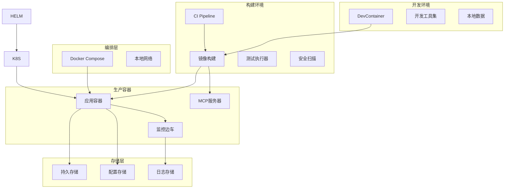
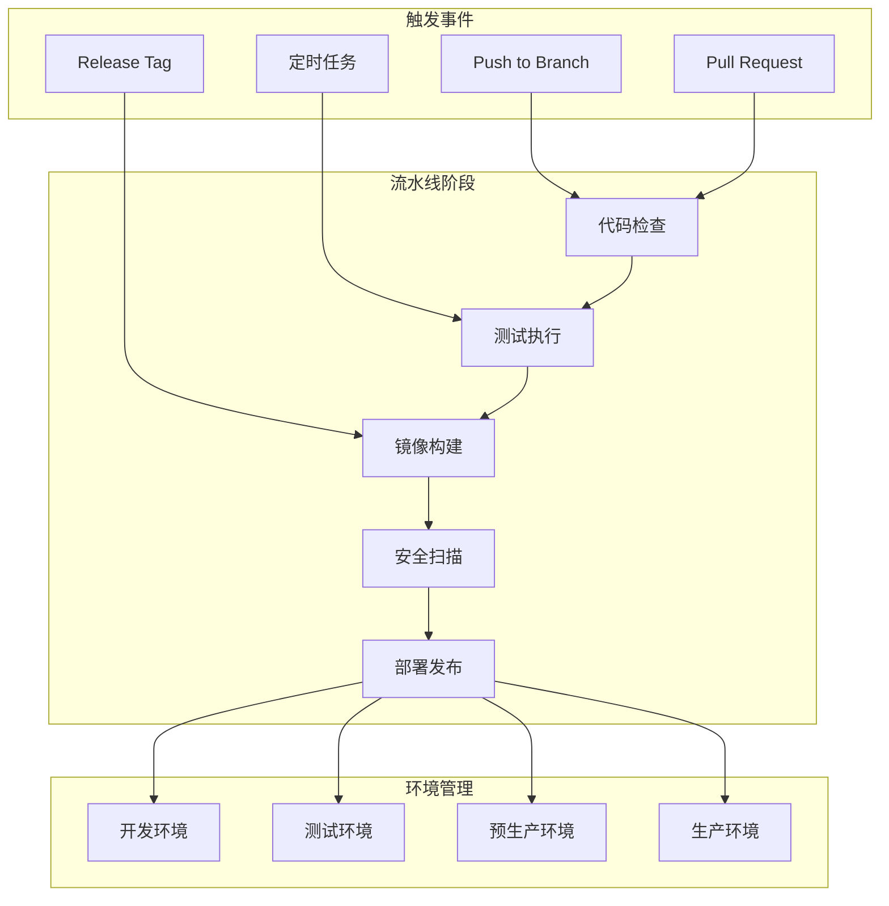
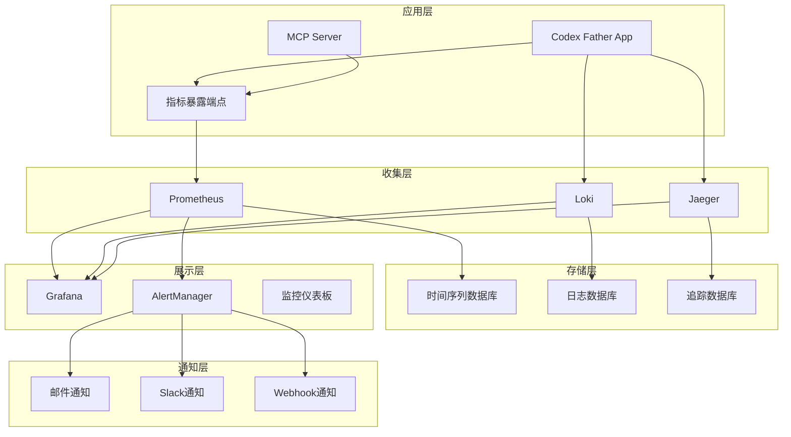
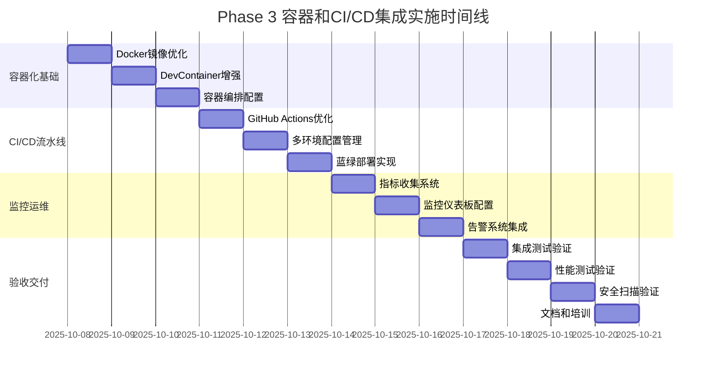

# Phase 3: 容器和CI/CD集成 - 设计文档

## 1. 设计概述

### 1.1 架构设计目标

构建本地容器化部署体系，实现开发、测试环境的一致性，建立高效的 CI/CD 流水线和完善的本地监控运维体系，确保系统的稳定性、可维护性和易用性。

### 1.2 设计原则

- **本地优先**: 容器化、本地自动化运维、开发友好
- **环境一致性**: 开发、测试环境配置和行为一致
- **自动化优先**: 最大化自动化程度，减少人工干预
- **可观测性**: 全面的监控、日志、追踪和告警体系
- **安全内建**: 安全措施内嵌到设计和实现的每个环节

### 1.3 技术栈选型

- **容器化**: Docker + Docker Compose
- **CI/CD**: GitHub Actions + 自定义流水线工具
- **监控**: Prometheus + Grafana + 自定义指标收集
- **日志**: 结构化日志 + 集中化收集和分析
- **配置管理**: 环境变量 + Docker Secrets + 配置文件

## 2. 容器化架构设计

### 2.1 整体容器架构



### 2.2 容器镜像设计

#### 2.2.1 多阶段构建 Dockerfile

```dockerfile
# Build stage
FROM node:18-alpine AS builder

WORKDIR /build

# 复制依赖文件
COPY mcp/codex-mcp-server/package*.json ./
COPY mcp/codex-mcp-server/tsconfig.json ./

# 安装依赖
RUN npm ci --only=production && \
    npm cache clean --force

# 复制源码
COPY mcp/codex-mcp-server/src ./src

# 构建应用
RUN npm run build

# Runtime stage
FROM ubuntu:22.04 AS runtime

# 设置非 root 用户
RUN groupadd -r codex && useradd -r -g codex codex

# 安装运行时依赖
RUN apt-get update && \
    apt-get install -y --no-install-recommends \
        bash \
        git \
        curl \
        jq \
        bc \
        ca-certificates \
    && rm -rf /var/lib/apt/lists/*

# 安装 Node.js
COPY --from=builder /usr/local/bin/node /usr/local/bin/
COPY --from=builder /usr/local/lib/node_modules /usr/local/lib/node_modules
RUN ln -s /usr/local/lib/node_modules/npm/bin/npm-cli.js /usr/local/bin/npm

# 安装 GitHub CLI
RUN curl -fsSL https://cli.github.com/packages/githubcli-archive-keyring.gpg | \
    gpg --dearmor -o /usr/share/keyrings/githubcli-archive-keyring.gpg && \
    echo "deb [arch=$(dpkg --print-architecture) signed-by=/usr/share/keyrings/githubcli-archive-keyring.gpg] https://cli.github.com/packages stable main" | \
    tee /etc/apt/sources.list.d/github-cli.list > /dev/null && \
    apt-get update && \
    apt-get install -y gh && \
    rm -rf /var/lib/apt/lists/*

# 创建应用目录
WORKDIR /app

# 复制应用文件
COPY --from=builder /build/dist ./mcp/dist
COPY --from=builder /build/node_modules ./mcp/node_modules
COPY --from=builder /build/package.json ./mcp/

# 复制脚本文件
COPY start.sh job.sh ./
COPY lib/ ./lib/
COPY scripts/ ./scripts/

# 复制配置和健康检查脚本
COPY docker/entrypoint.sh ./
COPY docker/health-check.sh ./
COPY docker/config/ ./config/

# 设置权限
RUN chmod +x *.sh scripts/*.sh && \
    chown -R codex:codex /app

# 创建数据目录
RUN mkdir -p /app/data /app/logs /app/.codex-father && \
    chown -R codex:codex /app/data /app/logs /app/.codex-father

# 切换到非 root 用户
USER codex

# 设置环境变量
ENV CODEX_HOME="/app/.codex-father"
ENV CODEX_LOG_LEVEL="info"
ENV CODEX_SESSIONS_ROOT="/app/.codex-father/sessions"
ENV NODE_ENV="production"

# 暴露端口
EXPOSE 3000

# 健康检查
HEALTHCHECK --interval=30s --timeout=10s --start-period=30s --retries=3 \
    CMD /app/health-check.sh

# 数据卷
VOLUME ["/app/data", "/app/logs"]

# 启动命令
ENTRYPOINT ["/app/entrypoint.sh"]
CMD ["start"]
```

#### 2.2.2 健康检查脚本设计

```bash
#!/bin/bash
# docker/health-check.sh - 容器健康检查

set -euo pipefail

# 配置
readonly HEALTH_CHECK_TIMEOUT=5
readonly MCP_SERVER_PORT="${MCP_SERVER_PORT:-3000}"

# 日志函数
log() {
    echo "[$(date -Iseconds)] HEALTH_CHECK: $*" >&2
}

# 检查 MCP 服务器
check_mcp_server() {
    log "检查 MCP 服务器状态"

    # 检查进程是否运行
    if ! pgrep -f "node.*mcp.*index.js" >/dev/null; then
        log "ERROR: MCP 服务器进程未运行"
        return 1
    fi

    # 检查端口是否监听
    if ! netstat -ln | grep ":${MCP_SERVER_PORT}" >/dev/null 2>&1; then
        log "ERROR: MCP 服务器端口 $MCP_SERVER_PORT 未监听"
        return 1
    fi

    log "MCP 服务器状态正常"
    return 0
}

# 检查文件系统
check_filesystem() {
    log "检查文件系统状态"

    local required_dirs=(
        "$CODEX_HOME"
        "$CODEX_SESSIONS_ROOT"
        "/app/data"
        "/app/logs"
    )

    for dir in "${required_dirs[@]}"; do
        if [[ ! -d "$dir" ]]; then
            log "ERROR: 必需目录不存在: $dir"
            return 1
        fi

        if [[ ! -w "$dir" ]]; then
            log "ERROR: 目录不可写: $dir"
            return 1
        fi
    done

    # 检查磁盘空间
    local available_space
    available_space=$(df /app | awk 'NR==2 {print $4}')
    local min_space=1048576  # 1GB in KB

    if [[ $available_space -lt $min_space ]]; then
        log "ERROR: 磁盘空间不足: ${available_space}KB 可用"
        return 1
    fi

    log "文件系统状态正常"
    return 0
}

# 检查 Git 配置
check_git() {
    log "检查 Git 配置"

    if ! command -v git >/dev/null; then
        log "ERROR: Git 命令不可用"
        return 1
    fi

    # 检查 Git 版本
    local git_version
    git_version=$(git --version | grep -oE '[0-9]+\.[0-9]+\.[0-9]+' | head -1)
    log "Git 版本: $git_version"

    # 检查基本配置
    if [[ -z "${GIT_USER_NAME:-}" ]] || [[ -z "${GIT_USER_EMAIL:-}" ]]; then
        log "WARN: Git 用户配置未设置"
    fi

    log "Git 配置正常"
    return 0
}

# 检查依赖工具
check_dependencies() {
    log "检查依赖工具"

    local required_tools=(
        "jq"
        "bc"
        "curl"
    )

    for tool in "${required_tools[@]}"; do
        if ! command -v "$tool" >/dev/null; then
            log "ERROR: 必需工具未安装: $tool"
            return 1
        fi
    done

    # 检查 GitHub CLI
    if command -v gh >/dev/null; then
        log "GitHub CLI 可用"
    else
        log "WARN: GitHub CLI 不可用"
    fi

    log "依赖工具检查完成"
    return 0
}

# 主健康检查函数
main() {
    log "开始容器健康检查"

    local checks=(
        "check_filesystem"
        "check_dependencies"
        "check_git"
        "check_mcp_server"
    )

    local failed_checks=()

    for check in "${checks[@]}"; do
        if ! timeout "$HEALTH_CHECK_TIMEOUT" "$check"; then
            failed_checks+=("$check")
        fi
    done

    if [[ ${#failed_checks[@]} -eq 0 ]]; then
        log "健康检查通过 ✓"
        exit 0
    else
        log "健康检查失败: ${failed_checks[*]}"
        exit 1
    fi
}

# 捕获信号
trap 'log "健康检查被中断"; exit 1' INT TERM

# 执行健康检查
main "$@"
```

#### 2.2.3 容器启动脚本设计

```bash
#!/bin/bash
# docker/entrypoint.sh - 容器启动脚本

set -euo pipefail

# 配置
readonly ENTRYPOINT_LOG_FILE="/app/logs/entrypoint.log"

# 日志函数
log() {
    local message="[$(date -Iseconds)] ENTRYPOINT: $*"
    echo "$message" | tee -a "$ENTRYPOINT_LOG_FILE"
}

# 初始化日志目录
init_logging() {
    mkdir -p "$(dirname "$ENTRYPOINT_LOG_FILE")"
    touch "$ENTRYPOINT_LOG_FILE"
    log "容器启动开始"
}

# 环境变量验证
validate_environment() {
    log "验证环境变量"

    # 必需的环境变量
    local required_vars=(
        "CODEX_HOME"
        "CODEX_SESSIONS_ROOT"
    )

    for var in "${required_vars[@]}"; do
        if [[ -z "${!var:-}" ]]; then
            log "ERROR: 必需的环境变量未设置: $var"
            exit 1
        fi
    done

    # 设置默认值
    export CODEX_LOG_LEVEL="${CODEX_LOG_LEVEL:-info}"
    export CODEX_MAX_CONCURRENT="${CODEX_MAX_CONCURRENT:-10}"
    export MCP_SERVER_PORT="${MCP_SERVER_PORT:-3000}"

    log "环境变量验证完成"
}

# 初始化目录结构
init_directories() {
    log "初始化目录结构"

    local dirs=(
        "$CODEX_HOME"
        "$CODEX_SESSIONS_ROOT"
        "/app/data"
        "/app/logs"
        "/app/.codex-father/git-state"
        "/app/.codex-father/queue"
    )

    for dir in "${dirs[@]}"; do
        if [[ ! -d "$dir" ]]; then
            mkdir -p "$dir"
            log "创建目录: $dir"
        fi
    done

    log "目录结构初始化完成"
}

# Git 配置
setup_git() {
    log "配置 Git"

    # 设置 Git 用户信息
    if [[ -n "${GIT_USER_NAME:-}" ]]; then
        git config --global user.name "$GIT_USER_NAME"
        log "设置 Git 用户名: $GIT_USER_NAME"
    fi

    if [[ -n "${GIT_USER_EMAIL:-}" ]]; then
        git config --global user.email "$GIT_USER_EMAIL"
        log "设置 Git 邮箱: $GIT_USER_EMAIL"
    fi

    # 设置 Git 安全配置
    git config --global --add safe.directory '*'
    git config --global init.defaultBranch main

    log "Git 配置完成"
}

# GitHub CLI 配置
setup_github_cli() {
    log "配置 GitHub CLI"

    if [[ -n "${GITHUB_TOKEN:-}" ]] && command -v gh >/dev/null; then
        # 配置 GitHub CLI 认证
        echo "$GITHUB_TOKEN" | gh auth login --with-token
        log "GitHub CLI 认证完成"
    else
        log "WARN: GitHub CLI 未配置认证"
    fi
}

# 启动服务
start_services() {
    local command="$1"
    shift

    case "$command" in
        "start")
            log "启动完整服务"
            start_full_services "$@"
            ;;
        "mcp-only")
            log "仅启动 MCP 服务器"
            start_mcp_server "$@"
            ;;
        "test")
            log "启动测试模式"
            start_test_mode "$@"
            ;;
        "shell")
            log "启动交互式 shell"
            exec /bin/bash "$@"
            ;;
        *)
            log "ERROR: 未知的启动命令: $command"
            exit 1
            ;;
    esac
}

# 启动完整服务
start_full_services() {
    log "启动完整服务栈"

    # 启动 MCP 服务器 (后台)
    log "启动 MCP 服务器"
    cd /app/mcp && \
    node dist/index.js &
    local mcp_pid=$!

    # 等待 MCP 服务器启动
    sleep 5

    # 验证 MCP 服务器状态
    if ! kill -0 $mcp_pid 2>/dev/null; then
        log "ERROR: MCP 服务器启动失败"
        exit 1
    fi

    log "MCP 服务器启动成功 (PID: $mcp_pid)"

    # 启动任务管理器 (前台)
    log "启动任务管理器"
    cd /app && exec ./job.sh monitor
}

# 仅启动 MCP 服务器
start_mcp_server() {
    log "启动 MCP 服务器"
    cd /app/mcp && exec node dist/index.js
}

# 启动测试模式
start_test_mode() {
    log "启动测试模式"

    # 设置测试环境变量
    export CODEX_DRY_RUN="true"
    export CODEX_LOG_LEVEL="debug"

    # 运行健康检查
    if ! /app/health-check.sh; then
        log "ERROR: 健康检查失败"
        exit 1
    fi

    log "测试模式就绪"
    exec /bin/bash
}

# 信号处理
cleanup() {
    log "接收到停止信号，正在清理..."

    # 停止后台进程
    if [[ -n "${mcp_pid:-}" ]]; then
        log "停止 MCP 服务器 (PID: $mcp_pid)"
        kill -TERM "$mcp_pid" 2>/dev/null || true
        wait "$mcp_pid" 2>/dev/null || true
    fi

    log "清理完成"
    exit 0
}

# 设置信号处理
trap cleanup SIGTERM SIGINT

# 主函数
main() {
    init_logging
    validate_environment
    init_directories
    setup_git
    setup_github_cli

    # 启动服务
    start_services "$@"
}

# 执行主函数
main "$@"
```

### 2.3 DevContainer 环境设计

#### 2.3.1 增强的 DevContainer 配置

```json
{
  "name": "Codex Father Development",
  "build": {
    "dockerfile": "Dockerfile",
    "context": "..",
    "args": {
      "VARIANT": "ubuntu-22.04",
      "NODE_VERSION": "18",
      "INSTALL_ZSH": "true"
    }
  },
  "runArgs": ["--init", "--privileged", "--network=host"],
  "containerEnv": {
    "CODEX_HOME": "/workspace/.codex",
    "CODEX_SESSIONS_ROOT": "/workspace/.codex-father/sessions",
    "CODEX_LOG_LEVEL": "debug",
    "CODEX_DEV_MODE": "true",
    "GITHUB_CODESPACES": "true"
  },
  "remoteEnv": {
    "PATH": "${containerEnv:PATH}:/workspace/scripts"
  },
  "mounts": [
    "source=${localWorkspaceFolder},target=/workspace,type=bind,consistency=cached",
    "source=codex-father-node_modules,target=/workspace/mcp/codex-mcp-server/node_modules,type=volume",
    "source=codex-father-sessions,target=/workspace/.codex-father/sessions,type=volume"
  ],
  "features": {
    "ghcr.io/devcontainers/features/common-utils:2": {
      "installZsh": true,
      "configureZshAsDefaultShell": true,
      "installOhMyZsh": true,
      "upgradePackages": true
    },
    "ghcr.io/devcontainers/features/node:1": {
      "nodeGypDependencies": true,
      "version": "18"
    },
    "ghcr.io/devcontainers/features/git:1": {
      "ppa": true,
      "version": "latest"
    },
    "ghcr.io/devcontainers/features/github-cli:1": {
      "installDirectlyFromGitHubRelease": true,
      "version": "latest"
    },
    "ghcr.io/devcontainers/features/docker-outside-of-docker:1": {
      "moby": true,
      "azureDnsAutoDetection": true,
      "installDockerBuildx": true
    }
  },
  "onCreateCommand": ["bash", "-c", "scripts/devcontainer-setup.sh"],
  "postCreateCommand": [
    "bash",
    "-c",
    "cd mcp/codex-mcp-server && npm install && npm run build"
  ],
  "postStartCommand": ["bash", "-c", "scripts/devcontainer-health-check.sh"],
  "customizations": {
    "vscode": {
      "settings": {
        "terminal.integrated.defaultProfile.linux": "zsh",
        "terminal.integrated.profiles.linux": {
          "zsh": {
            "path": "/usr/bin/zsh"
          }
        },
        "git.autofetch": true,
        "git.confirmSync": false,
        "files.autoSave": "afterDelay",
        "files.autoSaveDelay": 1000,
        "editor.formatOnSave": true,
        "eslint.format.enable": true,
        "shellcheck.enable": true,
        "shellcheck.executablePath": "/usr/bin/shellcheck"
      },
      "extensions": [
        "ms-vscode.vscode-typescript-next",
        "ms-vscode.vscode-eslint",
        "timonwong.shellcheck",
        "ms-vscode.test-adapter-converter",
        "hbenl.vscode-test-explorer",
        "ms-vscode.vscode-json",
        "redhat.vscode-yaml",
        "ms-vscode.vscode-docker",
        "GitHub.vscode-github-actions",
        "GitHub.vscode-pull-request-github",
        "ms-vscode.remote-repositories",
        "ms-vscode-remote.remote-containers-dev"
      ]
    }
  },
  "forwardPorts": [3000, 9090, 3001],
  "portsAttributes": {
    "3000": {
      "label": "MCP Server",
      "onAutoForward": "notify"
    },
    "9090": {
      "label": "Metrics",
      "onAutoForward": "ignore"
    },
    "3001": {
      "label": "Dev Dashboard",
      "onAutoForward": "openPreview"
    }
  },
  "remoteUser": "vscode",
  "updateRemoteUserUID": true
}
```

#### 2.3.2 DevContainer 设置脚本

```bash
#!/bin/bash
# scripts/devcontainer-setup.sh - DevContainer 环境设置

set -euo pipefail

# 配置
readonly SETUP_LOG="/tmp/devcontainer-setup.log"

# 日志函数
log() {
    echo "[$(date -Iseconds)] SETUP: $*" | tee -a "$SETUP_LOG"
}

# 安装开发工具
install_dev_tools() {
    log "安装开发工具"

    # 更新包列表
    sudo apt-get update

    # 安装基础工具
    sudo apt-get install -y \
        curl \
        wget \
        jq \
        bc \
        htop \
        tree \
        shellcheck \
        yamllint \
        sqlite3 \
        ripgrep \
        fd-find

    # 安装 BATS 测试框架
    if ! command -v bats >/dev/null; then
        log "安装 BATS 测试框架"
        git clone https://github.com/bats-core/bats-core.git /tmp/bats
        cd /tmp/bats && sudo ./install.sh /usr/local
        rm -rf /tmp/bats
    fi

    # 安装 hyperfine (性能测试)
    if ! command -v hyperfine >/dev/null; then
        log "安装 hyperfine"
        wget -O /tmp/hyperfine.deb \
            "https://github.com/sharkdp/hyperfine/releases/latest/download/hyperfine_*_amd64.deb"
        sudo dpkg -i /tmp/hyperfine.deb || sudo apt-get install -f -y
        rm -f /tmp/hyperfine.deb
    fi

    log "开发工具安装完成"
}

# 配置 Git
setup_git() {
    log "配置 Git"

    # Git 全局配置
    git config --global init.defaultBranch main
    git config --global pull.rebase false
    git config --global --add safe.directory /workspace

    # 设置 Git 别名
    git config --global alias.co checkout
    git config --global alias.br branch
    git config --global alias.ci commit
    git config --global alias.st status
    git config --global alias.lg "log --oneline --graph --decorate"

    log "Git 配置完成"
}

# 配置 shell 环境
setup_shell() {
    log "配置 shell 环境"

    # 添加自定义别名到 .zshrc
    cat >> ~/.zshrc <<'EOF'

# Codex Father 开发别名
alias cf-start='./start.sh'
alias cf-job='./job.sh'
alias cf-test='./tests/run-tests.sh'
alias cf-mcp='cd mcp/codex-mcp-server && npm start'
alias cf-build='cd mcp/codex-mcp-server && npm run build'
alias cf-logs='tail -f .codex-father/sessions/*/job.log'

# 开发工具别名
alias ll='ls -alF'
alias la='ls -A'
alias l='ls -CF'
alias grep='grep --color=auto'
alias fgrep='fgrep --color=auto'
alias egrep='egrep --color=auto'

# Git 别名
alias gst='git status'
alias gco='git checkout'
alias gci='git commit'
alias gps='git push'
alias gpl='git pull'

# 快速导航
alias workspace='cd /workspace'
alias logs='cd /workspace/.codex-father/sessions'
alias tests='cd /workspace/tests'
EOF

    # 设置提示符
    cat >> ~/.zshrc <<'EOF'

# 自定义提示符
setopt PROMPT_SUBST
PROMPT='%F{cyan}codex-father%f:%F{yellow}%~%f%F{red}$(git_branch)%f$ '

git_branch() {
    local branch=$(git branch --show-current 2>/dev/null)
    if [[ -n "$branch" ]]; then
        echo " ($branch)"
    fi
}
EOF

    log "Shell 环境配置完成"
}

# 设置项目环境
setup_project() {
    log "设置项目环境"

    # 创建必需目录
    mkdir -p /workspace/.codex-father/{sessions,git-state,queue,cache}
    mkdir -p /workspace/logs

    # 设置权限
    chmod 755 /workspace/*.sh
    chmod 755 /workspace/scripts/*.sh || true

    # 创建开发配置文件
    cat > /workspace/.codex-father/dev-config.conf <<EOF
# 开发环境配置
CODEX_LOG_LEVEL=debug
CODEX_DEV_MODE=true
CODEX_DRY_RUN=false
CODEX_MAX_CONCURRENT=5
CODEX_ENABLE_METRICS=true
EOF

    log "项目环境设置完成"
}

# 安装开发扩展
install_dev_extensions() {
    log "安装开发扩展"

    # 如果在 VS Code 环境中
    if [[ "${CODESPACES:-}" == "true" ]] || [[ "${VSCODE_WORKSPACE:-}" ]]; then
        log "检测到 VS Code 环境，扩展将自动安装"
    fi

    # 安装 Node.js 工具
    if command -v npm >/dev/null; then
        log "安装全局 Node.js 工具"
        npm install -g \
            typescript \
            ts-node \
            eslint \
            prettier \
            @types/node
    fi

    log "开发扩展安装完成"
}

# 创建开发脚本
create_dev_scripts() {
    log "创建开发脚本"

    # 快速测试脚本
    cat > /workspace/scripts/quick-test.sh <<'EOF'
#!/bin/bash
# 快速测试脚本

set -euo pipefail

echo "运行快速测试..."

# 语法检查
echo "1. 语法检查"
find . -name "*.sh" -not -path "./tests/*" -exec shellcheck {} \;

# 单元测试
echo "2. 单元测试"
if [[ -f tests/run-tests.sh ]]; then
    ./tests/run-tests.sh unit
fi

# MCP 服务器测试
echo "3. MCP 服务器测试"
if [[ -d mcp/codex-mcp-server ]]; then
    cd mcp/codex-mcp-server
    npm test || true
    cd -
fi

echo "快速测试完成!"
EOF

    # 开发服务器脚本
    cat > /workspace/scripts/dev-server.sh <<'EOF'
#!/bin/bash
# 开发服务器脚本

set -euo pipefail

echo "启动开发服务器..."

# 启动 MCP 服务器 (开发模式)
if [[ -d mcp/codex-mcp-server ]]; then
    cd mcp/codex-mcp-server
    echo "启动 MCP 服务器 (开发模式)"
    npm run dev
fi
EOF

    # 设置执行权限
    chmod +x /workspace/scripts/*.sh

    log "开发脚本创建完成"
}

# 主函数
main() {
    log "开始 DevContainer 环境设置"

    install_dev_tools
    setup_git
    setup_shell
    setup_project
    install_dev_extensions
    create_dev_scripts

    log "DevContainer 环境设置完成"
    log "重新加载 shell 以应用更改: source ~/.zshrc"
}

# 执行主函数
main "$@"
```

## 3. CI/CD 流水线设计

### 3.1 GitHub Actions 工作流架构



### 3.2 主要工作流实现

#### 3.2.1 完整 CI/CD 工作流

```yaml
# .github/workflows/ci-cd.yml
name: Complete CI/CD Pipeline

on:
  push:
    branches: [main, develop, feature/*]
    paths-ignore:
      - 'docs/**'
      - '*.md'
  pull_request:
    branches: [main, develop]
  release:
    types: [published]
  schedule:
    # 每日构建和测试
    - cron: '0 2 * * *'

env:
  REGISTRY: ghcr.io
  IMAGE_NAME: ${{ github.repository }}
  NODE_VERSION: '18'

jobs:
  # 变更检测
  detect-changes:
    runs-on: ubuntu-latest
    outputs:
      core-changed: ${{ steps.changes.outputs.core }}
      mcp-changed: ${{ steps.changes.outputs.mcp }}
      docs-changed: ${{ steps.changes.outputs.docs }}
      docker-changed: ${{ steps.changes.outputs.docker }}
    steps:
      - uses: actions/checkout@v4
      - uses: dorny/paths-filter@v2
        id: changes
        with:
          filters: |
            core:
              - 'start.sh'
              - 'job.sh'
              - 'lib/**'
            mcp:
              - 'mcp/**'
            docs:
              - 'docs/**'
              - '*.md'
            docker:
              - 'Dockerfile'
              - '.dockerignore'
              - 'docker/**'

  # 代码质量检查
  code-quality:
    runs-on: ubuntu-latest
    needs: detect-changes
    if:
      needs.detect-changes.outputs.core-changed == 'true' ||
      needs.detect-changes.outputs.mcp-changed == 'true'
    steps:
      - name: Checkout
        uses: actions/checkout@v4

      - name: Setup Node.js
        if: needs.detect-changes.outputs.mcp-changed == 'true'
        uses: actions/setup-node@v4
        with:
          node-version: ${{ env.NODE_VERSION }}
          cache: 'npm'
          cache-dependency-path: 'mcp/codex-mcp-server/package-lock.json'

      - name: Install dependencies
        if: needs.detect-changes.outputs.mcp-changed == 'true'
        run: |
          cd mcp/codex-mcp-server
          npm ci

      - name: Lint Shell Scripts
        if: needs.detect-changes.outputs.core-changed == 'true'
        run: |
          # 安装 ShellCheck
          sudo apt-get update
          sudo apt-get install -y shellcheck

          # 检查所有 shell 脚本
          find . -name "*.sh" -not -path "./tests/*" -not -path "./node_modules/*" | \
            xargs shellcheck -f gcc > shellcheck-results.txt || true

          # 显示结果
          if [[ -s shellcheck-results.txt ]]; then
            echo "ShellCheck 发现问题:"
            cat shellcheck-results.txt
            exit 1
          else
            echo "ShellCheck 检查通过"
          fi

      - name: Lint TypeScript
        if: needs.detect-changes.outputs.mcp-changed == 'true'
        run: |
          cd mcp/codex-mcp-server
          npm run lint

      - name: Type Check
        if: needs.detect-changes.outputs.mcp-changed == 'true'
        run: |
          cd mcp/codex-mcp-server
          npm run type-check

      - name: Format Check
        if: needs.detect-changes.outputs.mcp-changed == 'true'
        run: |
          cd mcp/codex-mcp-server
          npm run format:check

  # 安全扫描
  security-scan:
    runs-on: ubuntu-latest
    needs: [detect-changes, code-quality]
    if: always() && !cancelled()
    steps:
      - name: Checkout
        uses: actions/checkout@v4

      - name: Setup Node.js
        if: needs.detect-changes.outputs.mcp-changed == 'true'
        uses: actions/setup-node@v4
        with:
          node-version: ${{ env.NODE_VERSION }}
          cache: 'npm'
          cache-dependency-path: 'mcp/codex-mcp-server/package-lock.json'

      - name: Install dependencies
        if: needs.detect-changes.outputs.mcp-changed == 'true'
        run: |
          cd mcp/codex-mcp-server
          npm ci

      - name: Audit NPM dependencies
        if: needs.detect-changes.outputs.mcp-changed == 'true'
        run: |
          cd mcp/codex-mcp-server
          npm audit --audit-level=moderate

      - name: Security Lint
        if: needs.detect-changes.outputs.mcp-changed == 'true'
        run: |
          cd mcp/codex-mcp-server
          npx eslint . --ext .ts,.js --config .eslintrc.security.json || true

      - name: Secrets Scan
        uses: trufflesecurity/trufflehog@main
        with:
          path: ./
          base: main
          head: HEAD

  # 测试执行
  test-suite:
    runs-on: ubuntu-latest
    needs: [detect-changes, code-quality]
    if: success()
    strategy:
      matrix:
        test-type: [unit, integration, e2e]
        node-version: [18, 20]
      fail-fast: false

    steps:
      - name: Checkout
        uses: actions/checkout@v4

      - name: Setup Node.js
        uses: actions/setup-node@v4
        with:
          node-version: ${{ matrix.node-version }}
          cache: 'npm'
          cache-dependency-path: 'mcp/codex-mcp-server/package-lock.json'

      - name: Install system dependencies
        run: |
          sudo apt-get update
          sudo apt-get install -y jq bc git

      - name: Install BATS
        run: |
          wget -O bats.tar.gz \
            https://github.com/bats-core/bats-core/archive/v1.8.2.tar.gz
          tar -xzf bats.tar.gz
          sudo ./bats-core-1.8.2/install.sh /usr/local

      - name: Install GitHub CLI
        run: |
          curl -fsSL https://cli.github.com/packages/githubcli-archive-keyring.gpg | \
            sudo gpg --dearmor -o /usr/share/keyrings/githubcli-archive-keyring.gpg
          echo "deb [arch=$(dpkg --print-architecture) signed-by=/usr/share/keyrings/githubcli-archive-keyring.gpg] https://cli.github.com/packages stable main" | \
            sudo tee /etc/apt/sources.list.d/github-cli.list > /dev/null
          sudo apt update && sudo apt install gh

      - name: Setup Git
        run: |
          git config --global user.name "GitHub Actions"
          git config --global user.email "actions@github.com"

      - name: Install project dependencies
        run: |
          cd mcp/codex-mcp-server
          npm ci
          npm run build

      - name: Run tests
        run: |
          ./tests/run-tests.sh ${{ matrix.test-type }}
        env:
          TEST_ENV: ci
          NODE_VERSION: ${{ matrix.node-version }}
          GITHUB_TOKEN: ${{ secrets.GITHUB_TOKEN }}

      - name: Upload test results
        if: always()
        uses: actions/upload-artifact@v4
        with:
          name:
            test-results-${{ matrix.test-type }}-node${{ matrix.node-version }}
          path: |
            tests/results/
            tests/reports/
          retention-days: 7

      - name: Upload coverage
        if: matrix.test-type == 'unit' && matrix.node-version == '18'
        uses: codecov/codecov-action@v3
        with:
          file: tests/results/coverage.xml
          fail_ci_if_error: false

  # Docker 镜像构建
  build-image:
    runs-on: ubuntu-latest
    needs: [detect-changes, code-quality, security-scan]
    if:
      success() && (needs.detect-changes.outputs.core-changed == 'true' ||
      needs.detect-changes.outputs.mcp-changed == 'true' ||
      needs.detect-changes.outputs.docker-changed == 'true')
    outputs:
      image-tag: ${{ steps.meta.outputs.tags }}
      image-digest: ${{ steps.build.outputs.digest }}
    steps:
      - name: Checkout
        uses: actions/checkout@v4

      - name: Setup Docker Buildx
        uses: docker/setup-buildx-action@v3

      - name: Login to Container Registry
        uses: docker/login-action@v3
        with:
          registry: ${{ env.REGISTRY }}
          username: ${{ github.actor }}
          password: ${{ secrets.GITHUB_TOKEN }}

      - name: Extract metadata
        id: meta
        uses: docker/metadata-action@v5
        with:
          images: ${{ env.REGISTRY }}/${{ env.IMAGE_NAME }}
          tags: |
            type=ref,event=branch
            type=ref,event=pr
            type=semver,pattern={{version}}
            type=semver,pattern={{major}}.{{minor}}
            type=sha,prefix=commit-

      - name: Build and push
        id: build
        uses: docker/build-push-action@v5
        with:
          context: .
          platforms: linux/amd64,linux/arm64
          push: true
          tags: ${{ steps.meta.outputs.tags }}
          labels: ${{ steps.meta.outputs.labels }}
          cache-from: type=gha
          cache-to: type=gha,mode=max
          build-args: |
            BUILDTIME=${{ fromJSON(steps.meta.outputs.json).labels['org.opencontainers.image.created'] }}
            VERSION=${{ fromJSON(steps.meta.outputs.json).labels['org.opencontainers.image.version'] }}
            REVISION=${{ fromJSON(steps.meta.outputs.json).labels['org.opencontainers.image.revision'] }}

      - name: Image vulnerability scan
        uses: aquasecurity/trivy-action@master
        with:
          image-ref: ${{ env.REGISTRY }}/${{ env.IMAGE_NAME }}:${{ github.sha }}
          format: 'sarif'
          output: 'trivy-results.sarif'

      - name: Upload vulnerability scan results
        uses: github/codeql-action/upload-sarif@v2
        if: always()
        with:
          sarif_file: 'trivy-results.sarif'

  # 部署
  deploy:
    runs-on: ubuntu-latest
    needs: [test-suite, build-image]
    if:
      success() && (github.ref == 'refs/heads/main' || github.event_name ==
      'release')
    environment:
      name: ${{ github.ref == 'refs/heads/main' && 'staging' || 'production' }}
      url: ${{ steps.deploy.outputs.url }}

    steps:
      - name: Checkout
        uses: actions/checkout@v4

      - name: Setup local test environment
        run: |
          # 设置本地测试环境
          sudo systemctl start docker
          docker --version
          docker-compose --version

      - name: Deploy locally with Docker Compose
        id: deploy
        run: |
          # 使用 Docker Compose 本地部署
          export IMAGE_TAG=${{ needs.build-image.outputs.image-tag }}
          docker-compose -f docker-compose.test.yml up -d

          # 等待服务启动
          sleep 30

          # 检查服务状态
          docker-compose -f docker-compose.test.yml ps

          # 设置本地服务URL
          echo "url=http://localhost:8080" >> $GITHUB_OUTPUT

      - name: Deployment verification
        run: |
          # 验证本地部署是否成功
          curl -f http://localhost:8080/health || exit 1
          echo "本地部署验证成功"

      - name: Cleanup test environment
        if: always()
        run: |
          # 清理测试环境
          docker-compose -f docker-compose.test.yml down -v

  # 性能测试
  performance-test:
    runs-on: ubuntu-latest
    needs: [deploy]
    if: success() && github.ref == 'refs/heads/main'
    steps:
      - name: Checkout
        uses: actions/checkout@v4

      - name: Install performance testing tools
        run: |
          sudo apt-get update
          sudo apt-get install -y apache2-utils

      - name: Run performance tests
        run: |
          # 性能测试脚本
          ./tests/performance/run-performance-tests.sh ${{ needs.deploy.outputs.url }}

      - name: Upload performance results
        uses: actions/upload-artifact@v4
        with:
          name: performance-results
          path: tests/results/performance/
          retention-days: 30

  # 测试报告汇总
  test-report:
    runs-on: ubuntu-latest
    needs: [test-suite, security-scan, performance-test]
    if: always()
    steps:
      - name: Checkout
        uses: actions/checkout@v4

      - name: Download test artifacts
        uses: actions/download-artifact@v4
        with:
          path: test-artifacts/

      - name: Generate comprehensive report
        run: |
          ./scripts/generate-ci-report.sh test-artifacts/

      - name: Upload test report
        uses: actions/upload-artifact@v4
        with:
          name: comprehensive-test-report
          path: test-report.html
          retention-days: 30

      - name: Comment PR with results
        if: github.event_name == 'pull_request'
        uses: actions/github-script@v7
        with:
          script: |
            const fs = require('fs');
            if (fs.existsSync('test-summary.md')) {
              const summary = fs.readFileSync('test-summary.md', 'utf8');
              github.rest.issues.createComment({
                issue_number: context.issue.number,
                owner: context.repo.owner,
                repo: context.repo.repo,
                body: summary
              });
            }
```

### 3.3 环境管理和配置

#### 3.3.1 多环境部署配置

```yaml
# .github/workflows/deploy-environments.yml
name: Multi-Environment Deployment

on:
  workflow_call:
    inputs:
      environment:
        required: true
        type: string
      image-tag:
        required: true
        type: string
      dry-run:
        required: false
        type: boolean
        default: false

jobs:
  deploy:
    runs-on: ubuntu-latest
    environment: ${{ inputs.environment }}

    steps:
      - name: Checkout
        uses: actions/checkout@v4

      - name: Load environment configuration
        id: config
        run: |
          # 加载环境特定配置
          CONFIG_FILE="deployment/environments/${{ inputs.environment }}.yml"

          if [[ ! -f "$CONFIG_FILE" ]]; then
            echo "环境配置文件不存在: $CONFIG_FILE"
            exit 1
          fi

          # 解析配置
          REPLICAS=$(yq '.replicas' "$CONFIG_FILE")
          CPU_LIMIT=$(yq '.resources.cpu' "$CONFIG_FILE")
          MEMORY_LIMIT=$(yq '.resources.memory' "$CONFIG_FILE")

          echo "replicas=$REPLICAS" >> $GITHUB_OUTPUT
          echo "cpu-limit=$CPU_LIMIT" >> $GITHUB_OUTPUT
          echo "memory-limit=$MEMORY_LIMIT" >> $GITHUB_OUTPUT

      - name: Setup Docker Compose
        run: |
          # 准备 Docker Compose 环境
          docker --version
          docker-compose --version

          # 创建环境配置文件
          cat > .env.deploy <<EOF
          IMAGE_TAG=${{ inputs.image-tag }}
          ENVIRONMENT=${{ inputs.environment }}
          CPU_LIMIT=${{ steps.config.outputs.cpu-limit }}
          MEMORY_LIMIT=${{ steps.config.outputs.memory-limit }}
          EOF

      - name: Deploy with Docker Compose
        run: |
          # 使用 Docker Compose 部署
          docker-compose -f docker-compose.${{ inputs.environment }}.yml --env-file .env.deploy up -d

          # 等待服务启动
          sleep 30

      - name: Verify deployment
        if: ${{ !inputs.dry-run }}
        run: |
          # 检查容器状态
          docker-compose -f docker-compose.${{ inputs.environment }}.yml ps

          # 健康检查
          docker-compose -f docker-compose.${{ inputs.environment }}.yml exec -T app curl -f http://localhost:8080/health || exit 1

          echo "本地部署验证成功"
```

#### 3.3.2 配置管理系统

```bash
#!/bin/bash
# scripts/config-manager.sh - 配置管理脚本

set -euo pipefail

# 配置文件路径
readonly CONFIG_DIR="deployment/config"
readonly ENVIRONMENTS=("development" "testing" "staging" "production")

# 生成环境配置
generate_environment_config() {
    local env="$1"
    local config_file="${CONFIG_DIR}/${env}.yml"

    log_info "生成环境配置: $env"

    case "$env" in
        "development")
            cat > "$config_file" <<EOF
# 开发环境配置
apiVersion: v1
kind: ConfigMap
metadata:
  name: codex-father-config
  namespace: codex-father-dev
data:
  CODEX_LOG_LEVEL: "debug"
  CODEX_MAX_CONCURRENT: "5"
  CODEX_ENABLE_METRICS: "true"
  CODEX_DEV_MODE: "true"
  MCP_SERVER_PORT: "3000"
  GIT_USER_NAME: "Codex Father Dev"
  GIT_USER_EMAIL: "dev@codex-father.local"

---
apiVersion: v1
kind: Secret
metadata:
  name: codex-father-secrets
  namespace: codex-father-dev
type: Opaque
stringData:
  GITHUB_TOKEN: "\${GITHUB_TOKEN}"

---
# 开发环境资源配置
replicas: 1
resources:
  requests:
    cpu: "0.1"
    memory: "128Mi"
  limits:
    cpu: "0.5"
    memory: "512Mi"

# 存储配置
persistence:
  enabled: true
  size: "1Gi"
  storageClass: "standard"

# 网络配置
service:
  type: "ClusterIP"
  port: 3000

ingress:
  enabled: false
EOF
            ;;

        "testing")
            cat > "$config_file" <<EOF
# 测试环境配置
apiVersion: v1
kind: ConfigMap
metadata:
  name: codex-father-config
  namespace: codex-father-test
data:
  CODEX_LOG_LEVEL: "info"
  CODEX_MAX_CONCURRENT: "10"
  CODEX_ENABLE_METRICS: "true"
  CODEX_DEV_MODE: "false"
  MCP_SERVER_PORT: "3000"
  GIT_USER_NAME: "Codex Father Test"
  GIT_USER_EMAIL: "test@codex-father.local"

---
apiVersion: v1
kind: Secret
metadata:
  name: codex-father-secrets
  namespace: codex-father-test
type: Opaque
stringData:
  GITHUB_TOKEN: "\${GITHUB_TOKEN}"

---
# 测试环境资源配置
replicas: 2
resources:
  requests:
    cpu: "0.2"
    memory: "256Mi"
  limits:
    cpu: "1.0"
    memory: "1Gi"

# 存储配置
persistence:
  enabled: true
  size: "5Gi"
  storageClass: "standard"

# 网络配置
service:
  type: "ClusterIP"
  port: 3000

ingress:
  enabled: true
  host: "test.codex-father.local"
  tls:
    enabled: false
EOF
            ;;

        "staging")
            cat > "$config_file" <<EOF
# 预生产环境配置
apiVersion: v1
kind: ConfigMap
metadata:
  name: codex-father-config
  namespace: codex-father-staging
data:
  CODEX_LOG_LEVEL: "info"
  CODEX_MAX_CONCURRENT: "20"
  CODEX_ENABLE_METRICS: "true"
  CODEX_DEV_MODE: "false"
  MCP_SERVER_PORT: "3000"
  GIT_USER_NAME: "Codex Father Staging"
  GIT_USER_EMAIL: "staging@codex-father.local"

---
apiVersion: v1
kind: Secret
metadata:
  name: codex-father-secrets
  namespace: codex-father-staging
type: Opaque
stringData:
  GITHUB_TOKEN: "\${GITHUB_TOKEN}"

---
# 预生产环境资源配置
replicas: 3
resources:
  requests:
    cpu: "0.5"
    memory: "512Mi"
  limits:
    cpu: "2.0"
    memory: "2Gi"

# 存储配置
persistence:
  enabled: true
  size: "20Gi"
  storageClass: "fast-ssd"

# 网络配置
service:
  type: "ClusterIP"
  port: 3000

ingress:
  enabled: true
  host: "staging.codex-father.io"
  tls:
    enabled: true
    secretName: "codex-father-staging-tls"
EOF
            ;;

        "production")
            cat > "$config_file" <<EOF
# 生产环境配置
apiVersion: v1
kind: ConfigMap
metadata:
  name: codex-father-config
  namespace: codex-father-prod
data:
  CODEX_LOG_LEVEL: "warn"
  CODEX_MAX_CONCURRENT: "50"
  CODEX_ENABLE_METRICS: "true"
  CODEX_DEV_MODE: "false"
  MCP_SERVER_PORT: "3000"
  GIT_USER_NAME: "Codex Father"
  GIT_USER_EMAIL: "noreply@codex-father.io"

---
apiVersion: v1
kind: Secret
metadata:
  name: codex-father-secrets
  namespace: codex-father-prod
type: Opaque
stringData:
  GITHUB_TOKEN: "\${GITHUB_TOKEN}"

---
# 生产环境资源配置
replicas: 5
resources:
  requests:
    cpu: "1.0"
    memory: "1Gi"
  limits:
    cpu: "4.0"
    memory: "4Gi"

# 存储配置
persistence:
  enabled: true
  size: "100Gi"
  storageClass: "fast-ssd"

# 网络配置
service:
  type: "ClusterIP"
  port: 3000

ingress:
  enabled: true
  host: "api.codex-father.io"
  tls:
    enabled: true
    secretName: "codex-father-prod-tls"

# 高可用配置
podDisruptionBudget:
  enabled: true
  minAvailable: 2

# 自动扩缩容
hpa:
  enabled: true
  minReplicas: 5
  maxReplicas: 20
  metrics:
    - type: Resource
      resource:
        name: cpu
        target:
          type: Utilization
          averageUtilization: 70
    - type: Resource
      resource:
        name: memory
        target:
          type: Utilization
          averageUtilization: 80
EOF
            ;;
    esac

    log_info "环境配置生成完成: $config_file"
}

# 验证配置
validate_config() {
    local env="$1"
    local config_file="${CONFIG_DIR}/${env}.yml"

    log_info "验证环境配置: $env"

    # 检查配置文件是否存在
    if [[ ! -f "$config_file" ]]; then
        log_error "配置文件不存在: $config_file"
        return 1
    fi

    # 使用 yq 验证 YAML 格式
    if ! yq eval '.' "$config_file" >/dev/null; then
        log_error "配置文件格式错误: $config_file"
        return 1
    fi

    # 验证必需字段
    local required_fields=(
        "replicas"
        "resources.requests.cpu"
        "resources.requests.memory"
        "resources.limits.cpu"
        "resources.limits.memory"
    )

    for field in "${required_fields[@]}"; do
        if ! yq eval ".$field" "$config_file" >/dev/null 2>&1; then
            log_error "配置缺少必需字段: $field"
            return 1
        fi
    done

    log_info "配置验证通过: $env"
    return 0
}

# 部署配置到集群
deploy_config() {
    local env="$1"
    local config_file="${CONFIG_DIR}/${env}.yml"
    local namespace="codex-father-${env}"

    log_info "部署配置到集群: $env"

    # 创建命名空间
    kubectl create namespace "$namespace" --dry-run=client -o yaml | kubectl apply -f -

    # 处理环境变量替换
    local temp_config
    temp_config=$(mktemp)
    envsubst < "$config_file" > "$temp_config"

    # 应用配置
    kubectl apply -f "$temp_config" --namespace="$namespace"

    # 清理临时文件
    rm -f "$temp_config"

    log_info "配置部署完成: $env"
}

# 主函数
main() {
    local command="${1:-help}"
    shift || true

    case "$command" in
        "generate")
            local env="${1:-all}"
            if [[ "$env" == "all" ]]; then
                for environment in "${ENVIRONMENTS[@]}"; do
                    generate_environment_config "$environment"
                done
            else
                generate_environment_config "$env"
            fi
            ;;
        "validate")
            local env="${1:-all}"
            if [[ "$env" == "all" ]]; then
                for environment in "${ENVIRONMENTS[@]}"; do
                    validate_config "$environment"
                done
            else
                validate_config "$env"
            fi
            ;;
        "deploy")
            local env="${1}"
            if [[ -z "$env" ]]; then
                log_error "请指定环境名称"
                exit 1
            fi
            deploy_config "$env"
            ;;
        "help")
            echo "使用方法: $0 {generate|validate|deploy} [environment]"
            echo "环境: ${ENVIRONMENTS[*]}"
            ;;
        *)
            log_error "未知命令: $command"
            exit 1
            ;;
    esac
}

# 执行主函数
main "$@"
```

## 4. 监控系统设计

### 4.1 监控架构



### 4.2 指标收集和暴露

#### 4.2.1 应用指标收集器

```bash
#!/bin/bash
# lib/metrics_collector.sh - 应用指标收集器

set -euo pipefail

# 配置
readonly METRICS_PORT="${CODEX_METRICS_PORT:-9090}"
readonly METRICS_ENDPOINT="/metrics"
readonly METRICS_UPDATE_INTERVAL="${CODEX_METRICS_INTERVAL:-30}"

# 指标存储
declare -A METRICS=(
    # 系统指标
    ["codex_cpu_usage_percent"]="0"
    ["codex_memory_usage_bytes"]="0"
    ["codex_disk_usage_bytes"]="0"
    ["codex_uptime_seconds"]="0"

    # 应用指标
    ["codex_active_tasks_total"]="0"
    ["codex_completed_tasks_total"]="0"
    ["codex_failed_tasks_total"]="0"
    ["codex_task_duration_seconds_sum"]="0"
    ["codex_task_duration_seconds_count"]="0"

    # MCP 指标
    ["codex_mcp_requests_total"]="0"
    ["codex_mcp_request_duration_seconds_sum"]="0"
    ["codex_mcp_request_duration_seconds_count"]="0"
    ["codex_mcp_errors_total"]="0"

    # Git 指标
    ["codex_git_operations_total"]="0"
    ["codex_git_operation_duration_seconds_sum"]="0"
    ["codex_git_operation_duration_seconds_count"]="0"
    ["codex_git_failures_total"]="0"
)

# 启动时间
readonly START_TIME=$(date +%s)

# 收集系统指标
collect_system_metrics() {
    # CPU 使用率
    local cpu_usage
    cpu_usage=$(top -bn1 | grep "Cpu(s)" | awk '{print $2}' | sed 's/%us,//')
    METRICS["codex_cpu_usage_percent"]="$cpu_usage"

    # 内存使用
    local memory_usage
    memory_usage=$(ps -o rss= -p $$ | awk '{print $1 * 1024}')
    METRICS["codex_memory_usage_bytes"]="$memory_usage"

    # 磁盘使用
    local disk_usage
    disk_usage=$(du -sb "$CODEX_SESSIONS_ROOT" 2>/dev/null | awk '{print $1}' || echo "0")
    METRICS["codex_disk_usage_bytes"]="$disk_usage"

    # 运行时间
    local uptime
    uptime=$(($(date +%s) - START_TIME))
    METRICS["codex_uptime_seconds"]="$uptime"
}

# 收集任务指标
collect_task_metrics() {
    local queue_dir=".codex-father/queue"
    local sessions_dir="$CODEX_SESSIONS_ROOT"

    # 活跃任务数
    local active_tasks=0
    if [[ -d "$queue_dir" ]]; then
        active_tasks=$(find "$queue_dir" -name "*.running" | wc -l)
    fi
    METRICS["codex_active_tasks_total"]="$active_tasks"

    # 已完成任务数
    local completed_tasks=0
    if [[ -d "$sessions_dir" ]]; then
        completed_tasks=$(find "$sessions_dir" -name "job.log" -exec grep -l "CONTROL: DONE" {} \; | wc -l)
    fi
    METRICS["codex_completed_tasks_total"]="$completed_tasks"

    # 失败任务数
    local failed_tasks=0
    if [[ -d "$sessions_dir" ]]; then
        failed_tasks=$(find "$sessions_dir" -name "job.log" -exec grep -l "Exit Code: [^0]" {} \; | wc -l)
    fi
    METRICS["codex_failed_tasks_total"]="$failed_tasks"

    # 任务持续时间统计
    collect_task_duration_metrics
}

# 收集任务持续时间指标
collect_task_duration_metrics() {
    local sessions_dir="$CODEX_SESSIONS_ROOT"
    local total_duration=0
    local task_count=0

    if [[ -d "$sessions_dir" ]]; then
        while IFS= read -r -d '' session_dir; do
            local meta_file="$session_dir/job.meta.json"
            if [[ -f "$meta_file" ]]; then
                local duration
                duration=$(jq -r '.duration // 0' "$meta_file" 2>/dev/null || echo "0")
                total_duration=$(echo "$total_duration + $duration" | bc)
                ((task_count++))
            fi
        done < <(find "$sessions_dir" -type d -name "cdx-*" -print0 2>/dev/null || true)
    fi

    METRICS["codex_task_duration_seconds_sum"]="$total_duration"
    METRICS["codex_task_duration_seconds_count"]="$task_count"
}

# 收集 MCP 指标
collect_mcp_metrics() {
    local mcp_log_file="/app/logs/mcp-server.log"

    if [[ ! -f "$mcp_log_file" ]]; then
        return 0
    fi

    # MCP 请求总数
    local mcp_requests
    mcp_requests=$(grep -c "MCP Request" "$mcp_log_file" 2>/dev/null || echo "0")
    METRICS["codex_mcp_requests_total"]="$mcp_requests"

    # MCP 错误总数
    local mcp_errors
    mcp_errors=$(grep -c "MCP Error" "$mcp_log_file" 2>/dev/null || echo "0")
    METRICS["codex_mcp_errors_total"]="$mcp_errors"

    # MCP 请求持续时间统计
    local total_duration=0
    local request_count=0

    while IFS= read -r line; do
        if [[ "$line" =~ duration:([0-9.]+) ]]; then
            local duration="${BASH_REMATCH[1]}"
            total_duration=$(echo "$total_duration + $duration" | bc)
            ((request_count++))
        fi
    done < <(grep "MCP Request.*duration:" "$mcp_log_file" 2>/dev/null || true)

    METRICS["codex_mcp_request_duration_seconds_sum"]="$total_duration"
    METRICS["codex_mcp_request_duration_seconds_count"]="$request_count"
}

# 收集 Git 指标
collect_git_metrics() {
    local git_state_dir=".codex-father/git-state"

    if [[ ! -d "$git_state_dir" ]]; then
        return 0
    fi

    # Git 操作总数
    local git_operations=0
    git_operations=$(find "$git_state_dir" -name "*.json" | wc -l)
    METRICS["codex_git_operations_total"]="$git_operations"

    # Git 失败总数
    local git_failures=0
    while IFS= read -r -d '' state_file; do
        local status
        status=$(jq -r '.status' "$state_file" 2>/dev/null || echo "unknown")
        if [[ "$status" == "failed" ]]; then
            ((git_failures++))
        fi
    done < <(find "$git_state_dir" -name "*.json" -print0 2>/dev/null || true)

    METRICS["codex_git_failures_total"]="$git_failures"
}

# 生成 Prometheus 格式的指标
generate_prometheus_metrics() {
    cat <<EOF
# HELP codex_info Codex Father application info
# TYPE codex_info gauge
codex_info{version="$(get_version)",environment="$(get_environment)"} 1

EOF

    # 输出所有指标
    for metric_name in "${!METRICS[@]}"; do
        local metric_value="${METRICS[$metric_name]}"
        local metric_type="gauge"

        # 确定指标类型
        if [[ "$metric_name" =~ _total$ ]]; then
            metric_type="counter"
        elif [[ "$metric_name" =~ _seconds_(sum|count)$ ]]; then
            metric_type="counter"
        fi

        echo "# HELP $metric_name Codex Father metric"
        echo "# TYPE $metric_name $metric_type"
        echo "$metric_name $metric_value"
        echo
    done
}

# 获取版本信息
get_version() {
    if [[ -f "VERSION" ]]; then
        cat "VERSION"
    else
        echo "unknown"
    fi
}

# 获取环境信息
get_environment() {
    echo "${CODEX_ENVIRONMENT:-development}"
}

# 启动指标服务器
start_metrics_server() {
    log_info "启动指标服务器 (端口: $METRICS_PORT)"

    # 创建简单的 HTTP 服务器
    while true; do
        # 收集所有指标
        collect_system_metrics
        collect_task_metrics
        collect_mcp_metrics
        collect_git_metrics

        # 生成指标数据
        local metrics_data
        metrics_data=$(generate_prometheus_metrics)

        # 启动临时 HTTP 服务器
        {
            echo "HTTP/1.1 200 OK"
            echo "Content-Type: text/plain; version=0.0.4"
            echo "Content-Length: ${#metrics_data}"
            echo
            echo "$metrics_data"
        } | nc -l -p "$METRICS_PORT" -q 1 >/dev/null 2>&1 || true

        sleep "$METRICS_UPDATE_INTERVAL"
    done
}

# 记录指标事件
record_metric_event() {
    local metric_name="$1"
    local value="${2:-1}"
    local labels="${3:-}"

    # 更新指标值
    if [[ -n "$labels" ]]; then
        # 处理带标签的指标
        log_debug "记录指标事件: $metric_name{$labels} = $value"
    else
        # 更新简单指标
        if [[ "$metric_name" =~ _total$ ]]; then
            # 计数器类型，累加
            local current_value="${METRICS[$metric_name]:-0}"
            METRICS["$metric_name"]=$(echo "$current_value + $value" | bc)
        else
            # 其他类型，直接设置
            METRICS["$metric_name"]="$value"
        fi
        log_debug "记录指标事件: $metric_name = $value"
    fi
}

# 主函数
main() {
    local command="${1:-start}"

    case "$command" in
        "start")
            start_metrics_server
            ;;
        "collect")
            collect_system_metrics
            collect_task_metrics
            collect_mcp_metrics
            collect_git_metrics
            generate_prometheus_metrics
            ;;
        "record")
            shift
            record_metric_event "$@"
            ;;
        *)
            log_error "未知命令: $command"
            exit 1
            ;;
    esac
}

# 如果直接执行脚本
if [[ "${BASH_SOURCE[0]}" == "${0}" ]]; then
    main "$@"
fi
```

### 4.3 监控仪表板配置

#### 4.3.1 Grafana 仪表板定义

```json
{
  "dashboard": {
    "id": null,
    "title": "Codex Father Monitoring Dashboard",
    "tags": ["codex-father", "monitoring"],
    "timezone": "browser",
    "refresh": "30s",
    "time": {
      "from": "now-1h",
      "to": "now"
    },
    "panels": [
      {
        "id": 1,
        "title": "System Overview",
        "type": "stat",
        "gridPos": {
          "h": 6,
          "w": 24,
          "x": 0,
          "y": 0
        },
        "targets": [
          {
            "expr": "codex_uptime_seconds",
            "legendFormat": "Uptime",
            "refId": "A"
          },
          {
            "expr": "codex_active_tasks_total",
            "legendFormat": "Active Tasks",
            "refId": "B"
          },
          {
            "expr": "codex_completed_tasks_total",
            "legendFormat": "Completed Tasks",
            "refId": "C"
          },
          {
            "expr": "codex_failed_tasks_total",
            "legendFormat": "Failed Tasks",
            "refId": "D"
          }
        ],
        "fieldConfig": {
          "defaults": {
            "unit": "short",
            "color": {
              "mode": "thresholds"
            },
            "thresholds": {
              "steps": [
                {
                  "color": "green",
                  "value": null
                },
                {
                  "color": "yellow",
                  "value": 80
                },
                {
                  "color": "red",
                  "value": 90
                }
              ]
            }
          }
        },
        "options": {
          "reduceOptions": {
            "values": false,
            "calcs": ["lastNotNull"],
            "fields": ""
          },
          "orientation": "horizontal"
        }
      },
      {
        "id": 2,
        "title": "Resource Usage",
        "type": "timeseries",
        "gridPos": {
          "h": 8,
          "w": 12,
          "x": 0,
          "y": 6
        },
        "targets": [
          {
            "expr": "codex_cpu_usage_percent",
            "legendFormat": "CPU Usage (%)",
            "refId": "A"
          },
          {
            "expr": "codex_memory_usage_bytes / 1024 / 1024",
            "legendFormat": "Memory Usage (MB)",
            "refId": "B"
          }
        ],
        "fieldConfig": {
          "defaults": {
            "color": {
              "mode": "palette-classic"
            },
            "custom": {
              "axisPlacement": "auto",
              "barAlignment": 0,
              "drawStyle": "line",
              "fillOpacity": 10,
              "gradientMode": "none",
              "hideFrom": {
                "legend": false,
                "tooltip": false,
                "vis": false
              },
              "lineInterpolation": "linear",
              "lineWidth": 1,
              "pointSize": 5,
              "scaleDistribution": {
                "type": "linear"
              },
              "showPoints": "never",
              "spanNulls": false,
              "stacking": {
                "group": "A",
                "mode": "none"
              },
              "thresholdsStyle": {
                "mode": "off"
              }
            }
          }
        }
      },
      {
        "id": 3,
        "title": "Task Success Rate",
        "type": "gauge",
        "gridPos": {
          "h": 8,
          "w": 12,
          "x": 12,
          "y": 6
        },
        "targets": [
          {
            "expr": "codex_completed_tasks_total / (codex_completed_tasks_total + codex_failed_tasks_total) * 100",
            "legendFormat": "Success Rate",
            "refId": "A"
          }
        ],
        "fieldConfig": {
          "defaults": {
            "unit": "percent",
            "min": 0,
            "max": 100,
            "thresholds": {
              "steps": [
                {
                  "color": "red",
                  "value": null
                },
                {
                  "color": "yellow",
                  "value": 70
                },
                {
                  "color": "green",
                  "value": 90
                }
              ]
            }
          }
        },
        "options": {
          "reduceOptions": {
            "values": false,
            "calcs": ["lastNotNull"],
            "fields": ""
          },
          "orientation": "auto",
          "showThresholdLabels": true,
          "showThresholdMarkers": true
        }
      },
      {
        "id": 4,
        "title": "MCP Request Rate",
        "type": "timeseries",
        "gridPos": {
          "h": 8,
          "w": 12,
          "x": 0,
          "y": 14
        },
        "targets": [
          {
            "expr": "rate(codex_mcp_requests_total[5m])",
            "legendFormat": "Requests/sec",
            "refId": "A"
          },
          {
            "expr": "rate(codex_mcp_errors_total[5m])",
            "legendFormat": "Errors/sec",
            "refId": "B"
          }
        ],
        "fieldConfig": {
          "defaults": {
            "unit": "reqps",
            "color": {
              "mode": "palette-classic"
            }
          }
        }
      },
      {
        "id": 5,
        "title": "Average Response Time",
        "type": "timeseries",
        "gridPos": {
          "h": 8,
          "w": 12,
          "x": 12,
          "y": 14
        },
        "targets": [
          {
            "expr": "rate(codex_mcp_request_duration_seconds_sum[5m]) / rate(codex_mcp_request_duration_seconds_count[5m])",
            "legendFormat": "MCP Response Time",
            "refId": "A"
          },
          {
            "expr": "rate(codex_task_duration_seconds_sum[5m]) / rate(codex_task_duration_seconds_count[5m])",
            "legendFormat": "Task Duration",
            "refId": "B"
          }
        ],
        "fieldConfig": {
          "defaults": {
            "unit": "s",
            "color": {
              "mode": "palette-classic"
            }
          }
        }
      },
      {
        "id": 6,
        "title": "Git Operations",
        "type": "timeseries",
        "gridPos": {
          "h": 8,
          "w": 24,
          "x": 0,
          "y": 22
        },
        "targets": [
          {
            "expr": "rate(codex_git_operations_total[5m])",
            "legendFormat": "Git Operations/sec",
            "refId": "A"
          },
          {
            "expr": "rate(codex_git_failures_total[5m])",
            "legendFormat": "Git Failures/sec",
            "refId": "B"
          }
        ],
        "fieldConfig": {
          "defaults": {
            "unit": "ops",
            "color": {
              "mode": "palette-classic"
            }
          }
        }
      }
    ]
  }
}
```

### 4.4 告警配置

#### 4.4.1 Prometheus 告警规则

```yaml
# deployment/monitoring/alerts.yml
groups:
  - name: codex-father-alerts
    rules:
      # 系统资源告警
      - alert: HighCPUUsage
        expr: codex_cpu_usage_percent > 80
        for: 5m
        labels:
          severity: warning
          service: codex-father
        annotations:
          summary: 'Codex Father CPU usage is high'
          description:
            'CPU usage has been above 80% for more than 5 minutes. Current
            value: {{ $value }}%'

      - alert: HighMemoryUsage
        expr: codex_memory_usage_bytes / 1024 / 1024 > 1024
        for: 5m
        labels:
          severity: warning
          service: codex-father
        annotations:
          summary: 'Codex Father memory usage is high'
          description:
            'Memory usage has been above 1GB for more than 5 minutes. Current
            value: {{ $value }}MB'

      - alert: DiskSpaceRunningOut
        expr: codex_disk_usage_bytes / 1024 / 1024 / 1024 > 10
        for: 1m
        labels:
          severity: critical
          service: codex-father
        annotations:
          summary: 'Codex Father disk space is running out'
          description:
            'Disk usage has exceeded 10GB. Current value: {{ $value }}GB'

      # 应用性能告警
      - alert: HighTaskFailureRate
        expr:
          rate(codex_failed_tasks_total[5m]) /
          rate(codex_completed_tasks_total[5m]) > 0.1
        for: 2m
        labels:
          severity: warning
          service: codex-father
        annotations:
          summary: 'High task failure rate detected'
          description:
            'Task failure rate is above 10% for the last 5 minutes. Current
            rate: {{ $value | humanizePercentage }}'

      - alert: NoTasksCompleted
        expr: increase(codex_completed_tasks_total[10m]) == 0
        for: 10m
        labels:
          severity: warning
          service: codex-father
        annotations:
          summary: 'No tasks completed recently'
          description: 'No tasks have been completed in the last 10 minutes'

      - alert: TaskQueueBacklog
        expr: codex_active_tasks_total > 50
        for: 5m
        labels:
          severity: warning
          service: codex-father
        annotations:
          summary: 'Task queue has significant backlog'
          description: 'There are {{ $value }} active tasks in the queue'

      # MCP 服务告警
      - alert: MCPHighErrorRate
        expr:
          rate(codex_mcp_errors_total[5m]) / rate(codex_mcp_requests_total[5m])
          > 0.05
        for: 2m
        labels:
          severity: warning
          service: codex-father-mcp
        annotations:
          summary: 'MCP server has high error rate'
          description:
            'MCP error rate is above 5% for the last 5 minutes. Current rate: {{
            $value | humanizePercentage }}'

      - alert: MCPSlowResponse
        expr:
          rate(codex_mcp_request_duration_seconds_sum[5m]) /
          rate(codex_mcp_request_duration_seconds_count[5m]) > 2
        for: 3m
        labels:
          severity: warning
          service: codex-father-mcp
        annotations:
          summary: 'MCP server response time is slow'
          description:
            'Average MCP response time is above 2 seconds. Current average: {{
            $value }}s'

      - alert: MCPNoRequests
        expr: rate(codex_mcp_requests_total[5m]) == 0
        for: 5m
        labels:
          severity: warning
          service: codex-father-mcp
        annotations:
          summary: 'MCP server is not receiving requests'
          description: 'No MCP requests received in the last 5 minutes'

      # Git 操作告警
      - alert: GitHighFailureRate
        expr:
          rate(codex_git_failures_total[5m]) /
          rate(codex_git_operations_total[5m]) > 0.1
        for: 2m
        labels:
          severity: warning
          service: codex-father-git
        annotations:
          summary: 'High Git operation failure rate'
          description:
            'Git failure rate is above 10% for the last 5 minutes. Current rate:
            {{ $value | humanizePercentage }}'

      # 服务可用性告警
      - alert: ServiceDown
        expr: up{job="codex-father"} == 0
        for: 1m
        labels:
          severity: critical
          service: codex-father
        annotations:
          summary: 'Codex Father service is down'
          description:
            'Codex Father service has been down for more than 1 minute'

      - alert: ServiceRestarted
        expr: changes(codex_uptime_seconds[5m]) > 0
        for: 0m
        labels:
          severity: info
          service: codex-father
        annotations:
          summary: 'Codex Father service has restarted'
          description: 'Codex Father service has been restarted'
```

#### 4.4.2 AlertManager 配置

```yaml
# deployment/monitoring/alertmanager.yml
global:
  smtp_smarthost: 'localhost:587'
  smtp_from: 'alerts@codex-father.io'

route:
  group_by: ['alertname', 'service']
  group_wait: 10s
  group_interval: 10s
  repeat_interval: 1h
  receiver: 'default'
  routes:
    - match:
        severity: critical
      receiver: 'critical-alerts'
      group_wait: 5s
      repeat_interval: 15m
    - match:
        severity: warning
      receiver: 'warning-alerts'
      repeat_interval: 30m
    - match:
        severity: info
      receiver: 'info-alerts'
      repeat_interval: 4h

receivers:
  - name: 'default'
    email_configs:
      - to: 'admin@codex-father.io'
        subject: '[Codex Father] Alert: {{ .GroupLabels.alertname }}'
        body: |
          {{ range .Alerts }}
          Alert: {{ .Annotations.summary }}
          Description: {{ .Annotations.description }}
          Labels: {{ range .Labels.SortedPairs }}{{ .Name }}={{ .Value }} {{ end }}
          {{ end }}

  - name: 'critical-alerts'
    email_configs:
      - to: 'admin@codex-father.io'
        subject: '[CRITICAL] Codex Father Alert: {{ .GroupLabels.alertname }}'
        body: |
          🚨 CRITICAL ALERT 🚨

          {{ range .Alerts }}
          Alert: {{ .Annotations.summary }}
          Description: {{ .Annotations.description }}
          Severity: {{ .Labels.severity }}
          Service: {{ .Labels.service }}
          Started: {{ .StartsAt }}
          {{ end }}
    slack_configs:
      - api_url: '{{ .SlackWebhookURL }}'
        channel: '#alerts-critical'
        title: '🚨 Critical Alert: {{ .GroupLabels.alertname }}'
        text: |
          {{ range .Alerts }}
          {{ .Annotations.summary }}
          {{ .Annotations.description }}
          {{ end }}

  - name: 'warning-alerts'
    email_configs:
      - to: 'team@codex-father.io'
        subject: '[WARNING] Codex Father Alert: {{ .GroupLabels.alertname }}'
        body: |
          ⚠️ WARNING ALERT ⚠️

          {{ range .Alerts }}
          Alert: {{ .Annotations.summary }}
          Description: {{ .Annotations.description }}
          Severity: {{ .Labels.severity }}
          Service: {{ .Labels.service }}
          Started: {{ .StartsAt }}
          {{ end }}
    slack_configs:
      - api_url: '{{ .SlackWebhookURL }}'
        channel: '#alerts-warning'
        title: '⚠️ Warning: {{ .GroupLabels.alertname }}'
        text: |
          {{ range .Alerts }}
          {{ .Annotations.summary }}
          {{ .Annotations.description }}
          {{ end }}

  - name: 'info-alerts'
    slack_configs:
      - api_url: '{{ .SlackWebhookURL }}'
        channel: '#alerts-info'
        title: 'ℹ️ Info: {{ .GroupLabels.alertname }}'
        text: |
          {{ range .Alerts }}
          {{ .Annotations.summary }}
          {{ .Annotations.description }}
          {{ end }}

inhibit_rules:
  - source_match:
      severity: 'critical'
    target_match:
      severity: 'warning'
    equal: ['alertname', 'service']
  - source_match:
      alertname: 'ServiceDown'
    target_match_re:
      alertname: '.*'
    equal: ['service']
```

## 5. 部署和实施

### 5.1 部署策略

#### 5.1.1 蓝绿部署实现

```bash
#!/bin/bash
# scripts/blue-green-deploy.sh - 蓝绿部署脚本

set -euo pipefail

# 配置
readonly NAMESPACE="codex-father-prod"
readonly APP_NAME="codex-father"
readonly HEALTH_CHECK_TIMEOUT=300
readonly SWITCH_TIMEOUT=60

# 颜色定义
readonly BLUE="blue"
readonly GREEN="green"

# 日志函数
log() {
    echo "[$(date -Iseconds)] DEPLOY: $*"
}

# 获取当前活跃颜色
get_active_color() {
    local current_selector
    current_selector=$(kubectl get service "$APP_NAME-service" -n "$NAMESPACE" -o jsonpath='{.spec.selector.color}' 2>/dev/null || echo "")

    if [[ "$current_selector" == "$BLUE" ]]; then
        echo "$BLUE"
    elif [[ "$current_selector" == "$GREEN" ]]; then
        echo "$GREEN"
    else
        echo "$BLUE"  # 默认值
    fi
}

# 获取待部署颜色
get_target_color() {
    local active_color
    active_color=$(get_active_color)

    if [[ "$active_color" == "$BLUE" ]]; then
        echo "$GREEN"
    else
        echo "$BLUE"
    fi
}

# 部署到指定颜色环境
deploy_to_color() {
    local color="$1"
    local image_tag="$2"

    log "部署到 $color 环境: $image_tag"

    # 应用部署配置
    kubectl apply -f - <<EOF
apiVersion: apps/v1
kind: Deployment
metadata:
  name: $APP_NAME-$color
  namespace: $NAMESPACE
  labels:
    app: $APP_NAME
    color: $color
spec:
  replicas: 3
  selector:
    matchLabels:
      app: $APP_NAME
      color: $color
  template:
    metadata:
      labels:
        app: $APP_NAME
        color: $color
    spec:
      containers:
      - name: $APP_NAME
        image: ghcr.io/codex-father/codex-father:$image_tag
        ports:
        - containerPort: 3000
        env:
        - name: CODEX_ENVIRONMENT
          value: "production"
        - name: CODEX_LOG_LEVEL
          value: "info"
        - name: CODEX_MAX_CONCURRENT
          value: "50"
        livenessProbe:
          httpGet:
            path: /health
            port: 3000
          initialDelaySeconds: 30
          periodSeconds: 10
        readinessProbe:
          httpGet:
            path: /health
            port: 3000
          initialDelaySeconds: 10
          periodSeconds: 5
        resources:
          requests:
            cpu: 1000m
            memory: 1Gi
          limits:
            cpu: 4000m
            memory: 4Gi
EOF

    # 等待部署就绪
    log "等待 $color 环境部署就绪"
    kubectl rollout status deployment "$APP_NAME-$color" -n "$NAMESPACE" --timeout="${HEALTH_CHECK_TIMEOUT}s"

    log "$color 环境部署完成"
}

# 健康检查
health_check() {
    local color="$1"
    local max_attempts=30
    local attempt=1

    log "执行 $color 环境健康检查"

    while [[ $attempt -le $max_attempts ]]; do
        # 获取 Pod IP
        local pod_ip
        pod_ip=$(kubectl get pods -n "$NAMESPACE" -l "app=$APP_NAME,color=$color" -o jsonpath='{.items[0].status.podIP}' 2>/dev/null || echo "")

        if [[ -n "$pod_ip" ]]; then
            # 执行健康检查
            if kubectl exec -n "$NAMESPACE" deployment/"$APP_NAME-$color" -- wget -q -O /dev/null --timeout=5 "http://localhost:3000/health"; then
                log "$color 环境健康检查通过"
                return 0
            fi
        fi

        log "健康检查失败，重试 $attempt/$max_attempts"
        ((attempt++))
        sleep 10
    done

    log "健康检查失败: $color 环境"
    return 1
}

# 切换流量
switch_traffic() {
    local target_color="$1"

    log "切换流量到 $target_color 环境"

    # 更新服务选择器
    kubectl patch service "$APP_NAME-service" -n "$NAMESPACE" -p '{"spec":{"selector":{"color":"'$target_color'"}}}'

    # 等待流量切换完成
    sleep "$SWITCH_TIMEOUT"

    # 验证流量切换
    local current_color
    current_color=$(kubectl get service "$APP_NAME-service" -n "$NAMESPACE" -o jsonpath='{.spec.selector.color}')

    if [[ "$current_color" == "$target_color" ]]; then
        log "流量切换成功: $target_color"
        return 0
    else
        log "流量切换失败: 期望 $target_color，实际 $current_color"
        return 1
    fi
}

# 清理旧环境
cleanup_old_environment() {
    local old_color="$1"

    log "清理旧环境: $old_color"

    # 缩减旧环境副本数
    kubectl scale deployment "$APP_NAME-$old_color" -n "$NAMESPACE" --replicas=0

    # 等待 Pod 终止
    kubectl wait --for=delete pods -l "app=$APP_NAME,color=$old_color" -n "$NAMESPACE" --timeout=120s

    log "旧环境清理完成: $old_color"
}

# 回滚部署
rollback_deployment() {
    local current_color="$1"
    local previous_color="$2"

    log "回滚部署: $current_color -> $previous_color"

    # 检查上一个环境是否还存在
    if kubectl get deployment "$APP_NAME-$previous_color" -n "$NAMESPACE" >/dev/null 2>&1; then
        # 恢复上一个环境
        kubectl scale deployment "$APP_NAME-$previous_color" -n "$NAMESPACE" --replicas=3
        kubectl rollout status deployment "$APP_NAME-$previous_color" -n "$NAMESPACE" --timeout=120s

        # 切换流量回去
        switch_traffic "$previous_color"

        # 清理失败的环境
        cleanup_old_environment "$current_color"

        log "回滚完成: $previous_color"
    else
        log "ERROR: 无法回滚，上一个环境不存在"
        return 1
    fi
}

# 主部署函数
main() {
    local command="${1:-deploy}"
    local image_tag="${2:-latest}"

    case "$command" in
        "deploy")
            deploy_blue_green "$image_tag"
            ;;
        "status")
            show_deployment_status
            ;;
        "rollback")
            manual_rollback
            ;;
        "cleanup")
            cleanup_all_environments
            ;;
        *)
            echo "使用方法: $0 {deploy|status|rollback|cleanup} [image-tag]"
            exit 1
            ;;
    esac
}

# 蓝绿部署流程
deploy_blue_green() {
    local image_tag="$1"

    log "开始蓝绿部署: $image_tag"

    # 获取当前和目标颜色
    local active_color
    local target_color
    active_color=$(get_active_color)
    target_color=$(get_target_color)

    log "当前活跃环境: $active_color"
    log "目标部署环境: $target_color"

    # 部署到目标环境
    if ! deploy_to_color "$target_color" "$image_tag"; then
        log "ERROR: 部署失败"
        exit 1
    fi

    # 健康检查
    if ! health_check "$target_color"; then
        log "ERROR: 健康检查失败，开始清理"
        cleanup_old_environment "$target_color"
        exit 1
    fi

    # 切换流量
    if ! switch_traffic "$target_color"; then
        log "ERROR: 流量切换失败，开始回滚"
        rollback_deployment "$target_color" "$active_color"
        exit 1
    fi

    # 清理旧环境
    cleanup_old_environment "$active_color"

    log "蓝绿部署成功完成"
}

# 显示部署状态
show_deployment_status() {
    log "当前部署状态:"

    local active_color
    active_color=$(get_active_color)
    echo "活跃环境: $active_color"

    # 显示所有部署
    kubectl get deployments -n "$NAMESPACE" -l "app=$APP_NAME"

    # 显示服务状态
    kubectl get service "$APP_NAME-service" -n "$NAMESPACE"

    # 显示 Pod 状态
    kubectl get pods -n "$NAMESPACE" -l "app=$APP_NAME"
}

# 手动回滚
manual_rollback() {
    local active_color
    active_color=$(get_active_color)

    local previous_color
    if [[ "$active_color" == "$BLUE" ]]; then
        previous_color="$GREEN"
    else
        previous_color="$BLUE"
    fi

    rollback_deployment "$active_color" "$previous_color"
}

# 清理所有环境
cleanup_all_environments() {
    log "清理所有环境"

    kubectl delete deployment "$APP_NAME-$BLUE" -n "$NAMESPACE" --ignore-not-found
    kubectl delete deployment "$APP_NAME-$GREEN" -n "$NAMESPACE" --ignore-not-found

    log "清理完成"
}

# 执行主函数
main "$@"
```

### 5.2 实施时间线



## 6. 总结

Phase 3 的设计涵盖了完整的容器化部署体系和 CI/CD 流程，主要特点包括：

### 6.1 核心优势

1. **标准化环境**: DevContainer 和 Docker 确保开发、测试、生产环境一致性
2. **自动化流水线**: 完整的 CI/CD 流程，从代码提交到生产部署全自动化
3. **可观测性**: 全面的监控、日志、告警体系，确保系统可见性
4. **高可用性**: 蓝绿部署、健康检查、自动恢复等保证服务稳定性
5. **安全合规**: 镜像扫描、密钥管理、访问控制等安全措施

### 6.2 技术亮点

1. **多阶段镜像构建**: 优化镜像大小和安全性
2. **智能环境管理**: 自动化的多环境配置和部署
3. **实时监控指标**: 业务指标和系统指标的全面监控
4. **故障自愈能力**: 自动检测和恢复机制
5. **渐进式部署**: 蓝绿部署降低发布风险

### 6.3 运维友好

1. **一键部署**: 简化的部署流程和回滚机制
2. **可视化监控**: 直观的监控仪表板和告警通知
3. **完整文档**: 详细的操作手册和故障排除指南
4. **自动化运维**: 减少人工干预，提高运维效率

通过 Phase 3 的实施，Codex
Father 将具备生产级别的容器化部署能力和完善的 CI/CD 体系，为项目的长期稳定运行提供坚实保障。

---

**文档版本**: v1.0 **创建日期**: 2025-09-26 **负责人**: Claude Code 集成项目组
**审批状态**: 待审批
