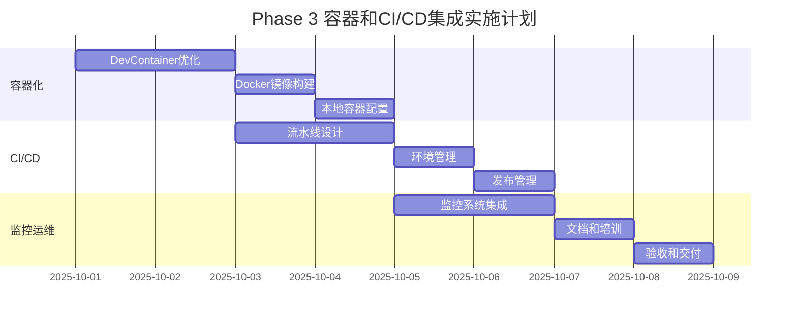

# Phase 3: 容器和CI/CD集成 - 需求文档

## 1. 文档概述

### 1.1 项目背景

在 Phase 1 和 Phase 2 完成核心功能开发和测试体系建设后，Phase
3 专注于生产环境的部署支持、容器化集成和 CI/CD 流程的完善，确保系统能够在各种环境下稳定运行并易于维护。

### 1.2 阶段目标

建立完整的容器化部署体系，优化开发环境和生产环境的一致性，实现自动化的 CI/CD 流程，并提供完善的监控和运维支持。

### 1.3 范围说明

- **包含**: DevContainer 优化、Docker 部署、CI/CD 完善、监控集成、运维工具
- **不包含**: 商业监控服务集成、高级安全审计、生产环境运维

## 2. 功能需求

### 2.1 DevContainer 环境增强

#### 2.1.1 开发环境标准化

**需求ID**: REQ-P3-001 **优先级**: 高
**描述**: 提供标准化的开发环境配置，确保所有开发者的环境一致性

**功能要求**:

- 预配置所有必需的开发工具和依赖
- 自动安装和配置 Git、Node.js、GitHub CLI
- 集成 VS Code 扩展和开发设置
- 提供开发环境健康检查和诊断工具
- 支持环境变量和配置的自动加载

**开发工具集成**:

- Git 2.35+ 与完整配置
- Node.js 18+ 与 npm/yarn
- GitHub CLI 与认证配置
- BATS 测试框架
- jq、bc、curl 等工具
- ShellCheck 代码检查工具

**验收标准**:

- [ ] 从空环境到可用开发环境 < 5分钟
- [ ] 所有开发工具自动配置且可用
- [ ] 环境健康检查 100% 通过
- [ ] 支持离线模式下的基本开发
- [ ] 配置变更能够热更新

#### 2.1.2 调试和开发支持

**需求ID**: REQ-P3-002 **优先级**: 中 **描述**: 增强开发环境的调试能力和开发体验

**功能要求**:

- 集成 MCP 服务器的调试支持
- 提供 Git 工作流的可视化调试
- 实现任务状态的实时监控面板
- 支持断点调试和日志跟踪
- 提供性能分析和优化建议

**调试工具集成**:

- VS Code 调试配置
- Node.js Inspector 集成
- 实时日志查看器
- 性能监控仪表板
- 网络请求追踪工具

**验收标准**:

- [ ] MCP 服务器支持断点调试
- [ ] 实时监控面板正常工作
- [ ] 日志级别可动态调整
- [ ] 性能数据实时更新
- [ ] 调试会话状态持久化

#### 2.1.3 团队协作支持

**需求ID**: REQ-P3-003 **优先级**: 中 **描述**: 支持团队开发的协作功能和共享配置

**功能要求**:

- 共享的开发环境配置模板
- 团队特定的工具和扩展配置
- 开发环境版本管理和同步
- 协作开发的冲突检测和解决
- 团队开发标准的自动检查

**协作功能**:

- 配置文件版本控制
- 环境差异检测和同步
- 团队代码标准检查
- 共享调试会话支持
- 协作开发指标收集

**验收标准**:

- [ ] 团队成员环境配置一致性 >= 95%
- [ ] 配置同步延迟 < 30秒
- [ ] 协作冲突自动检测和提示
- [ ] 团队标准检查自动执行
- [ ] 环境使用数据可统计分析

### 2.2 Docker 容器化部署

#### 2.2.1 生产容器镜像

**需求ID**: REQ-P3-004 **优先级**: 高 **描述**: 构建优化的生产环境 Docker 镜像

**功能要求**:

- 多阶段构建的轻量化镜像
- 安全加固的基础镜像配置
- 运行时环境变量配置支持
- 健康检查和启动探针
- 日志收集和输出标准化

**镜像规格**:

- 基础镜像: Ubuntu 22.04 LTS 或 Alpine Linux
- 镜像大小: < 200MB (压缩后)
- 启动时间: < 10秒
- 内存占用: < 100MB (基线)
- 支持架构: amd64, arm64

**验收标准**:

- [ ] 镜像构建时间 < 5分钟
- [ ] 镜像安全扫描无高危漏洞
- [ ] 容器启动成功率 >= 99%
- [ ] 健康检查响应时间 < 1秒
- [ ] 支持优雅关闭和重启

#### 2.2.2 本地容器环境配置

**需求ID**: REQ-P3-005 **优先级**: 中
**描述**: 优化本地 Docker 容器环境配置和管理

**功能要求**:

- Docker Compose 配置用于本地开发和测试
- 本地服务发现和网络配置
- 数据持久化和卷管理
- 容器健康检查和自动重启
- 本地环境的资源限制配置

**编排配置**:

- Docker Compose v3.8+ 格式
- 本地网络和卷管理
- 环境变量和配置文件管理
- 本地端口映射和服务暴露
- 开发模式的热重载支持

**验收标准**:

- [ ] Docker Compose 一键启动成功
- [ ] 本地服务间通信正常
- [ ] 数据持久化功能验证
- [ ] 开发环境热重载正常工作

#### 2.2.3 容器安全和监控

**需求ID**: REQ-P3-006 **优先级**: 中 **描述**: 实现容器安全策略和运行时监控

**功能要求**:

- 最小权限原则的安全配置
- 运行时安全扫描和检测
- 容器资源使用监控
- 日志聚合和分析
- 异常检测和告警机制

**安全措施**:

- 非 root 用户运行
- 只读文件系统支持
- 网络策略限制
- 镜像签名验证
- 运行时行为监控

**验收标准**:

- [ ] 安全基线检查 100% 通过
- [ ] 资源监控数据准确性 >= 95%
- [ ] 异常检测延迟 < 5秒
- [ ] 日志完整性和可查询性
- [ ] 告警机制及时性验证

### 2.3 CI/CD 流程完善

#### 2.3.1 自动化构建流水线

**需求ID**: REQ-P3-007 **优先级**: 高 **描述**: 建立完整的自动化构建和部署流水线

**功能要求**:

- 多分支构建策略支持
- 代码质量检查和安全扫描
- 自动化测试执行和报告
- 镜像构建和推送自动化
- 部署环境管理和配置

**流水线阶段**:

1. **代码检查**: Lint、格式化、安全扫描
2. **测试执行**: 单元测试、集成测试、E2E 测试
3. **构建打包**: Docker 镜像构建和推送
4. **部署发布**: 自动部署到测试/生产环境
5. **验证监控**: 部署后验证和监控

**验收标准**:

- [ ] 完整流水线执行时间 < 20分钟
- [ ] 构建成功率 >= 95%
- [ ] 质量门控检查 100% 执行
- [ ] 部署回滚时间 < 2分钟
- [ ] 流水线状态可视化和通知

#### 2.3.2 环境管理和配置

**需求ID**: REQ-P3-008 **优先级**: 高 **描述**: 实现多环境的配置管理和部署策略

**功能要求**:

- 开发、测试、生产环境分离
- 环境特定的配置管理
- 密钥和敏感信息安全存储
- 环境间的数据迁移和同步
- 环境健康状态监控

**环境配置**:

- **开发环境**: 本地开发和调试
- **测试环境**: 自动化测试和集成验证
- **预生产环境**: 生产前最终验证
- **生产环境**: 正式服务运行
- **灾备环境**: 故障恢复和备份

**验收标准**:

- [ ] 环境配置零硬编码
- [ ] 密钥轮换和管理自动化
- [ ] 环境间一致性验证
- [ ] 配置变更审计追踪
- [ ] 环境恢复时间 < 10分钟

#### 2.3.3 发布管理和版本控制

**需求ID**: REQ-P3-009 **优先级**: 中 **描述**: 实现规范化的版本发布和管理流程

**功能要求**:

- 语义化版本控制自动化
- 发布说明自动生成
- 蓝绿部署和金丝雀发布
- 版本回滚和恢复机制
- 发布影响分析和验证

**版本策略**:

- 主版本: 重大功能变更或不兼容更新
- 次版本: 新功能添加和增强
- 修订版本: 错误修复和安全更新
- 预发布版本: Alpha、Beta、RC 版本
- 构建元数据: 构建时间、提交哈希

**验收标准**:

- [ ] 版本号自动递增和标记
- [ ] 发布说明完整性和准确性
- [ ] 发布流程标准化和可重复
- [ ] 版本回滚成功率 100%
- [ ] 发布影响范围可控和可预测

### 2.4 监控和运维支持

#### 2.4.1 应用性能监控

**需求ID**: REQ-P3-010 **优先级**: 中 **描述**: 实现全面的应用性能监控和分析

**功能要求**:

- 关键指标的实时监控
- 性能趋势分析和预测
- 异常检测和自动告警
- 性能瓶颈识别和优化建议
- 用户体验监控和分析

**监控指标**:

- **系统指标**: CPU、内存、磁盘、网络
- **应用指标**: 响应时间、吞吐量、错误率
- **业务指标**: 任务完成率、Git 操作成功率
- **用户指标**: 会话数、活跃用户、使用频率
- **可用性指标**: 服务可用性、故障恢复时间

**验收标准**:

- [ ] 监控数据延迟 < 30秒
- [ ] 告警准确率 >= 90%
- [ ] 误报率 < 5%
- [ ] 监控覆盖率 100%
- [ ] 性能基线自动更新

#### 2.4.2 日志管理和分析

**需求ID**: REQ-P3-011 **优先级**: 中 **描述**: 建立集中化的日志管理和分析系统

**功能要求**:

- 结构化日志格式标准化
- 日志收集和聚合自动化
- 日志检索和查询优化
- 日志分析和可视化
- 日志保留和归档策略

**日志管理**:

- **应用日志**: 业务逻辑和错误日志
- **系统日志**: 操作系统和基础设施日志
- **访问日志**: MCP 调用和 API 访问日志
- **审计日志**: 安全相关操作日志
- **性能日志**: 性能数据和指标日志

**验收标准**:

- [ ] 日志格式标准化和一致性
- [ ] 日志检索响应时间 < 2秒
- [ ] 日志完整性和可靠性
- [ ] 敏感信息自动脱敏
- [ ] 日志存储成本优化

#### 2.4.3 故障诊断和恢复

**需求ID**: REQ-P3-012 **优先级**: 高 **描述**: 提供快速的故障诊断和自动恢复能力

**功能要求**:

- 故障检测和根因分析
- 自动恢复和故障转移
- 故障影响评估和通知
- 恢复时间目标 (RTO) 管理
- 恢复点目标 (RPO) 保证

**诊断工具**:

- 健康检查和存活探针
- 依赖关系图和影响分析
- 故障模拟和混沌工程
- 性能分析和瓶颈定位
- 自动化故障排除手册

**验收标准**:

- [ ] 故障检测时间 < 1分钟
- [ ] 自动恢复成功率 >= 80%
- [ ] 故障通知延迟 < 30秒
- [ ] RTO < 5分钟，RPO < 1分钟
- [ ] 故障报告自动生成

### 2.5 文档和用户支持

#### 2.5.1 部署和运维文档

**需求ID**: REQ-P3-013 **优先级**: 中 **描述**: 提供完整的部署和运维文档

**功能要求**:

- 安装和配置指南
- 常见问题和故障排除
- 最佳实践和推荐配置
- API 文档和使用示例
- 运维手册和操作流程

**文档内容**:

- **快速开始指南**: 5分钟入门教程
- **详细配置指南**: 完整的配置说明
- **故障排除手册**: 常见问题和解决方案
- **最佳实践**: 生产环境推荐配置
- **API 参考**: MCP 工具完整文档

**验收标准**:

- [ ] 文档完整性和准确性
- [ ] 示例代码可执行性
- [ ] 文档更新及时性
- [ ] 用户反馈集成
- [ ] 多语言支持 (中英文)

#### 2.5.2 用户培训和支持

**需求ID**: REQ-P3-014 **优先级**: 低 **描述**: 提供用户培训材料和技术支持

**功能要求**:

- 视频教程和演示
- 交互式学习路径
- 社区支持和论坛
- 技术支持和服务
- 用户反馈收集和处理

**培训内容**:

- 基础概念和架构介绍
- 开发环境搭建和配置
- 高级功能和最佳实践
- 故障排除和性能优化
- 定制开发和扩展

**验收标准**:

- [ ] 培训材料覆盖所有核心功能
- [ ] 用户学习路径清晰明确
- [ ] 技术支持响应时间 < 24小时
- [ ] 用户满意度 >= 80%
- [ ] 社区活跃度和参与度

## 3. 非功能需求

### 3.1 性能需求

#### 3.1.1 容器性能

- 容器启动时间 < 10秒
- 镜像构建时间 < 5分钟
- 资源使用效率 >= 80%
- 并发处理能力 >= 50个请求/秒

#### 3.1.2 部署性能

- CI/CD 流水线执行时间 < 20分钟
- 部署过程停机时间 < 30秒
- 配置变更生效时间 < 1分钟
- 环境恢复时间 < 10分钟

### 3.2 可靠性需求

#### 3.2.1 系统可用性

- 服务可用性 >= 99.5%
- 故障检测时间 < 1分钟
- 自动恢复成功率 >= 80%
- 数据一致性保证 100%

#### 3.2.2 容灾能力

- RTO (恢复时间目标) < 5分钟
- RPO (恢复点目标) < 1分钟
- 备份成功率 >= 99%
- 故障转移时间 < 2分钟

### 3.3 安全需求

#### 3.3.1 容器安全

- 镜像漏洞扫描覆盖率 100%
- 运行时安全策略执行
- 网络隔离和访问控制
- 数据加密和密钥管理

#### 3.3.2 CI/CD 安全

- 流水线安全扫描集成
- 密钥和证书安全管理
- 代码签名和验证
- 审计日志完整性

### 3.4 扩展性需求

#### 3.4.1 水平扩展

- 支持容器副本动态扩缩容
- 负载均衡和流量分发
- 状态数据外部化存储
- 服务发现和配置管理

#### 3.4.2 垂直扩展

- 资源限制动态调整
- 性能监控和自动优化
- 资源使用预测和规划
- 弹性伸缩策略配置

## 4. 接口需求

### 4.1 容器接口

#### 4.1.1 Docker 接口

```dockerfile
# Dockerfile 接口规范
FROM ubuntu:22.04
LABEL maintainer="codex-father-team"
LABEL version="1.0.0"

# 健康检查接口
HEALTHCHECK --interval=30s --timeout=3s --start-period=5s --retries=3 \
  CMD /app/scripts/health-check.sh

# 容器配置接口
ENV CODEX_HOME="/app/.codex"
ENV CODEX_LOG_LEVEL="info"
ENV CODEX_MAX_CONCURRENT="10"

# 数据卷接口
VOLUME ["/app/data", "/app/logs"]

# 网络接口
EXPOSE 3000/tcp

# 启动接口
ENTRYPOINT ["/app/scripts/entrypoint.sh"]
CMD ["start"]
```

#### 4.1.2 环境变量接口

```bash
# 必需环境变量
CODEX_HOME              # Codex 工作目录
CODEX_LOG_LEVEL         # 日志级别 (debug|info|warn|error)
CODEX_MAX_CONCURRENT    # 最大并发任务数

# 可选环境变量
CODEX_SESSIONS_ROOT     # 会话数据目录
CODEX_CONFIG_FILE       # 配置文件路径
CODEX_ENABLE_METRICS    # 是否启用指标收集
CODEX_METRICS_PORT      # 指标服务端口

# Git 配置
GIT_USER_NAME          # Git 用户名
GIT_USER_EMAIL         # Git 邮箱
GITHUB_TOKEN           # GitHub 访问令牌

# MCP 配置
MCP_SERVER_PORT        # MCP 服务器端口
MCP_MAX_CONNECTIONS    # 最大连接数
MCP_TIMEOUT            # 连接超时时间
```

### 4.2 CI/CD 接口

#### 4.2.1 GitHub Actions 接口

```yaml
# 工作流输入接口
inputs:
  environment:
    description: 'Deployment environment'
    required: true
    type: choice
    options: ['dev', 'test', 'staging', 'prod']

  version:
    description: 'Version to deploy'
    required: false
    type: string
    default: 'latest'

  skip_tests:
    description: 'Skip test execution'
    required: false
    type: boolean
    default: false

# 工作流输出接口
outputs:
  deployment_url:
    description: 'Deployed application URL'
    value: ${{ steps.deploy.outputs.url }}

  version:
    description: 'Deployed version'
    value: ${{ steps.deploy.outputs.version }}

  status:
    description: 'Deployment status'
    value: ${{ steps.deploy.outputs.status }}
```

#### 4.2.2 配置管理接口

```json
{
  "environments": {
    "development": {
      "replicas": 1,
      "resources": {
        "cpu": "0.5",
        "memory": "512Mi"
      },
      "config": {
        "logLevel": "debug",
        "maxConcurrent": 5
      }
    },
    "production": {
      "replicas": 3,
      "resources": {
        "cpu": "1.0",
        "memory": "1Gi"
      },
      "config": {
        "logLevel": "info",
        "maxConcurrent": 20
      }
    }
  }
}
```

### 4.3 监控接口

#### 4.3.1 指标接口

```typescript
// Prometheus 指标接口
interface MetricsEndpoint {
  // 系统指标
  codex_cpu_usage_percent: number;
  codex_memory_usage_bytes: number;
  codex_disk_usage_bytes: number;

  // 应用指标
  codex_active_tasks_total: number;
  codex_completed_tasks_total: number;
  codex_failed_tasks_total: number;
  codex_task_duration_seconds: number;

  // MCP 指标
  codex_mcp_requests_total: number;
  codex_mcp_request_duration_seconds: number;
  codex_mcp_errors_total: number;

  // Git 指标
  codex_git_operations_total: number;
  codex_git_operation_duration_seconds: number;
  codex_git_failures_total: number;
}
```

#### 4.3.2 健康检查接口

```typescript
// 健康检查响应格式
interface HealthCheckResponse {
  status: 'healthy' | 'unhealthy' | 'degraded';
  timestamp: string;
  uptime: number;
  version: string;
  checks: {
    [component: string]: {
      status: 'pass' | 'fail' | 'warn';
      output?: string;
      duration?: number;
    };
  };
}

// 组件健康检查
interface ComponentChecks {
  database: HealthCheck;
  git: HealthCheck;
  mcp_server: HealthCheck;
  file_system: HealthCheck;
  network: HealthCheck;
}
```

## 5. 约束条件

### 5.1 技术约束

#### 5.1.1 容器化约束

- 必须支持 Docker 20.10+ 和 Podman
- 镜像大小限制 < 500MB (未压缩)
- 容器启动时间 < 15秒
- 必须支持无特权运行模式

#### 5.1.2 CI/CD 约束

- 必须使用 GitHub Actions 作为主要 CI/CD 平台
- 支持其他主流 CI/CD 平台 (GitLab CI, Jenkins)
- 流水线执行时间 < 30分钟
- 必须支持并行执行优化

### 5.2 环境约束

#### 5.2.1 部署环境

- 支持 Docker 20.10+ 和 Docker Compose
- 支持 Linux 容器环境 (Ubuntu, Alpine, CentOS)
- 最小资源要求: 1 CPU, 1GB RAM, 5GB 存储
- 网络要求: 支持 HTTP/HTTPS 和自定义端口

#### 5.2.2 依赖约束

- 外部依赖最小化，避免复杂的服务依赖
- 必须支持离线部署模式
- 数据库依赖可选 (默认使用文件存储)
- 第三方服务集成必须可配置开关

### 5.3 运维约束

#### 5.3.1 监控约束

- 监控数据存储 < 1GB/月
- 告警延迟 < 2分钟
- 监控覆盖率 >= 90%
- 支持自定义监控指标

#### 5.3.2 维护约束

- 支持滚动更新和零停机部署
- 配置变更不需要重启服务
- 日志轮转和自动清理
- 备份和恢复操作自动化

## 6. 验收标准

### 6.1 功能验收

#### 6.1.1 容器化验收

- [ ] Docker 镜像构建成功且可运行
- [ ] 容器在所有支持环境下正常启动
- [ ] 健康检查和监控功能正常
- [ ] 数据持久化和状态管理正确
- [ ] 本地容器配置验证通过

#### 6.1.2 CI/CD 验收

- [ ] 完整流水线执行成功
- [ ] 多环境部署功能验证
- [ ] 自动化测试集成正常
- [ ] 版本管理和发布流程正确
- [ ] 回滚机制验证有效

#### 6.1.3 监控验收

- [ ] 关键指标监控正常
- [ ] 告警机制及时准确
- [ ] 日志收集和查询功能
- [ ] 故障诊断工具可用
- [ ] 性能监控和分析正确

### 6.2 性能验收

#### 6.2.1 部署性能

- [ ] 容器启动时间 < 10秒
- [ ] 镜像构建时间 < 5分钟
- [ ] CI/CD 流水线 < 20分钟
- [ ] 部署停机时间 < 30秒
- [ ] 配置更新时间 < 1分钟

#### 6.2.2 运行性能

- [ ] 资源使用效率 >= 80%
- [ ] 并发处理 >= 50 req/s
- [ ] 监控数据延迟 < 30秒
- [ ] 故障检测时间 < 1分钟
- [ ] 自动恢复时间 < 5分钟

### 6.3 可靠性验收

#### 6.3.1 稳定性验证

- [ ] 24小时连续运行稳定
- [ ] 故障注入测试通过
- [ ] 负载测试表现良好
- [ ] 内存泄漏检测通过
- [ ] 并发安全性验证

#### 6.3.2 恢复能力

- [ ] 自动故障恢复验证
- [ ] 数据备份和恢复测试
- [ ] 灾难恢复流程验证
- [ ] 配置漂移检测和修复
- [ ] 版本回滚功能验证

### 6.4 安全验收

#### 6.4.1 容器安全

- [ ] 镜像安全扫描通过
- [ ] 运行时安全策略生效
- [ ] 网络隔离配置正确
- [ ] 权限控制策略执行
- [ ] 密钥管理安全合规

#### 6.4.2 CI/CD 安全

- [ ] 流水线安全扫描集成
- [ ] 密钥和证书管理安全
- [ ] 代码签名验证机制
- [ ] 审计日志完整准确
- [ ] 访问控制策略生效

## 7. 风险评估和缓解

### 7.1 技术风险

#### 7.1.1 容器化风险

**风险**: 容器运行时兼容性问题 **影响**: 高 **缓解措施**:

- 多容器运行时测试验证
- 标准化容器镜像构建
- 运行时环境检测和适配

**风险**: 镜像大小和性能问题 **影响**: 中 **缓解措施**:

- 多阶段构建优化
- 基础镜像选择和优化
- 定期性能基准测试

#### 7.1.2 CI/CD 风险

**风险**: 流水线复杂性和维护困难 **影响**: 中 **缓解措施**:

- 模块化流水线设计
- 标准化配置模板
- 自动化测试和验证

**风险**: 多环境配置不一致 **影响**: 高 **缓解措施**:

- 配置即代码管理
- 环境一致性自动检查
- 配置变更审核流程

### 7.2 运维风险

#### 7.2.1 监控风险

**风险**: 监控盲点和误报 **影响**: 中 **缓解措施**:

- 全面的监控覆盖率检查
- 告警规则调优和测试
- 监控数据质量验证

**风险**: 故障诊断时间过长 **影响**: 高 **缓解措施**:

- 自动化诊断工具
- 故障模式库建设
- 快速响应流程优化

#### 7.2.2 安全风险

**风险**: 容器安全漏洞 **影响**: 高 **缓解措施**:

- 定期安全扫描和更新
- 最小权限原则执行
- 安全策略持续监控

**风险**: CI/CD 流水线安全 **影响**: 中 **缓解措施**:

- 流水线安全扫描集成
- 密钥管理最佳实践
- 访问控制和审计

### 7.3 业务风险

#### 7.3.1 用户体验风险

**风险**: 部署过程服务中断 **影响**: 中 **缓解措施**:

- 蓝绿部署和滚动更新
- 健康检查和自动回滚
- 用户通知和沟通机制

**风险**: 学习成本和采用难度 **影响**: 低 **缓解措施**:

- 完善的文档和教程
- 渐进式功能推出
- 用户反馈收集和改进

## 8. 实施计划

### 8.1 开发里程碑



### 8.2 交付清单

#### 8.2.1 核心交付物

- [ ] 优化的 DevContainer 配置
- [ ] 生产就绪的 Docker 镜像
- [ ] 完整的 CI/CD 流水线
- [ ] 本地容器配置 (Docker Compose)
- [ ] 监控和告警系统
- [ ] 故障诊断和恢复工具

#### 8.2.2 文档交付物

- [ ] 部署和运维指南
- [ ] 容器化最佳实践文档
- [ ] CI/CD 流程文档
- [ ] 监控和故障排除手册
- [ ] 用户培训材料

#### 8.2.3 配置文件

- [ ] Dockerfile 和构建脚本
- [ ] Docker Compose 配置
- [ ] GitHub Actions 工作流
- [ ] 监控配置和仪表板

---

**文档版本**: v1.0 **创建日期**: 2025-09-26 **负责人**: Claude Code 集成项目组
**审批状态**: 待审批
