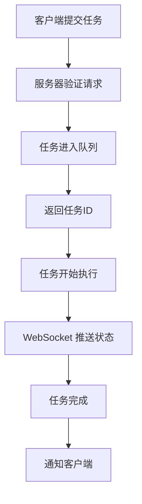
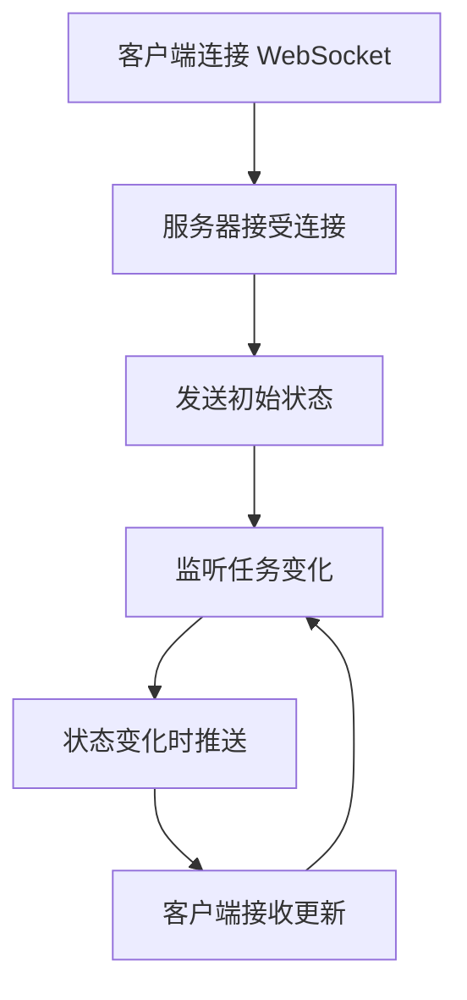

# HTTP API 概览

Codex Father 2.0 提供了完整的 HTTP API 接口，支持 RESTful API 和 WebSocket 实时通信，适合系统集成、自动化流程和第三方应用开发。

## 🎯 API 特性

### 📡 REST API
- **标准化接口**: 遵循 REST 设计原则
- **JSON 格式**: 统一的请求/响应格式
- **错误处理**: 完整的错误码和错误信息
- **版本控制**: API 版本管理

### 🔄 WebSocket 实时通信
- **实时推送**: 任务状态变化实时通知
- **双向通信**: 支持客户端与服务器双向消息
- **连接管理**: 自动重连和心跳检测
- **事件驱动**: 基于事件的异步通信

### 🛡️ 安全特性
- **CORS 支持**: 跨域资源共享配置
- **请求验证**: 输入参数验证和清理
- **速率限制**: API 调用频率控制
- **认证支持**: 可扩展的认证机制

## 🚀 快速开始

### 启动 HTTP 服务器

```bash
# 基础启动
codex-father server

# 指定端口
codex-father server --port 3000

# 完整配置启动
codex-father server \
  --port 3000 \
  --host localhost \
  --enable-websocket \
  --cors-origin "*"
```

### 健康检查

```bash
# 检查服务器状态
curl http://localhost:3000/healthz

# 响应示例
{
  "status": "healthy",
  "version": "2.0.0",
  "uptime": 120500,
  "tasks": {
    "running": 2,
    "pending": 5,
    "completed": 42
  },
  "system": {
    "memory": "45MB",
    "cpu": "12%"
  }
}
```

## 📋 API 端点概览

### 任务管理
```
POST   /tasks              # 提交新任务
GET    /tasks/{id}         # 查询任务状态
GET    /tasks              # 获取任务列表
POST   /tasks/{id}/reply   # 继续执行任务
DELETE /tasks/{id}         # 取消任务
GET    /tasks/{id}/logs    # 获取任务日志
```

### 系统管理
```
GET    /healthz            # 健康检查
GET    /status             # 系统状态
GET    /metrics            # 性能指标
POST   /shutdown           # 关闭服务器
```

### WebSocket
```
WS     /ws                 # WebSocket 连接端点
```

## 🔄 API 工作流程

### 1. 任务提交流程



### 2. 实时监控流程



## 📝 请求/响应格式

### 统一响应格式

```json
{
  "success": true,
  "data": {},
  "message": "操作成功",
  "timestamp": "2024-01-01T10:30:00Z",
  "requestId": "req-1704067200000-abc123"
}
```

### 错误响应格式

```json
{
  "success": false,
  "error": {
    "code": "TASK_NOT_FOUND",
    "message": "指定的任务不存在",
    "details": {
      "taskId": "task-123",
      "timestamp": "2024-01-01T10:30:00Z"
    }
  },
  "timestamp": "2024-01-01T10:30:00Z",
  "requestId": "req-1704067200000-def456"
}
```

## 🎯 核心功能示例

### 提交任务

```bash
curl -X POST http://localhost:3000/tasks \
  -H "Content-Type: application/json" \
  -d '{
    "prompt": "创建一个用户登录组件",
    "environment": "nodejs",
    "priority": "high",
    "timeout": 300000,
    "files": ["src/components/", "package.json"]
  }'

# 响应
{
  "success": true,
  "data": {
    "taskId": "task-1704067200000-abc123",
    "status": "queued",
    "priority": "high",
    "estimatedDuration": 120000
  },
  "message": "任务已成功提交"
}
```

### 查询任务状态

```bash
curl http://localhost:3000/tasks/task-1704067200000-abc123

# 响应
{
  "success": true,
  "data": {
    "id": "task-1704067200000-abc123",
    "status": "running",
    "progress": 65,
    "startTime": "2024-01-01T10:30:00Z",
    "duration": 78000,
    "result": null,
    "error": null
  }
}
```

### 获取任务列表

```bash
curl "http://localhost:3000/tasks?status=running&limit=10&sort=startTime"

# 响应
{
  "success": true,
  "data": {
    "tasks": [
      {
        "id": "task-1704067200000-abc123",
        "status": "running",
        "progress": 65,
        "priority": "high",
        "startTime": "2024-01-01T10:30:00Z"
      }
    ],
    "pagination": {
      "page": 1,
      "limit": 10,
      "total": 1,
      "hasMore": false
    }
  }
}
```

## 🔌 WebSocket 集成

### 连接建立

```javascript
const ws = new WebSocket('ws://localhost:3000/ws');

ws.onopen = function(event) {
  console.log('WebSocket 连接已建立');
  
  // 请求初始状态
  ws.send(JSON.stringify({
    type: 'get_status'
  }));
};

ws.onmessage = function(event) {
  const message = JSON.parse(event.data);
  console.log('收到消息:', message);
  
  switch(message.type) {
    case 'task_started':
      console.log(`任务开始: ${message.data.taskId}`);
      break;
    case 'task_progress':
      console.log(`任务进度: ${message.data.progress}%`);
      break;
    case 'task_completed':
      console.log(`任务完成: ${message.data.result}`);
      break;
    case 'task_failed':
      console.error(`任务失败: ${message.data.error}`);
      break;
  }
};
```

### WebSocket 消息格式

#### 客户端请求
```json
{
  "type": "subscribe_tasks",
  "data": {
    "taskIds": ["task-123", "task-456"]
  }
}
```

#### 服务器推送
```json
{
  "type": "task_progress",
  "data": {
    "taskId": "task-123",
    "progress": 75,
    "message": "正在处理组件样式",
    "timestamp": "2024-01-01T10:31:15Z"
  }
}
```

## 🌐 语言集成示例

### Python 客户端

```python
import requests
import websocket
import json
import threading

class CodexFatherClient:
    def __init__(self, base_url="http://localhost:3000"):
        self.base_url = base_url
        self.ws_url = base_url.replace("http://", "ws://").replace("https://", "wss://")
        
    def submit_task(self, prompt, environment="nodejs", **kwargs):
        """提交任务"""
        data = {
            "prompt": prompt,
            "environment": environment,
            **kwargs
        }
        response = requests.post(f"{self.base_url}/tasks", json=data)
        return response.json()
    
    def get_task_status(self, task_id):
        """获取任务状态"""
        response = requests.get(f"{self.base_url}/tasks/{task_id}")
        return response.json()
    
    def get_task_logs(self, task_id):
        """获取任务日志"""
        response = requests.get(f"{self.base_url}/tasks/{task_id}/logs")
        return response.json()
    
    def start_websocket(self, on_message):
        """启动 WebSocket 连接"""
        def on_ws_message(ws, message):
            data = json.loads(message)
            on_message(data)
        
        ws = websocket.WebSocketApp(
            f"{self.ws_url}/ws",
            on_message=on_ws_message
        )
        
        wst = threading.Thread(target=ws.run_forever)
        wst.daemon = True
        wst.start()
        
        return ws

# 使用示例
client = CodexFatherClient()

# 提交任务
task = client.submit_task("创建一个数据分析脚本", environment="python")
task_id = task["data"]["taskId"]
print(f"任务已提交: {task_id}")

# 监控任务状态
def handle_message(message):
    if message["type"] == "task_completed":
        print(f"任务完成: {message['data']['result']}")

client.start_websocket(handle_message)
```

### Node.js 客户端

```javascript
class CodexFatherClient {
  constructor(baseUrl = 'http://localhost:3000') {
    this.baseUrl = baseUrl;
    this.wsUrl = baseUrl.replace('http://', 'ws://').replace('https://', 'wss://');
  }

  async submitTask(prompt, environment = 'nodejs', options = {}) {
    const response = await fetch(`${this.baseUrl}/tasks`, {
      method: 'POST',
      headers: {
        'Content-Type': 'application/json',
      },
      body: JSON.stringify({
        prompt,
        environment,
        ...options
      })
    });
    return response.json();
  }

  async getTaskStatus(taskId) {
    const response = await fetch(`${this.baseUrl}/tasks/${taskId}`);
    return response.json();
  }

  async getTaskLogs(taskId) {
    const response = await fetch(`${this.baseUrl}/tasks/${taskId}/logs`);
    return response.json();
  }

  startWebSocket(onMessage) {
    const ws = new WebSocket(`${this.wsUrl}/ws`);
    
    ws.onopen = () => {
      console.log('WebSocket 连接已建立');
    };

    ws.onmessage = (event) => {
      const message = JSON.parse(event.data);
      onMessage(message);
    };

    ws.onerror = (error) => {
      console.error('WebSocket 错误:', error);
    };

    ws.onclose = () => {
      console.log('WebSocket 连接已关闭');
    };

    return ws;
  }
}

// 使用示例
const client = new CodexFatherClient();

async function main() {
  // 提交任务
  const task = await client.submitTask('创建一个 Express 服务器', 'nodejs');
  const taskId = task.data.taskId;
  console.log(`任务已提交: ${taskId}`);

  // 监控任务状态
  const ws = client.startWebSocket((message) => {
    if (message.type === 'task_completed') {
      console.log(`任务完成: ${message.data.result}`);
    }
  });

  // 轮询任务状态
  const checkStatus = async () => {
    const status = await client.getTaskStatus(taskId);
    console.log(`任务状态: ${status.data.status}`);
    
    if (status.data.status === 'completed') {
      console.log('任务已完成!');
    } else {
      setTimeout(checkStatus, 2000);
    }
  };
  
  checkStatus();
}

main().catch(console.error);
```

## ⚙️ 服务器配置

### 基础配置

```json
{
  "server": {
    "port": 3000,
    "host": "localhost",
    "enableWebSocket": true,
    "cors": {
      "origin": "*",
      "credentials": true
    }
  },
  "runner": {
    "maxConcurrency": 10,
    "defaultTimeout": 600000
  }
}
```

### 高级配置

```json
{
  "server": {
    "port": 3000,
    "host": "0.0.0.0",
    "enableWebSocket": true,
    "websocket": {
      "heartbeatInterval": 30000,
      "maxConnections": 100
    },
    "cors": {
      "origin": ["http://localhost:3000", "https://myapp.com"],
      "methods": ["GET", "POST", "PUT", "DELETE"],
      "credentials": true
    },
    "rateLimit": {
      "windowMs": 60000,
      "max": 100,
      "message": "请求过于频繁，请稍后再试"
    },
    "security": {
      "helmet": true,
      "compression": true
    }
  }
}
```

## 📊 性能监控

### 系统指标

```bash
curl http://localhost:3000/metrics

# 响应
{
  "success": true,
  "data": {
    "tasks": {
      "total": 150,
      "running": 3,
      "pending": 8,
      "completed": 139
    },
    "performance": {
      "avgExecutionTime": 45000,
      "successRate": 0.96,
      "throughput": 12.5
    },
    "system": {
      "uptime": 86400,
      "memory": "128MB",
      "cpu": "15%"
    }
  }
}
```

### 实时监控

```javascript
const ws = new WebSocket('ws://localhost:3000/ws');

ws.onmessage = (event) => {
  const message = JSON.parse(event.data);
  
  if (message.type === 'metrics_update') {
    console.log('系统指标更新:', message.data);
    // 更新监控面板
  }
};
```

## 🛡️ 安全配置

### CORS 配置

```json
{
  "cors": {
    "origin": ["https://trusted-domain.com"],
    "methods": ["GET", "POST"],
    "allowedHeaders": ["Content-Type", "Authorization"],
    "credentials": true
  }
}
```

### 速率限制

```json
{
  "rateLimit": {
    "windowMs": 60000,
    "max": 100,
    "skipSuccessfulRequests": false,
    "skipFailedRequests": false
  }
}
```

### 认证中间件（示例）

```javascript
// 自定义认证中间件
app.use('/api', (req, res, next) => {
  const token = req.headers.authorization;
  
  if (!token || !validateToken(token)) {
    return res.status(401).json({
      success: false,
      error: { code: 'UNAUTHORIZED', message: '无效的认证令牌' }
    });
  }
  
  next();
});
```

## 🔧 故障排除

### 常见问题

#### 连接超时
```bash
# 增加超时时间
curl --max-time 30 http://localhost:3000/tasks
```

#### CORS 错误
```json
{
  "cors": {
    "origin": "*",
    "methods": ["GET", "POST", "PUT", "DELETE", "OPTIONS"]
  }
}
```

#### WebSocket 连接失败
```javascript
// 添加重连逻辑
function connectWebSocket() {
  const ws = new WebSocket('ws://localhost:3000/ws');
  
  ws.onclose = () => {
    console.log('连接断开，5秒后重连...');
    setTimeout(connectWebSocket, 5000);
  };
  
  return ws;
}
```

## ✅ 最佳实践

### 1. 错误处理
```javascript
try {
  const response = await client.submitTask(prompt);
  if (!response.success) {
    console.error('任务提交失败:', response.error);
    return;
  }
  const taskId = response.data.taskId;
  // 处理成功逻辑
} catch (error) {
  console.error('网络错误:', error);
}
```

### 2. 连接管理
```javascript
class ConnectionManager {
  constructor() {
    this.ws = null;
    this.reconnectAttempts = 0;
    this.maxReconnectAttempts = 5;
  }
  
  connect() {
    this.ws = new WebSocket('ws://localhost:3000/ws');
    this.ws.onclose = () => this.handleReconnect();
  }
  
  handleReconnect() {
    if (this.reconnectAttempts < this.maxReconnectAttempts) {
      this.reconnectAttempts++;
      setTimeout(() => this.connect(), 1000 * this.reconnectAttempts);
    }
  }
}
```

### 3. 批量操作
```javascript
async function submitBatchTasks(tasks) {
  const results = await Promise.allSettled(
    tasks.map(task => client.submitTask(task.prompt, task.environment))
  );
  
  return results.map((result, index) => ({
    task: tasks[index],
    status: result.status,
    data: result.status === 'fulfilled' ? result.value : null,
    error: result.status === 'rejected' ? result.reason : null
  }));
}
```

## 🎉 下一步

现在你已经了解了 HTTP API 的基本概念：

1. **深入学习** → [REST 端点详解](./rest-endpoints.md)
2. **WebSocket 开发** → [WebSocket 实时通信](./websocket.md)
3. **客户端示例** → [API 客户端示例](./client-examples.md)
4. **集成案例** → [HTTP API 集成示例](../examples/http-integration.md)

---

**💡 提示**: HTTP API 适合系统集成和自动化场景，而 MCP 集成更适合对话式开发。根据你的需求选择合适的接口！