# Data Model: 基于分阶段实施方案的技术架构更新

**Date**: 2025-09-27
**Context**: 基于 TypeScript 技术栈的数据模型设计

## 核心实体模型

### 1. 技术架构规范 (TechnicalArchitectureSpec)

**职责**: 系统设计原则、模块划分、接口标准和集成规范

```typescript
interface TechnicalArchitectureSpec {
  id: string;
  name: string;
  version: string;
  principles: DesignPrinciple[];
  modules: ModuleDefinition[];
  interfaces: InterfaceStandard[];
  integrationRules: IntegrationRule[];
  createdAt: Date;
  updatedAt: Date;
}

interface DesignPrinciple {
  name: string;
  description: string;
  priority: 'critical' | 'important' | 'recommended';
  enforcement: EnforcementRule[];
}

interface ModuleDefinition {
  name: string;
  path: string;
  responsibilities: string[];
  dependencies: string[];
  exports: ExportedInterface[];
}
```

**验证规则**:
- `id` 必须唯一
- `version` 遵循语义化版本规范
- `modules` 不能有循环依赖

### 2. 目录架构标准 (DirectoryArchitectureStandard)

**职责**: 项目结构、文件组织、命名约定和分层策略

```typescript
interface DirectoryArchitectureStandard {
  id: string;
  name: string;
  structure: DirectoryNode;
  namingConventions: NamingConvention[];
  layeringStrategy: LayeringRule[];
  migrationPlan: MigrationStep[];
}

interface DirectoryNode {
  name: string;
  type: 'directory' | 'file';
  description: string;
  children?: DirectoryNode[];
  purpose: string;
  owner: string; // 负责维护的团队/人员
}

interface NamingConvention {
  scope: 'file' | 'directory' | 'variable' | 'function' | 'class';
  pattern: string; // regex pattern
  examples: string[];
  exceptions: string[];
}
```

**状态转换**:
- `draft` → `review` → `approved` → `implemented`

### 3. 代码质量规范 (CodeQualityStandard)

**职责**: 编码标准、代码审查、静态分析和质量门禁

```typescript
interface CodeQualityStandard {
  id: string;
  language: 'typescript' | 'javascript' | 'shell';
  linting: LintingConfig;
  formatting: FormattingConfig;
  qualityGates: QualityGate[];
  reviewChecklist: ReviewChecklistItem[];
}

interface LintingConfig {
  tool: 'eslint' | 'tslint';
  configFile: string;
  rules: Record<string, any>;
  ignorePatterns: string[];
}

interface QualityGate {
  name: string;
  metric: string;
  threshold: number;
  operator: 'gt' | 'gte' | 'lt' | 'lte' | 'eq';
  required: boolean;
}
```

### 4. 测试架构框架 (TestArchitectureFramework)

**职责**: 测试分层、覆盖率要求、自动化策略和容器化测试

```typescript
interface TestArchitectureFramework {
  id: string;
  framework: 'vitest' | 'jest' | 'mocha';
  layers: TestLayer[];
  coverageRequirements: CoverageRequirement[];
  automationStrategy: AutomationStrategy;
  containerizedTesting: ContainerTestConfig;
}

interface TestLayer {
  name: 'unit' | 'integration' | 'e2e';
  directory: string;
  patterns: string[];
  tools: string[];
  parallelExecution: boolean;
  timeout: number;
}

interface CoverageRequirement {
  scope: 'core' | 'critical-path' | 'overall';
  type: 'line' | 'branch' | 'function' | 'statement';
  threshold: number; // percentage
  enforcement: 'strict' | 'warning';
}
```

### 5. 任务队列系统 (TaskQueueSystem)

**职责**: 异步任务管理、优先级调度和重试机制

```typescript
interface TaskQueueSystem {
  id: string;
  queueDirectory: string;
  maxConcurrency: number;
  retryPolicy: RetryPolicy;
  priorityLevels: PriorityLevel[];
  monitoring: MonitoringConfig;
}

interface Task {
  id: string;
  type: string;
  priority: number;
  payload: Record<string, any>;
  status: TaskStatus;
  createdAt: Date;
  updatedAt: Date;
  attempts: number;
  lastError?: string;
  scheduledAt?: Date;
}

type TaskStatus =
  | 'pending'
  | 'processing'
  | 'completed'
  | 'failed'
  | 'retrying'
  | 'cancelled';

interface RetryPolicy {
  maxAttempts: number;
  baseDelay: number; // milliseconds
  backoffStrategy: 'linear' | 'exponential' | 'fixed';
  maxDelay: number;
}
```

**状态转换图**:
```
pending → processing → completed
         ↓
        failed → retrying → processing
         ↓
        cancelled
```

### 6. 配置管理系统 (ConfigurationManagement)

**职责**: 配置文件管理、环境变量和运行时配置

```typescript
interface ConfigurationManagement {
  id: string;
  configFiles: ConfigFile[];
  environments: Environment[];
  schema: ConfigSchema;
  validation: ValidationRule[];
}

interface ConfigFile {
  path: string;
  format: 'json' | 'yaml' | 'toml' | 'env';
  schema: string;
  environment: string[];
  encrypted: boolean;
  required: boolean;
}

interface Environment {
  name: string;
  description: string;
  variables: EnvironmentVariable[];
  inheritsFrom?: string;
}
```

### 7. 安全合规框架 (SecurityComplianceFramework)

**职责**: 安全策略、权限管理、数据保护和审计要求

```typescript
interface SecurityComplianceFramework {
  id: string;
  sandboxStrategies: SandboxStrategy[];
  dataProtection: DataProtectionRule[];
  auditLogging: AuditConfig;
  complianceChecks: ComplianceCheck[];
}

interface SandboxStrategy {
  name: 'readonly' | 'workspace-write' | 'container-full';
  description: string;
  permissions: Permission[];
  restrictions: Restriction[];
  defaultFor: string[];
}

interface AuditConfig {
  enabled: boolean;
  logLevel: 'debug' | 'info' | 'warn' | 'error';
  retention: number; // days
  sensitiveDataHandling: 'redact' | 'encrypt' | 'exclude';
  outputs: AuditOutput[];
}
```

## 关系图

```mermaid
erDiagram
    TechnicalArchitectureSpec ||--o{ ModuleDefinition : contains
    TechnicalArchitectureSpec ||--o{ DesignPrinciple : follows

    DirectoryArchitectureStandard ||--o{ DirectoryNode : defines
    DirectoryArchitectureStandard ||--o{ NamingConvention : enforces

    CodeQualityStandard ||--o{ QualityGate : requires
    CodeQualityStandard ||--o{ LintingConfig : uses

    TestArchitectureFramework ||--o{ TestLayer : organizes
    TestArchitectureFramework ||--o{ CoverageRequirement : enforces

    TaskQueueSystem ||--o{ Task : manages
    TaskQueueSystem ||--|| RetryPolicy : uses

    ConfigurationManagement ||--o{ ConfigFile : manages
    ConfigurationManagement ||--o{ Environment : supports

    SecurityComplianceFramework ||--o{ SandboxStrategy : implements
    SecurityComplianceFramework ||--|| AuditConfig : uses
```



## 数据持久化策略

### 文件系统存储结构

```
config/
├── architecture/
│   ├── technical-spec.json
│   ├── directory-standard.json
│   └── quality-rules.json
├── testing/
│   ├── framework-config.json
│   └── coverage-requirements.json
├── security/
│   ├── sandbox-policies.json
│   └── audit-config.json
└── environments/
    ├── development.json
    ├── testing.json
    └── production.json

queues/
├── pending/
├── processing/
├── completed/
├── failed/
└── retry/

logs/
├── audit/
├── tasks/
└── system/
```

### 数据一致性保证

1. **原子操作**: 使用文件系统的原子写入（write + rename）
2. **锁机制**: 基于文件锁防止并发修改
3. **版本控制**: 配置文件变更记录和回滚支持
4. **备份策略**: 定期备份关键配置文件

### 性能优化

1. **缓存策略**: 内存缓存频繁读取的配置
2. **索引机制**: 为任务队列建立简单索引文件
3. **批量操作**: 减少频繁的文件 I/O 操作
4. **异步处理**: 非关键操作使用异步文件操作

## 验证和约束

### 数据完整性检查

1. **配置文件 JSON Schema 验证**
2. **任务状态转换合法性检查**
3. **依赖关系循环检测**
4. **权限和安全策略一致性验证**

### 运行时约束

1. **并发任务数量限制**
2. **文件大小和数量限制**
3. **内存使用监控和限制**
4. **磁盘空间检查和清理策略**