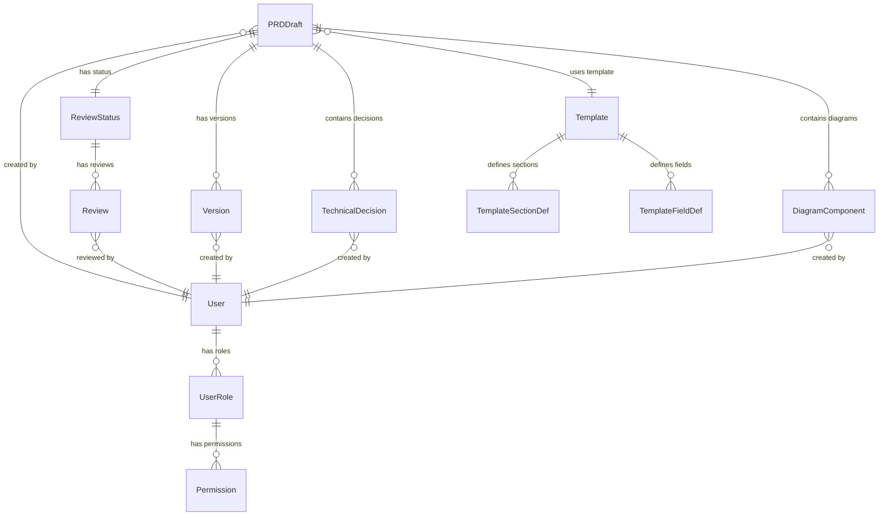

# Data Model: PRD Draft Documentation System

**Date**: 2025-09-28 **Feature**: PRD Draft Documentation System
(002-docs-prd-draft)

## Core Entities

### 1. PRDDraft

PRD文档核心实体，代表产品需求文档的草稿状态。

```typescript
interface PRDDraft {
  id: string; // 唯一标识符 (UUID)
  title: string; // 文档标题
  description?: string; // 简短描述
  content: string; // Markdown格式内容
  templateId: string; // 使用的模板ID
  status: ReviewStatus; // 当前状态
  authorId: string; // 创建者ID
  createdAt: Date; // 创建时间
  updatedAt: Date; // 最后更新时间
  version: number; // 版本号
  metadata: DocumentMetadata; // 文档元数据
  sections: DocumentSection[]; // 文档章节结构
  decisions: TechnicalDecision[]; // 技术决策记录
  diagrams: DiagramComponent[]; // 图表组件
}

interface DocumentMetadata {
  tags: string[]; // 标签分类
  category?: string; // 文档类别
  priority: 'low' | 'medium' | 'high'; // 优先级
  estimatedReadTime: number; // 预估阅读时间(分钟)
  wordCount: number; // 字数统计
  lastEditor: string; // 最后编辑者
}

interface DocumentSection {
  id: string; // 章节ID
  title: string; // 章节标题
  order: number; // 排序序号
  content: string; // 章节内容
  level: number; // 层级深度 (1-6)
  isRequired: boolean; // 是否必填
  editableBy: UserRole[]; // 可编辑角色
}
```

**Validation Rules**:

- title: 必填，1-200字符
- content: 必填，最大10MB
- version: 自动递增，从1开始
- metadata.tags: 最多10个标签
- sections: 至少包含一个章节

### 2. Template

模板配置实体，定义PRD文档的结构和字段。

```typescript
interface Template {
  id: string; // 模板ID
  name: string; // 模板名称
  description: string; // 模板描述
  version: string; // 模板版本 (semver)
  isDefault: boolean; // 是否默认模板
  structure: TemplateStructure; // 模板结构定义
  createdAt: Date; // 创建时间
  updatedAt: Date; // 更新时间
  createdBy: string; // 创建者
}

interface TemplateStructure {
  sections: TemplateSectionDef[]; // 预定义章节
  fields: TemplateFieldDef[]; // 自定义字段
  rules: TemplateRule[]; // 验证规则
  decisionTables: DecisionTableDef[]; // 决策对比表格定义
}

interface TemplateSectionDef {
  id: string; // 章节定义ID
  title: string; // 默认章节标题
  description: string; // 章节说明
  order: number; // 默认排序
  level: number; // 层级深度
  isRequired: boolean; // 是否必须包含
  defaultContent?: string; // 默认内容模板
  editableBy: UserRole[]; // 允许编辑的角色
}

interface TemplateFieldDef {
  id: string; // 字段ID
  name: string; // 字段名称
  type: 'text' | 'number' | 'date' | 'select' | 'multiselect'; // 字段类型
  isRequired: boolean; // 是否必填
  defaultValue?: any; // 默认值
  options?: string[]; // 选择项(select类型)
  validation?: FieldValidation; // 验证规则
}

interface DecisionTableDef {
  id: string; // 表格定义ID
  name: string; // 表格名称
  columns: DecisionColumn[]; // 列定义
  template: string; // Markdown表格模板
}

interface DecisionColumn {
  id: string; // 列ID
  title: string; // 列标题
  type: 'text' | 'score' | 'boolean' | 'link'; // 列类型
  width?: string; // 列宽度
  sortable: boolean; // 是否可排序
}
```

**Validation Rules**:

- name: 必填，唯一，3-50字符
- version: 遵循semver格式
- structure.sections: 至少包含一个必填章节
- 同一模板内section.order不重复

### 3. Version

版本历史实体，记录文档的变更历史。

```typescript
interface Version {
  id: string; // 版本ID
  draftId: string; // 关联文档ID
  versionNumber: number; // 版本号
  changeType: ChangeType; // 变更类型
  changes: VersionChange[]; // 具体变更内容
  createdAt: Date; // 创建时间
  createdBy: string; // 变更作者
  commitMessage?: string; // 变更说明
  contentSnapshot: string; // 内容快照(压缩存储)
  metadata: VersionMetadata; // 版本元数据
}

type ChangeType =
  | 'create'
  | 'edit'
  | 'review'
  | 'approve'
  | 'reject'
  | 'restore';

interface VersionChange {
  path: string; // 变更路径 (如: "sections.0.content")
  operation: 'add' | 'remove' | 'replace'; // 操作类型
  oldValue?: any; // 原值
  newValue?: any; // 新值
  diffSize: number; // 变更大小(字符数)
}

interface VersionMetadata {
  source: 'user' | 'auto' | 'import'; // 变更来源
  userAgent?: string; // 用户代理
  sessionId?: string; // 会话ID
  parentVersions: string[]; // 父版本ID(合并场景)
  tags: string[]; // 版本标签
}
```

**Validation Rules**:

- versionNumber: 自动递增，不可重复
- changes: 非空数组
- contentSnapshot: 自动生成，gzip压缩
- commitMessage: 可选，最大500字符

### 4. ReviewStatus

审查状态实体，管理文档的审查流程状态。

```typescript
interface ReviewStatus {
  id: string; // 状态ID
  draftId: string; // 关联文档ID
  status: StatusType; // 当前状态
  phase: ReviewPhase; // 审查阶段
  assignees: ReviewAssignee[]; // 指派审查者
  reviews: Review[]; // 审查记录
  createdAt: Date; // 状态创建时间
  updatedAt: Date; // 状态更新时间
  dueDate?: Date; // 截止时间
  priority: 'low' | 'medium' | 'high'; // 优先级
}

type StatusType =
  | 'draft'
  | 'in_review'
  | 'changes_requested'
  | 'approved'
  | 'rejected'
  | 'confirmed';

type ReviewPhase = 'technical' | 'business' | 'final' | 'complete';

interface ReviewAssignee {
  userId: string; // 用户ID
  role: UserRole; // 用户角色
  assignedAt: Date; // 指派时间
  status: 'pending' | 'in_progress' | 'completed'; // 个人审查状态
  requiredActions: string[]; // 需要执行的动作
}

interface Review {
  id: string; // 审查记录ID
  reviewerId: string; // 审查者ID
  status: 'approved' | 'rejected' | 'changes_requested'; // 审查结果
  comments: ReviewComment[]; // 审查意见
  createdAt: Date; // 提交时间
  resolvedAt?: Date; // 解决时间
}

interface ReviewComment {
  id: string; // 评论ID
  sectionId?: string; // 关联章节ID
  lineNumber?: number; // 行号(针对具体位置)
  content: string; // 评论内容
  type: 'suggestion' | 'issue' | 'question' | 'approval'; // 评论类型
  severity: 'low' | 'medium' | 'high' | 'blocking'; // 严重程度
  resolved: boolean; // 是否已解决
  resolvedBy?: string; // 解决者ID
  resolvedAt?: Date; // 解决时间
}
```

**Validation Rules**:

- status: 状态转换必须遵循预定义流程
- assignees: 至少包含一个审查者
- review.comments: 拒绝状态必须包含至少一个评论
- dueDate: 不能早于当前时间

### 5. UserRole

用户角色实体，定义权限和访问控制。

```typescript
interface UserRole {
  id: string; // 角色ID
  name: RoleType; // 角色名称
  displayName: string; // 显示名称
  description: string; // 角色描述
  permissions: Permission[]; // 权限列表
  isActive: boolean; // 是否启用
  createdAt: Date; // 创建时间
}

type RoleType =
  | 'architect'
  | 'product_manager'
  | 'developer'
  | 'tester'
  | 'reviewer';

interface Permission {
  resource: ResourceType; // 资源类型
  actions: ActionType[]; // 允许的操作
  conditions?: PermissionCondition[]; // 权限条件
}

type ResourceType =
  | 'draft'
  | 'template'
  | 'review'
  | 'version'
  | 'user'
  | 'system';

type ActionType =
  | 'create'
  | 'read'
  | 'update'
  | 'delete'
  | 'approve'
  | 'assign'
  | 'export';

interface PermissionCondition {
  field: string; // 条件字段
  operator: 'eq' | 'ne' | 'in' | 'contains'; // 操作符
  value: any; // 条件值
  description: string; // 条件说明
}

interface User {
  id: string; // 用户ID
  username: string; // 用户名
  email: string; // 邮箱
  displayName: string; // 显示名称
  roles: UserRole[]; // 用户角色
  isActive: boolean; // 是否启用
  lastLoginAt?: Date; // 最后登录时间
  preferences: UserPreferences; // 用户偏好
}

interface UserPreferences {
  language: string; // 界面语言
  timezone: string; // 时区设置
  emailNotifications: boolean; // 邮件通知
  defaultTemplate?: string; // 默认模板ID
  editorSettings: EditorSettings; // 编辑器设置
}
```

**Validation Rules**:

- username: 唯一，3-50字符，字母数字下划线
- email: 有效邮箱格式，唯一
- roles: 至少包含一个角色
- permissions: 每个角色必须有明确权限定义

### 6. TechnicalDecision

技术决策实体，记录和追踪技术方案选择。

```typescript
interface TechnicalDecision {
  id: string; // 决策ID
  draftId: string; // 关联文档ID
  title: string; // 决策标题
  context: string; // 决策背景
  options: DecisionOption[]; // 方案选项
  selectedOption?: string; // 选中方案ID
  rationale?: string; // 决策理由
  consequences: string[]; // 预期后果
  status: DecisionStatus; // 决策状态
  stakeholders: string[]; // 利益相关者
  decisionDate?: Date; // 决策时间
  reviewDate?: Date; // 计划复审时间
  createdAt: Date; // 创建时间
  updatedAt: Date; // 更新时间
  createdBy: string; // 创建者
}

type DecisionStatus =
  | 'proposed'
  | 'under_review'
  | 'decided'
  | 'superseded'
  | 'deprecated';

interface DecisionOption {
  id: string; // 选项ID
  title: string; // 选项标题
  description: string; // 详细描述
  pros: string[]; // 优点
  cons: string[]; // 缺点
  cost: CostEstimate; // 成本估算
  risk: RiskAssessment; // 风险评估
  timeline: string; // 时间估算
  dependencies: string[]; // 依赖项
  implementation: ImplementationNotes; // 实施说明
}

interface CostEstimate {
  development: number; // 开发成本(工时)
  maintenance: number; // 维护成本(月/工时)
  infrastructure: number; // 基础设施成本
  training: number; // 培训成本
  migration: number; // 迁移成本
  currency: string; // 货币单位
}

interface RiskAssessment {
  technical: RiskLevel; // 技术风险
  business: RiskLevel; // 业务风险
  timeline: RiskLevel; // 时间风险
  maintenance: RiskLevel; // 维护风险
  mitigation: string[]; // 风险缓解措施
}

type RiskLevel = 'low' | 'medium' | 'high' | 'critical';

interface ImplementationNotes {
  prerequisites: string[]; // 前置条件
  steps: ImplementationStep[]; // 实施步骤
  verification: string[]; // 验证方法
  rollback: string[]; // 回滚方案
}

interface ImplementationStep {
  order: number; // 步骤序号
  title: string; // 步骤标题
  description: string; // 步骤描述
  estimatedTime: string; // 预估时间
  assignee?: string; // 负责人
  dependencies: number[]; // 依赖步骤
}
```

**Validation Rules**:

- title: 必填，5-200字符
- options: 至少包含2个选项
- selectedOption: 必须是options中的有效ID
- cost: 所有字段必须非负数
- risk: 所有级别必须在枚举范围内

### 7. DiagramComponent

图表组件实体，管理文档中的可视化元素。

```typescript
interface DiagramComponent {
  id: string; // 图表ID
  draftId: string; // 关联文档ID
  sectionId?: string; // 关联章节ID
  type: DiagramType; // 图表类型
  title: string; // 图表标题
  description?: string; // 图表描述
  source: DiagramSource; // 图表源码
  rendered: RenderedDiagram; // 渲染结果
  position: DiagramPosition; // 位置信息
  settings: DiagramSettings; // 渲染设置
  version: number; // 图表版本
  createdAt: Date; // 创建时间
  updatedAt: Date; // 更新时间
  createdBy: string; // 创建者
}

type DiagramType = 'mermaid' | 'ascii' | 'plantuml' | 'custom';

interface DiagramSource {
  content: string; // 源码内容
  language: string; // 语言类型 (mermaid/ascii/etc)
  dependencies: string[]; // 外部依赖
  config?: any; // 配置参数
}

interface RenderedDiagram {
  svg?: string; // SVG格式
  png?: Buffer; // PNG格式
  html?: string; // HTML格式
  error?: string; // 渲染错误信息
  metadata: RenderMetadata; // 渲染元数据
}

interface RenderMetadata {
  width: number; // 图表宽度
  height: number; // 图表高度
  fileSize: number; // 文件大小(bytes)
  renderTime: number; // 渲染时间(ms)
  cacheKey: string; // 缓存键
  lastRendered: Date; // 最后渲染时间
}

interface DiagramPosition {
  order: number; // 在文档中的顺序
  alignment: 'left' | 'center' | 'right'; // 对齐方式
  width?: string; // 显示宽度
  caption?: string; // 图表标题
  anchor?: string; // 锚点标识
}

interface DiagramSettings {
  theme: string; // 主题设置
  scale: number; // 缩放比例
  maxWidth: number; // 最大宽度
  quality: 'low' | 'medium' | 'high'; // 渲染质量
  cacheEnabled: boolean; // 是否启用缓存
  autoRerender: boolean; // 是否自动重新渲染
}
```

**Validation Rules**:

- source.content: 必填，不超过100KB
- type: 必须是支持的图表类型
- position.order: 在同一文档中唯一
- settings.scale: 0.1-5.0范围内
- rendered: 渲染失败时必须包含error信息

## Entity Relationships



## Data Storage Strategy

### File System Layout

```
.codex-father/
├── prd-drafts/
│   ├── {draft-id}/
│   │   ├── content.md          # 文档内容
│   │   ├── metadata.json       # 元数据
│   │   ├── versions/            # 版本历史
│   │   │   └── {version}.jsonl  # 版本变更记录
│   │   ├── reviews/             # 审查记录
│   │   │   └── {review-id}.json
│   │   ├── diagrams/            # 图表文件
│   │   │   ├── {diagram-id}.svg
│   │   │   └── {diagram-id}.png
│   │   └── decisions/           # 决策记录
│   │       └── {decision-id}.json
├── templates/
│   ├── {template-id}.yaml      # 模板定义
│   └── defaults/               # 默认模板
├── users/
│   └── {user-id}.json          # 用户信息
└── config/
    ├── permissions.yaml        # 权限配置
    └── settings.yaml          # 系统设置
```

### Performance Optimizations

- 文档内容和元数据分离存储
- 版本历史增量存储(JSON Lines)
- 图表渲染结果缓存
- 索引文件加速搜索和查询
- 大文档分块加载

---

**Data Model Complete**: All entities defined with validation rules and
relationships.
