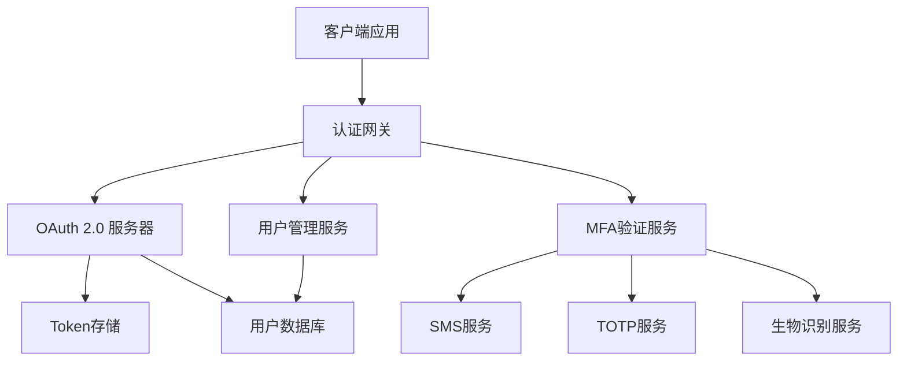

# Quickstart Guide: PRD Draft Documentation System

**目标**: 在15分钟内完成PRD草稿系统的基本使用流程
**前置条件**: 已安装codex-father，配置基本用户信息

## 🚀 快速开始

### 1. 初始化配置 (2分钟)

```bash
# 初始化PRD配置
prd config init

# 设置用户信息
prd config set user.name "张三"
prd config set user.email "zhangsan@example.com"
prd config set user.role "architect"

# 验证配置
prd config show
```

**预期结果**:

```
✅ Configuration initialized successfully
📁 Config file: ~/.codex-father/prd-config.yaml
👤 User: 张三 (architect)
```

### 2. 创建第一个PRD草稿 (3分钟)

```bash
# 查看可用模板
prd template list

# 创建新的PRD草稿
prd create --title "用户认证系统重构" --template technical --description "重构现有用户认证，支持多因素认证"

# 查看创建的草稿
prd list
```

**预期结果**:

```
📋 Available Templates:
- technical     Technical Architecture PRD
- business      Business Requirements PRD
- feature       Feature Specification PRD

✅ PRD draft '用户认证系统重构' created successfully (ID: auth-123)

📋 PRD Drafts (1 total)
ID       Title              Status    Author    Updated
-------- ------------------ --------- --------- ----------
auth-123 用户认证系统重构      draft     张三       2分钟前
```

### 3. 编辑PRD内容 (5分钟)

```bash
# 查看草稿内容结构
prd show auth-123

# 编辑草稿 (会打开默认编辑器)
prd edit auth-123 --section overview --message "添加认证系统概述"

# 查看编辑后的内容
prd show auth-123 --format markdown
```

**预期编辑内容示例**:

```markdown
# 用户认证系统重构 PRD

## 1. 概述 (Overview)

### 1.1 背景

当前用户认证系统存在以下问题：

- 仅支持用户名密码认证
- 缺乏多因素认证(MFA)支持
- 密码策略不够强化
- 缺乏统一的认证管理

### 1.2 目标

重构认证系统，实现：

- 支持多种认证方式 (密码、SMS、TOTP、生物识别)
- 实现多因素认证流程
- 统一认证管理后台
- 提升安全性和用户体验

## 2. 技术架构决策

| 方案     | OAuth 2.0 + OpenID Connect | 自建认证系统 | 第三方服务 |
| -------- | -------------------------- | ------------ | ---------- |
| 优点     | 标准化、生态完善           | 完全可控     | 快速集成   |
| 缺点     | 复杂度高                   | 开发成本高   | 厂商依赖   |
| 评分     | 8/10                       | 6/10         | 7/10       |
| **选择** | ✅ **推荐**                | ❌           | ❌         |

### 决策理由

选择OAuth 2.0 + OpenID Connect方案，理由：

1. 行业标准，安全性有保障
2. 生态系统完善，库支持丰富
3. 便于未来扩展和集成
4. 符合企业级应用要求
```

### 4. 添加技术决策和图表 (3分钟)

```bash
# 查看草稿当前状态
prd show auth-123 --sections decisions,diagrams

# 编辑添加架构图
prd edit auth-123 --section architecture
```

**添加Mermaid架构图**:

````markdown
## 3. 系统架构


````

## 4. 实施计划

### 4.1 阶段划分

- **阶段1** (2周): OAuth 2.0核心实现
- **阶段2** (1周): MFA集成
- **阶段3** (1周): 管理后台开发
- **阶段4** (1周): 测试和上线

````

### 5. 提交审查 (2分钟)

```bash
# 提交草稿供团队审查
prd review submit auth-123 --reviewers "lisi,wangwu" --due-date "2025-10-05" --priority high --message "请重点关注安全性和技术可行性"

# 查看审查状态
prd review status auth-123
````

**预期结果**:

```
✅ Review submitted successfully
📝 Review ID: review-456
👥 Reviewers: lisi, wangwu
📅 Due date: 2025-10-05
⏰ Priority: high

📊 Review Status Summary:
- Status: in_review
- Phase: technical
- Assigned: 2 reviewers
- Pending: 2 responses
- Due: 3 days remaining
```

## 🔄 常见工作流程

### 场景1: 产品经理创建业务需求PRD

```bash
# 1. 创建业务需求PRD
prd create --title "移动端用户体验优化" --template business

# 2. 编辑业务需求章节
prd edit mobile-ux-001 --section requirements

# 3. 提交给开发团队评审
prd review submit mobile-ux-001 --reviewers "dev-team" --priority medium
```

### 场景2: 架构师响应技术审查

```bash
# 1. 查看待审查的PRD
prd list --status in_review

# 2. 查看具体PRD内容
prd show auth-123 --format markdown

# 3. 提交审查意见
prd review respond auth-123 --decision "changes_requested" --inline "建议使用更轻量的认证方案"

# 4. 查看所有审查历史
prd review status auth-123
```

### 场景3: 版本管理和回滚

```bash
# 1. 查看版本历史
prd version list auth-123

# 2. 对比版本差异
prd version diff auth-123 --from 1 --to 3

# 3. 回滚到之前版本
prd version restore auth-123 2 --message "回滚到稳定版本，重新设计MFA部分"

# 4. 查看回滚结果
prd show auth-123 --version 4
```

## 📋 验证清单

完成以下步骤验证系统功能：

### ✅ 基础功能验证

- [ ] 创建PRD草稿成功
- [ ] 编辑PRD内容成功
- [ ] 查看PRD列表和详情
- [ ] 删除/归档PRD草稿

### ✅ 协作功能验证

- [ ] 提交审查请求
- [ ] 接收和响应审查
- [ ] 查看审查状态和历史
- [ ] 处理审查意见

### ✅ 版本管理验证

- [ ] 查看版本历史
- [ ] 对比版本差异
- [ ] 回滚到指定版本
- [ ] 版本恢复成功

### ✅ 模板系统验证

- [ ] 查看可用模板
- [ ] 使用不同模板创建PRD
- [ ] 验证模板结构正确
- [ ] 自定义模板字段

### ✅ 权限控制验证

- [ ] 不同角色权限正确
- [ ] 编辑权限按角色限制
- [ ] 审查权限正确分配
- [ ] 敏感操作需要确认

## 🔧 故障排除

### 常见问题

**问题1**: `prd create` 失败，提示权限不足

```bash
# 解决方案: 检查用户角色配置
prd config show --key user.role
prd config set user.role "architect"
```

**问题2**: 编辑器无法打开PRD文件

```bash
# 解决方案: 配置默认编辑器
prd config set editor.command "code"  # VS Code
prd config set editor.command "vim"   # Vim
```

**问题3**: Mermaid图表渲染失败

```bash
# 解决方案: 检查diagram服务状态
prd config show --key diagram.service
# 重启diagram服务
systemctl restart codex-father-diagram
```

**问题4**: 审查通知未收到

```bash
# 解决方案: 检查通知配置
prd config show --key notifications
prd config set notifications.email true
```

## 📊 性能基准

完成quickstart后，系统应达到以下性能指标：

| 操作     | 预期响应时间 | 实测时间 | 状态 |
| -------- | ------------ | -------- | ---- |
| PRD创建  | < 2秒        | \_\_\_秒 | ⏳   |
| 内容编辑 | < 1秒        | \_\_\_秒 | ⏳   |
| 列表查询 | < 500ms      | \_\_\_ms | ⏳   |
| 图表渲染 | < 3秒        | \_\_\_秒 | ⏳   |
| 审查提交 | < 1秒        | \_\_\_秒 | ⏳   |

## 🎯 下一步

完成quickstart后，建议继续：

1. **深入学习**: 查看 [PRD用户指南](./user-guide.md)
2. **模板定制**: 学习 [模板开发指南](./template-guide.md)
3. **集成配置**: 参考 [集成配置文档](./integration.md)
4. **最佳实践**: 阅读 [PRD编写最佳实践](./best-practices.md)

---

**🎉 恭喜！** 您已经掌握了PRD草稿系统的基本用法。如有问题，请查看
[FAQ](./faq.md) 或联系技术支持。
