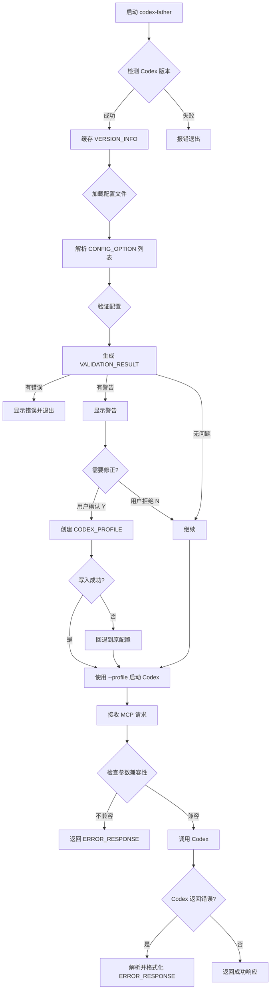

# Data Model: Codex 0.44 兼容性检查与修复

**Feature**: 008-ultrathink-codex-0 **Date**: 2025-10-03 **Phase**: 1 - Design

---

## 概述

本文档定义实现 Codex
0.42 和 0.44 双版本兼容性支持所需的核心实体模型，包括字段定义、验证规则和状态转换。

---

## 实体关系图

```mermaid
erDiagram
    VERSION_INFO ||--o{ PARAMETER_MAPPING : "determines"
    VERSION_INFO ||--o{ CONFIG_OPTION : "filters"
    CONFIG_OPTION }o--|| CODEX_PROFILE : "stored in"
    VALIDATION_RESULT ||--o{ CONFIG_OPTION : "validates"
    MCP_METHOD }o--|| PARAMETER_MAPPING : "uses"
    ERROR_RESPONSE }o--|| VERSION_INFO : "references"

    VERSION_INFO {
        string version
        number major
        number minor
        number patch
        timestamp detectedAt
    }

    PARAMETER_MAPPING {
        string name
        string category
        string minVersion
        string maxVersion
        string dataSource
        string incompatibleBehavior
    }

    CONFIG_OPTION {
        string key
        any value
        string type
        boolean required
        any defaultValue
        string minVersion
    }

    CODEX_PROFILE {
        string name
        map<string,any> config
        timestamp createdAt
        string reason
    }

    VALIDATION_RESULT {
        boolean valid
        array<string> errors
        array<string> warnings
        map<string,string> suggestions
    }

    MCP_METHOD {
        string name
        string description
        object params
        object response
        string minVersion
    }

    ERROR_RESPONSE {
        number code
        string message
        object context
        array<string> suggestions
    }
```

---

## 1. 版本信息 (Version Info)

### 描述

Codex 版本检测的结果，用于控制功能启用/禁用。

### 字段定义

| 字段         | 类型      | 必需 | 描述                      | 验证规则                           |
| ------------ | --------- | ---- | ------------------------- | ---------------------------------- |
| `version`    | string    | ✅   | 完整版本号（如 "0.44.0"） | 符合语义化版本规范 `\d+\.\d+\.\d+` |
| `major`      | number    | ✅   | 主版本号                  | >= 0                               |
| `minor`      | number    | ✅   | 次版本号                  | >= 0                               |
| `patch`      | number    | ✅   | 修订版本号                | >= 0                               |
| `detectedAt` | timestamp | ✅   | 检测时间戳（毫秒）        | Unix timestamp                     |

### TypeScript 定义

```typescript
interface VersionInfo {
  version: string; // "0.44.0"
  major: number; // 0
  minor: number; // 44
  patch: number; // 0
  detectedAt: number; // Date.now()
}
```

### Zod Schema

```typescript
import { z } from 'zod';

export const VersionInfoSchema = z.object({
  version: z.string().regex(/^\d+\.\d+\.\d+$/, 'Invalid semantic version'),
  major: z.number().int().min(0),
  minor: z.number().int().min(0),
  patch: z.number().int().min(0),
  detectedAt: z.number().int().positive(),
});

export type VersionInfo = z.infer<typeof VersionInfoSchema>;
```

### 状态转换

```
[未检测] ---> [检测中] ---> [已缓存]
                  |
                  v
              [检测失败] ---> [报错退出]
```

**转换规则**:

- **未检测 → 检测中**: 首次调用 `detectCodexVersion()`
- **检测中 → 已缓存**: 成功解析 `codex --version` 输出
- **检测中 → 检测失败**: `codex` 命令不存在或执行失败
- **检测失败 → 报错退出**: 显示错误并 `process.exit(1)`

---

## 2. 参数-版本映射 (Parameter Mapping)

### 描述

CLI 参数、MCP 参数、配置选项与 Codex 版本的兼容性映射关系。

### 字段定义

| 字段                   | 类型   | 必需 | 描述                                               | 验证规则                   |
| ---------------------- | ------ | ---- | -------------------------------------------------- | -------------------------- |
| `name`                 | string | ✅   | 参数名称（如 "profile", "model_reasoning_effort"） | 非空字符串                 |
| `category`             | enum   | ✅   | 参数类别                                           | "mcp" \| "cli" \| "config" |
| `minVersion`           | string | ❌   | 最低支持版本（如 "0.44.0"）                        | 语义化版本或 null          |
| `maxVersion`           | string | ❌   | 最高支持版本（如 "1.0.0"）                         | 语义化版本或 null          |
| `dataSource`           | string | ✅   | 数据来源（文件路径:行号）                          | 非空字符串                 |
| `incompatibleBehavior` | string | ❌   | 不兼容时的行为描述                                 | -                          |

### TypeScript 定义

```typescript
type ParameterCategory = 'mcp' | 'cli' | 'config';

interface ParameterMapping {
  name: string;
  category: ParameterCategory;
  minVersion: string | null;
  maxVersion: string | null;
  dataSource: string;
  incompatibleBehavior?: string;
}
```

### Zod Schema

```typescript
export const ParameterMappingSchema = z.object({
  name: z.string().min(1),
  category: z.enum(['mcp', 'cli', 'config']),
  minVersion: z
    .string()
    .regex(/^\d+\.\d+\.\d+$/)
    .nullable(),
  maxVersion: z
    .string()
    .regex(/^\d+\.\d+\.\d+$/)
    .nullable(),
  dataSource: z.string().min(1),
  incompatibleBehavior: z.string().optional(),
});

export type ParameterMapping = z.infer<typeof ParameterMappingSchema>;
```

### 示例数据

```typescript
const PARAMETER_MAPPINGS: ParameterMapping[] = [
  {
    name: 'profile',
    category: 'mcp',
    minVersion: '0.44.0',
    maxVersion: null,
    dataSource:
      'refer-research/openai-codex/codex-rs/docs/codex_mcp_interface.md:55',
    incompatibleBehavior: 'Returns JSON-RPC error: Invalid params',
  },
  {
    name: 'model_reasoning_effort',
    category: 'config',
    minVersion: '0.44.0',
    maxVersion: null,
    dataSource: 'refer-research/openai-codex/docs/config.md:89',
    incompatibleBehavior: 'Ignored with warning',
  },
];
```

---

## 3. 配置选项 (Config Option)

### 描述

Codex 配置文件（`config.toml`）中的单个配置项。

### 字段定义

| 字段           | 类型    | 必需 | 描述                                                       | 验证规则                                                |
| -------------- | ------- | ---- | ---------------------------------------------------------- | ------------------------------------------------------- |
| `key`          | string  | ✅   | 配置键名（支持嵌套，如 "model_providers.openai.wire_api"） | 非空字符串                                              |
| `value`        | any     | ✅   | 配置值                                                     | 根据 type 字段验证                                      |
| `type`         | enum    | ✅   | 值类型                                                     | "string" \| "number" \| "boolean" \| "enum" \| "object" |
| `required`     | boolean | ✅   | 是否必需                                                   | true \| false                                           |
| `defaultValue` | any     | ❌   | 默认值                                                     | 类型匹配 value                                          |
| `minVersion`   | string  | ❌   | 最低支持版本                                               | 语义化版本或 null                                       |

### TypeScript 定义

```typescript
type ConfigValueType = 'string' | 'number' | 'boolean' | 'enum' | 'object';

interface ConfigOption {
  key: string;
  value: any;
  type: ConfigValueType;
  required: boolean;
  defaultValue?: any;
  minVersion?: string;
}
```

### Zod Schema

```typescript
export const ConfigOptionSchema = z.object({
  key: z.string().min(1),
  value: z.any(),
  type: z.enum(['string', 'number', 'boolean', 'enum', 'object']),
  required: z.boolean(),
  defaultValue: z.any().optional(),
  minVersion: z
    .string()
    .regex(/^\d+\.\d+\.\d+$/)
    .optional(),
});

export type ConfigOption = z.infer<typeof ConfigOptionSchema>;
```

### 验证规则

**类型验证**:

- `type === 'string'`: `typeof value === 'string'`
- `type === 'number'`: `typeof value === 'number' && !isNaN(value)`
- `type === 'boolean'`: `typeof value === 'boolean'`
- `type === 'enum'`: `value in enumValues`
- `type === 'object'`: `typeof value === 'object' && value !== null`

**版本兼容性验证**:

- 如果 `minVersion` 存在且 `currentVersion < minVersion`，则：
  - CLI 层：报错并退出
  - 配置层：显示警告并过滤
  - MCP 层：返回 JSON-RPC 错误

---

## 4. Codex Profile (Auto-fix Profile)

### 描述

存储在 `~/.codex/config.toml` 中的 `[profiles.codex-father-auto-fix]`
段，用于持久化自动修正的配置。

### 字段定义

| 字段        | 类型      | 必需 | 描述                                           | 验证规则                       |
| ----------- | --------- | ---- | ---------------------------------------------- | ------------------------------ |
| `name`      | string    | ✅   | Profile 名称（固定为 "codex-father-auto-fix"） | 必须为 "codex-father-auto-fix" |
| `config`    | object    | ✅   | 修正后的配置项（键值对）                       | 非空对象                       |
| `createdAt` | timestamp | ✅   | 创建时间戳                                     | Unix timestamp                 |
| `reason`    | string    | ✅   | 修正原因（作为注释写入 TOML）                  | 非空字符串                     |

### TypeScript 定义

```typescript
interface CodexProfile {
  name: 'codex-father-auto-fix';
  config: Record<string, any>;
  createdAt: number;
  reason: string;
}
```

### Zod Schema

```typescript
export const CodexProfileSchema = z.object({
  name: z.literal('codex-father-auto-fix'),
  config: z.record(z.any()).refine((obj) => Object.keys(obj).length > 0, {
    message: 'Config must not be empty',
  }),
  createdAt: z.number().int().positive(),
  reason: z.string().min(1),
});

export type CodexProfile = z.infer<typeof CodexProfileSchema>;
```

### TOML 格式

```toml
[profiles.codex-father-auto-fix]
# Auto-fixed by codex-father on 2025-10-03: gpt-5-codex requires wire_api = "responses"
model = "gpt-5-codex"

[profiles.codex-father-auto-fix.model_providers.openai]
wire_api = "responses"
```

### 状态转换

```
[不存在] ---> [待创建] ---> [已写入]
                  |
                  v
              [写入失败] ---> [回退到原配置]
```

**转换规则**:

- **不存在 → 待创建**: 用户确认自动修正（Y）
- **待创建 → 已写入**: 成功写入 `~/.codex/config.toml`
- **待创建 → 写入失败**: 文件权限不足或 TOML 格式错误
- **写入失败 → 回退**: 显示错误，继续使用原配置

---

## 5. 配置验证结果 (Validation Result)

### 描述

配置文件静态校验的结果，包含错误、警告和修复建议。

### 字段定义

| 字段          | 类型     | 必需 | 描述                               | 验证规则      |
| ------------- | -------- | ---- | ---------------------------------- | ------------- |
| `valid`       | boolean  | ✅   | 配置是否有效（无错误）             | true \| false |
| `errors`      | string[] | ✅   | 错误列表（阻止启动）               | 数组          |
| `warnings`    | string[] | ✅   | 警告列表（不阻止启动）             | 数组          |
| `suggestions` | object   | ✅   | 修复建议（键：配置项，值：建议值） | 键值对        |

### TypeScript 定义

```typescript
interface ValidationResult {
  valid: boolean;
  errors: string[];
  warnings: string[];
  suggestions: Record<string, string>;
}
```

### Zod Schema

```typescript
export const ValidationResultSchema = z.object({
  valid: z.boolean(),
  errors: z.array(z.string()),
  warnings: z.array(z.string()),
  suggestions: z.record(z.string()),
});

export type ValidationResult = z.infer<typeof ValidationResultSchema>;
```

### 示例数据

```typescript
const validationResult: ValidationResult = {
  valid: false,
  errors: ['model_providers.openai.wire_api is required but missing'],
  warnings: [
    'model_reasoning_effort is not supported in Codex 0.42 (will be ignored)',
  ],
  suggestions: {
    'model_providers.openai.wire_api': 'responses',
  },
};
```

### 决策规则

- `valid === true`: 继续启动
- `valid === false && errors.length > 0`: 报错并退出
- `valid === true && warnings.length > 0`: 显示警告并继续

---

## 6. MCP 方法 (MCP Method)

### 描述

Codex MCP 协议中定义的 MCP 方法及其参数/响应结构。

### 字段定义

| 字段          | 类型   | 必需 | 描述                             | 验证规则           |
| ------------- | ------ | ---- | -------------------------------- | ------------------ |
| `name`        | string | ✅   | 方法名称（如 "newConversation"） | 非空字符串         |
| `description` | string | ✅   | 方法描述                         | 非空字符串         |
| `params`      | object | ✅   | 参数 Schema（JSON Schema 格式）  | 有效的 JSON Schema |
| `response`    | object | ✅   | 响应 Schema（JSON Schema 格式）  | 有效的 JSON Schema |
| `minVersion`  | string | ❌   | 最低支持版本                     | 语义化版本或 null  |

### TypeScript 定义

```typescript
interface McpMethod {
  name: string;
  description: string;
  params: JSONSchema;
  response: JSONSchema;
  minVersion?: string;
}

type JSONSchema = {
  type: string;
  properties?: Record<string, JSONSchema>;
  required?: string[];
  // ... 其他 JSON Schema 字段
};
```

### Zod Schema

```typescript
export const McpMethodSchema = z.object({
  name: z.string().min(1),
  description: z.string().min(1),
  params: z.record(z.any()), // JSON Schema
  response: z.record(z.any()), // JSON Schema
  minVersion: z
    .string()
    .regex(/^\d+\.\d+\.\d+$/)
    .optional(),
});

export type McpMethod = z.infer<typeof McpMethodSchema>;
```

### 示例数据

```typescript
const newConversationMethod: McpMethod = {
  name: 'newConversation',
  description: 'Create a new Codex conversation',
  params: {
    type: 'object',
    properties: {
      prompt: { type: 'string' },
      model: { type: 'string' },
      profile: { type: 'string' }, // 0.44 only
      config: { type: 'object' },
    },
    required: ['prompt'],
  },
  response: {
    type: 'object',
    properties: {
      conversationId: { type: 'string' },
    },
    required: ['conversationId'],
  },
  minVersion: undefined, // 0.42 也支持（但 profile 参数除外）
};
```

### 版本兼容性处理

**参数级别检查**:

- 遍历 `params.properties`，检查每个参数的 `minVersion`
- 如果 `currentVersion < paramMinVersion`，返回 JSON-RPC 错误

---

## 7. 错误响应 (Error Response)

### 描述

HTTP 错误和 JSON-RPC 错误的统一结构，包含完整上下文和操作建议。

### 字段定义

| 字段          | 类型     | 必需 | 描述                             | 验证规则   |
| ------------- | -------- | ---- | -------------------------------- | ---------- |
| `code`        | number   | ✅   | 错误代码（HTTP 或 JSON-RPC）     | 整数       |
| `message`     | string   | ✅   | 错误消息                         | 非空字符串 |
| `context`     | object   | ✅   | 错误上下文（如 URL、参数、版本） | 对象       |
| `suggestions` | string[] | ✅   | 操作建议列表                     | 数组       |

### TypeScript 定义

```typescript
interface ErrorResponse {
  code: number;
  message: string;
  context: Record<string, any>;
  suggestions: string[];
}
```

### Zod Schema

```typescript
export const ErrorResponseSchema = z.object({
  code: z.number().int(),
  message: z.string().min(1),
  context: z.record(z.any()),
  suggestions: z.array(z.string()),
});

export type ErrorResponse = z.infer<typeof ErrorResponseSchema>;
```

### 示例数据

#### HTTP 405 错误

```typescript
const http405Error: ErrorResponse = {
  code: 405,
  message: 'Method Not Allowed',
  context: {
    endpoint: 'https://api.openai.com/v1/chat/completions',
    method: 'POST',
    model: 'gpt-5-codex',
    wire_api: 'chat',
  },
  suggestions: [
    'gpt-5-codex requires wire_api = "responses"',
    'Edit ~/.codex/config.toml and set model_providers.openai.wire_api = "responses"',
  ],
};
```

#### JSON-RPC 参数错误

```typescript
const jsonRpcParamError: ErrorResponse = {
  code: -32602,
  message: "Invalid params: 'profile' requires Codex >= 0.44 (current: 0.42.5)",
  context: {
    method: 'newConversation',
    param: 'profile',
    currentVersion: '0.42.5',
    minVersion: '0.44.0',
  },
  suggestions: [
    'Upgrade to Codex 0.44: npm install -g @openai/codex@latest',
    'Or remove the "profile" parameter',
  ],
};
```

### 错误代码映射

**JSON-RPC 错误代码** (标准):

- `-32700`: Parse error
- `-32600`: Invalid Request
- `-32601`: Method not found
- `-32602`: **Invalid params** (版本不兼容使用此代码)
- `-32603`: Internal error

**HTTP 错误代码** (Codex API):

- `405`: Method Not Allowed (wire_api 错误)
- `401`: Unauthorized (API Key 错误)
- `429`: Too Many Requests (速率限制)
- `500`: Internal Server Error

---

## 数据流图



---

## 验证规则总结

### 1. 版本兼容性验证

- **规则**:
  `currentVersion >= minVersion && (maxVersion === null || currentVersion <= maxVersion)`
- **应用于**: 参数映射、配置选项、MCP 方法

### 2. 配置类型验证

- **规则**: 使用 Zod Schema 进行运行时类型检查
- **应用于**: 所有配置选项

### 3. 模型与 wire_api 兼容性验证

- **规则**: `MODEL_WIRE_API_MAP[model] === config.wire_api`
- **应用于**: 配置验证阶段

### 4. API Key 存在性验证

- **规则**: `process.env[envKey] !== undefined && process.env[envKey] !== ''`
- **应用于**: 配置验证阶段（不验证 Key 的有效性）

---

## 下一步

- ✅ 实体模型已定义
- ⏭️ 生成 contracts/ 目录（MCP 方法契约测试）
- ⏭️ 生成 quickstart.md（用户场景验收测试）
- ⏭️ 更新 CLAUDE.md（添加新技术栈信息）

---

_所有实体模型遵循 DRY、KISS、YAGNI 原则，并使用 Zod 进行运行时验证以确保类型安全。_
